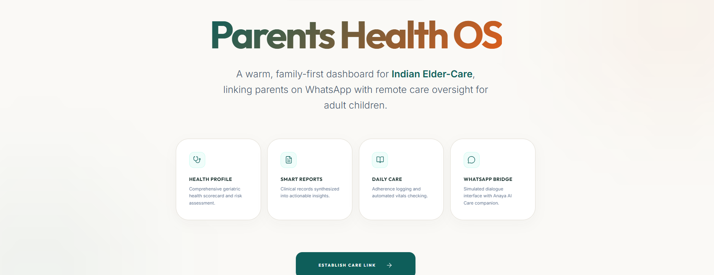
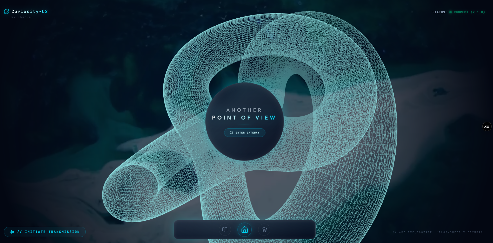

# 🌌 Tharun Gajula: Multimodal Portfolio System

> **An interactive, Agentic AI-powered digital portfolio pushing the boundaries of web experiences.**

## 💡 The "Why"
Traditional resumes and portfolios are static. They tell, but they don't *show*. This project was built to demonstrate product vision, architectural understanding, and a deep appreciation for high-end UI/UX. It serves as a living, breathing sandbox that visitors can interact with, ask questions to, and explore in a non-linear way.

## ✨ Key Features
- **🤖 Integrated AI Explorer:** A built-in AI assistant powered by Gemini that can converse about my background, skills, and projects.
- **🧊 Glassmorphic Aesthetic:** Premium dark-mode UI with subtle cyan accents, deep blurs, and polished micro-animations.
- **🎮 3D Spatial Interface:** Integrated Spline 3D models with reactive lighting and interactive triggers.
- **⚡ Next.js 16 Turbo:** Blazing fast performance leveraging the newest App Router and React 19 capabilities.

## 🖼 Visual Tour

*The immersive landing experience featuring the interactive 3D avatar.*


*The integrated conversational AI panel.*


*Categorized breakdown of product and analytics case studies.*

---

## ⚙️ The Engine Room (Technical Anatomy)

**Tech Stack:**
- **Framework:** Next.js 16 (App Router)
- **UI/Styling:** Tailwind CSS v4, Framer Motion
- **3D Engine:** Spline (`@splinetool/react-spline`)
- **AI Integration:** Google Gemini API streaming (Edge Runtime via direct fetch)
- **Deployment:** Vercel

**Environment Variables:**
To run the AI features locally, you will need a `.env.local` file with the following:
```env
GEMINI_API_KEY=your_api_key_here
```

**Local Setup Instructions:**
1. Clone the repository.
2. Install dependencies:
   ```bash
   npm install
   ```
3. Start the Turbopack development server:
   ```bash
   npm run dev
   ```
4. Open [http://localhost:3000](http://localhost:3000) in your browser.
