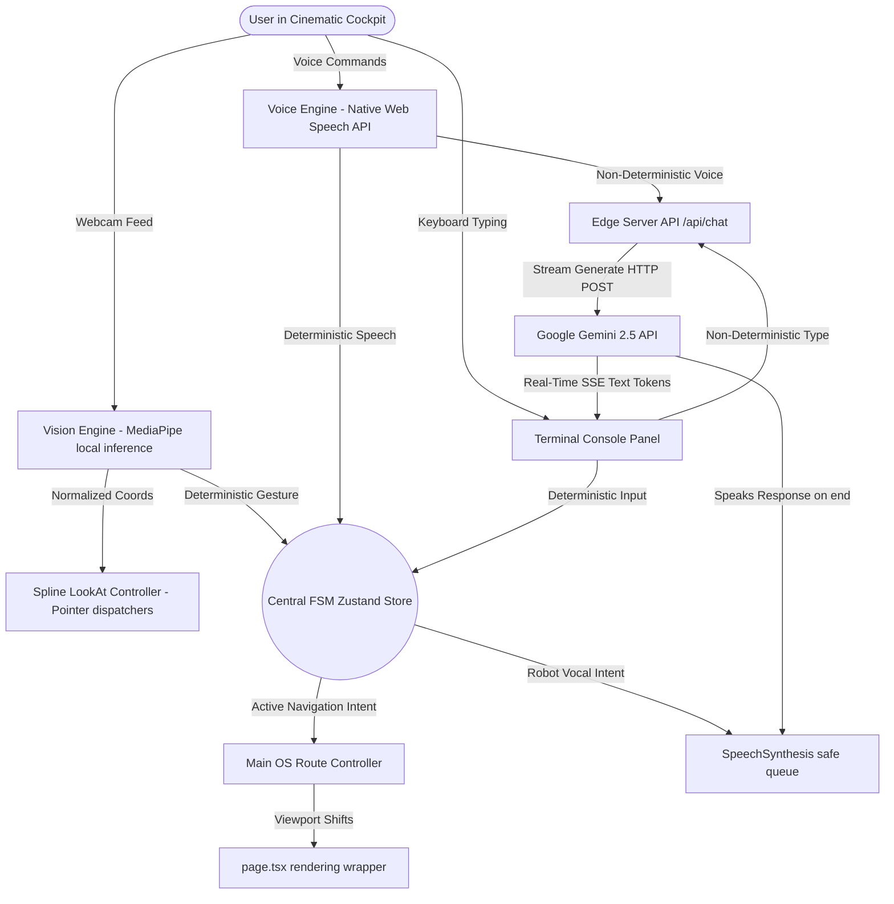

# SOURCE_OF_TRUTH.md
**Project: Tharun Gajula's Multimodal Embodied AI Portfolio OS**  
**Version: 1.0.0 (JARVIZ Live Stable Release)**  
**Last Audited & Verified: May 31, 2026**  

---

## 1. PROJECT NAME & SUMMARY
*   **Project Name**: `tharungajula` (Multimodal Embodied AI Portfolio OS)
*   **Description**: A futuristic, single-page professional portfolio and cinematic command cockpit (`JARVIZ Live`) built for founder-level and recruiter-level target audiences. It showcases Tharun Gajula's career trajectory as an AI Product Manager & Systems Architect through dynamic on-device computer vision, native voice controls, and edge-streamed Gemini conversational AI.

---

## 2. THE POINT — PROBLEM & MISSION
*   **The Problem**: Traditional recruiter and founder portfolios are static, boring, and fail to demonstrate real-world engineering or product capability.
*   **The Mission**: Elevate the portfolio experience to a high-fidelity "AI Cockpit OS." By integrating complex modern technologies (MediaPipe machine learning running locally in the browser, real-time Web Speech synthesizers, and Edge API streamed models), the system acts as a living demonstration of high-agency **Agentic Product Engineering** and spatial UI/UX design.

---

## 3. FULL TECH STACK & EXACT VERSIONS
All dependencies are verified from `package.json`:

### Core Engines & Frameworks
*   **Next.js**: `16.1.6` (App Router architecture)
*   **React**: `19.2.3`
*   **React DOM**: `19.2.3`
*   **TypeScript**: `^5`

### 3D & Computer Vision
*   **MediaPipe Vision Tasks**: `@mediapipe/tasks-vision: ^0.10.35` (On-device neural hand tracking and gesture categorization)
*   **Spline React Bridge**: `@splinetool/react-spline: ^4.1.0` (Client-side 3D rendering pipeline)
*   **Spline Runtime**: `@splinetool/runtime: ^1.12.90` (Allows programmatic scene and event interaction)
*   **Three.js**: `three: ^0.165.0` & `@react-three/fiber: ^9.5.0` & `@react-three/drei: ^10.7.7` (3D webgl dependencies)
*   **Graph Visualizations**: `react-force-graph-2d: ^1.29.1` & `react-force-graph-3d: ^1.29.1` (Physics-based graph visualization engines)

### Styling & Animation
*   **Tailwind CSS**: `^4` (Premium layout management)
*   **PostCSS Tailwind**: `@tailwindcss/postcss: ^4`
*   **Framer Motion**: `framer-motion: ^12.34.0` (Immersive card transitions and layout physics)
*   **Lucide React**: `lucide-react: ^0.563.0` (High-tech diagnostic iconography)

### LLM Orchestration & Utilities
*   **Google Generative AI**: `@google/generative-ai: ^0.24.1` (Direct API bindings)
*   **Markdown Parsing**: `react-markdown: ^10.1.0` & `remark-gfm: ^4.0.1` (Allows formatted AI streaming)
*   **Frontmatter Parser**: `gray-matter: ^4.0.3`
*   **Tailwind Merge**: `tailwind-merge: ^3.4.0` & `clsx: ^2.1.1` (Safe styling utility composition)

---

## 4. SETUP FROM ZERO — SETUP GUIDE
### Prerequisites
1.  **Node.js**: Recommended `v20.x` or higher (tested with `v20.x` LTS).
2.  **Package Manager**: `npm` (packaged with Node).
3.  **Browser**: Google Chrome or Chromium-based browsers (required for native Web Speech APIs and webcam permissions).
4.  **Hardware**: Webcam and Microphone (optional, but required for live gesture and voice telemetry controls).

### Local Installation Steps
1.  **Clone / Create Folder**: Extract files into your local directory.
    ```bash
    cd tharungajula
    ```
2.  **Install Dependencies**: Use npm to install lockfile assets.
    ```bash
    npm install
    ```

### Environment Configurations
Create a `.env.local` file in the root directory and add your Google Gemini API key:
```env
GEMINI_API_KEY=AIzaSyYourRealGeminiKeyHere
```
> [!IMPORTANT]
> The `/api/chat` Edge route requires a valid `GEMINI_API_KEY` to successfully generate SSE streaming tokens.

### CLI Operational Commands
*   **Local Development**: Starts the Next.js development server with Turbopack acceleration.
    ```bash
    npm run dev
    ```
*   **Production Compilation**: Compiles code, runs type checks, and outputs optimized build directories.
    ```bash
    npm run build
    ```
*   **Local Production Server**: Serves compiled code locally.
    ```bash
    npm run start
    ```
*   **ESLint Linter Check**: Audits project styling and code patterns.
    ```bash
    npm run lint
    ```

---

## 5. ARCHITECTURE
The system combines a reactive state coordinator, local input engines, and a streaming cloud endpoint into a synchronized multimodal interface:



### Key Architectural Systems
1.  **Global FSM Store (`lib/jarviz/useJarvizStore.ts`)**: Acts as the single coordinator for state (`IDLE` | `CAMERA_PERMISSION_PENDING` | `VISION_ONLINE` | `HAND_DETECTED` | `GESTURE_CANDIDATE` | `COMMAND_CONFIRMED` | `LISTENING` | `ROBOT_RESPONDING` | `PAUSED`). Restricts feedback loops with reaction timeouts.
2.  **Vision Engine (`components/jarviz/VisionEngine.tsx`)**: Controls camera life-cycles, downloads `@mediapipe/tasks-vision` dynamically, and runs a high-performance requestAnimationFrame inference loop.
3.  **Voice Engine (`components/jarviz/VoiceEngine.tsx`)**: Harnesses browser `webkitSpeechRecognition` to capture, filter, and parse verbal intent on the client side with zero-latency.
4.  **Edge SSE Router (`app/api/chat/route.ts`)**: Operates on the Vercel Edge Runtime to proxy visitor questions to Gemini, bypass serverless timeouts, and stream text fragments live.
5.  **Look-At Translator (`components/jarviz/SplineController.ts`)**: Evaluates wrist coordinates ($x, y$) and dispatches window-level synthetic `pointermove` events to drive Spline 3D tracking vectors dynamically.
6.  **Vocalizer Queue (`lib/jarviz/speech.ts`)**: Connects to native `window.speechSynthesis`, cancels duplicate queues, selects premium English speech engines, and vocalizes robot confirmations.

---

## 6. FOLDER & FILE STRUCTURE
Explanation of all critical folders and files in the repository:

```
├── app/
│   ├── layout.tsx             # Global layout, custom typography configuration, background grid.
│   ├── page.tsx               # Entry OS Single Page Application container, manages active views.
│   ├── sitemap.ts             # SEO XML Sitemap generator.
│   └── api/chat/
│       └── route.ts           # Next.js Edge Runtime Server-Sent Events (SSE) proxy router for Gemini.
├── components/
│   ├── ConnectPage.tsx        # High-impact CTA panel featuring clean profiles, and direct email targets.
│   ├── EvolutionTimeline.tsx # Structured, high-fidelity career timeline (non-retrospective milestones).
│   ├── SplineAvatar.tsx       # Core 3D Robot presentation canvas with floating Monospace Chest HUD.
│   ├── WorkGallery.tsx        # CSS Grid layout displaying high-aesthetic project cards and images.
│   ├── WorkOverview.tsx       # Interactive capability pillar map & Notion-style production stack drawer.
│   ├── ui/
│   │   └── AIChatPanel.tsx    # Slide-up portfolio helper bot (passive backup conversational panel).
│   └── jarviz/
│       ├── JarvizCockpit.tsx  # Master cinematic overlay coordinator, handles teardowns.
│       ├── RobotLivenessOverlay.tsx # Immersive SVG animated status ring representing FSM actions.
│       ├── SplineController.ts # Window-level PointerEvent dispatcher driving 3D LookAt tracking.
│       ├── VisionEngine.tsx   # Camera feed hardware manager and MediaPipe classification thread.
│       ├── VoiceEngine.tsx    # webkitSpeechRecognition API interface.
│       └── hud/
│           ├── CommandMap.tsx       # Recruiter manual detailing gestures, voice inputs, and demo scripts.
│           ├── ConsentCard.tsx      # Entry permission gate explaining browser camera/mic usages.
│           ├── GestureTelemetry.tsx # PiP camera window rendering dynamic confidence levels.
│           ├── HudFrame.tsx         # Holographic visor corner tech lines and linear scanline gradients.
│           ├── StatusReadout.tsx    # Dynamic dashboard debugging panel showing real-time FSM data.
│           └── TranscriptPanel.tsx  # Interactive chat text output and terminal command inputs.
├── lib/
│   ├── ai-context.ts          # Central LLM positioning system representing the V6 developer profile.
│   ├── utils.ts               # CSS class merger utilities.
│   └── jarviz/
│       ├── commands.ts        # Intent lookup tables for local speech parsing.
│       ├── speech.ts          # Safe SpeechSynthesis vocalization controller.
│       └── useJarvizStore.ts  # Zustand-like synced browser state machine.
├── data/
│   └── systems.ts             # Static metadata for prototypes and quantitative codebases.
├── public/                    # Root folder containing screenshots, assets, and raw static vectors.
├── package.json               # Full technical framework and library metadata.
├── tailwind.config.ts         # Tailwind token configurations.
└── tsconfig.json              # TypeScript compilation rules.
```

---

## 7. SYSTEM FEATURES
### 1. Cinematic Command Cockpit (`JarvizCockpit.tsx`)
*   **Overview**: Mounted conditionally when the user selects "Talk to me" in the thesis panel. Slides in with a high-fidelity glassmorphic visor layer and triggers a cinematic startup wake sequence.
*   **Safeguards**: Esc key and "Exit Cockpit" buttons trigger clean teardowns: halting MediaPipe, closing camera hardware channels, flushing SpeechSynthesis queues, and aborting fetch requests.

### 2. On-Device Computer Vision & LookAt Swivel (`VisionEngine.tsx`)
*   **Overview**: Activates user-granted webcam streams to classify gestures locally.
*   **Gesture Intents**:
    *   `Victory / Two Hands` → Displays the Command manual matrix.
    *   `Pointing_Up` → Routes main view to **Connect**.
    *   `Closed_Fist` → Suspends webcam tracking / sets FSM to standby.
    *   `Open_Palm` → Sends wake / welcome pulse.
    *   `swipe_right` → Routes view to **Work**.
    *   `swipe_left` → Routes view to **Story**.
*   **3D Swivel**: Evaluates Index MCP Coordinates locally and fires synthetic PointerEvents to the window, forcing the Spline 3D robot head to swivel smoothly in real-time.

### 3. Native Voice Recognition & Vocal Synthesis (`VoiceEngine.tsx` & `speech.ts`)
*   **Overview**: Captures continuous browser verbal transcripts.
*   **Parsing Logic**: Compares sentences against local regex maps. If a command match is verified (e.g. *"go home"*, *"show work"*, *"connect"*), the system executes local routing immediately with zero edge latency.
*   **Vocalizer**: Responds verbally with confirmations utilizing standard volume, a warm pitch (`0.9`), and a crisp speed rate (`1.05`).

### 4. Edge-Streamed Conversational Gemini HUD (`TranscriptPanel.tsx`)
*   **Overview**: If transcripts do not match any deterministic navigation rule, they are passed as conversational questions.
*   **Edge Pipeline**: HTTP POST requests securely proxy data to Gemini 2.5 Flash-Lite inside a Next.js Edge Runtime stream, bypassing serverless API execution limits.
*   **Streaming UI**: Renders text tokens immediately alongside a pulsing block cursor (`█`) and a crimson **Stop Response** button that aborts the HTTP stream instantly.

### 5. Cybernetic Liveness Overlay (`RobotLivenessOverlay.tsx`)
*   **Overview**: An SVG system overlay centering exactly around the Spline robot head.
*   **Expressive Indicators**: Scale, color coordinates, and rotate to represent states: Standby (faint grey ring), Wake (cyan double rings), CV Track (cyan brackets), Speech listening (pulsing purple shadow), Thinking (spinning fuchsia dashed vectors), Speaking (glowing cyan audio bars), and Anomaly (blinking red caution symbols).

---

## 8. DATA, SCHEMAS & CONTENT STRUCTURE
The application stores metadata inside simple static modules, guaranteeing fast loading times:

### System Prototypes Data Model (`data/systems.ts`)
```typescript
export interface SystemItem {
  id: string;
  title: string;
  subtitle: string;
  description: string;
  longDescription?: string;
  tags: string[];
  metrics: { label: string; value: string }[];
  links: { label: string; url: string }[];
  image: string; // Screenshot path
}
```

### Conversational Knowledge Model (`lib/ai-context.ts`)
*   Contains the master static prompt block (`THARUN_CONTEXT`) structuring Tharun Gajula's professional summary, career timeline (Act 1 PO, Act 2 Consultant, Act 3 PM Prototyper), education (IISc Deep Learning), built prototypes, and email links.
*   Acts as the strict system boundary for the Gemini Edge endpoint.

---

## 9. DESIGN SYSTEM
The project enforces high-fidelity, premium spatial aesthetics:

### Design Tokens & Colors
*   **Backgrounds**: Pitch Black (`#000000`), Glassmorphic Transparents (`bg-black/50 backdrop-blur-2xl border border-white/10`).
*   **Primary Accent**: Bio-Scan Cyan (`#06b6d4` / `cyan-400` / `rgba(6,182,212)`).
*   **Secondary Accent**: Neural Purple (`#a855f7` / `purple-500`).
*   **Anomaly Alert**: Crimson Red (`#ef4444` / `red-500`).

### Typography Standards
*   **Headings**: Outfit (`font-sans` font-family fallback) — structures titles, names, and core headings.
*   **Monospace System**: JetBrains Mono (`font-mono`) — drives terminal UI logs, telemetry numbers, and diagnostic counters.
*   **Body Content**: Inter (`font-sans`) — displays project descriptions, lists, and career milestones.

### Viewport Space Preservation
*   To prevent HUD overlays from overflowing or being clipped on small laptop and mobile screens, outer padding margins are strictly eliminated.
*   The actual interactive content wrapper utilizes `overflow-y-auto scrollbar-none` coupled with a `min-h-full` cockpit container. Tech borders, ambient glows, and scanning elements remain fixed like a helmet visor, while interactive buttons scroll smoothly underneath.

---

## 10. EXTERNAL SERVICES & KEYS
The project integrates with the following cloud APIs:

1.  **Google Gemini Developer API**:
    *   **Required Key**: `GEMINI_API_KEY` (configured in `.env.local` locally, or set in environment variables on your deployment host).
    *   **Acquisition**: Acquired from [Google AI Studio](https://aistudio.google.com/). Select the Gemini 2.5 Flash-Lite API model endpoints.
2.  **Unpkg & JSDelivr CDNs**:
    *   Used to fetch MediaPipe compiled tasks and WASM files (`@mediapipe/tasks-vision@0.10.35/wasm`) and the gesture task binary model on runtime start. Needs an active internet connection.

---

## 11. DECISIONS & REASONS
*   **Edge Runtime Selection**: The Next.js `/api/chat` route uses `export const runtime = 'edge'`. This enables Server-Sent Events (SSE) stream chunks to pass immediately to the client, dodging standard Vercel serverless functions' 10-second timeout limits.
*   **Zustand-Alternative Synced Store**: Implemented a lightweight synced store using `useSyncExternalStore` in `useJarvizStore.ts`. This provides ultra-fast global updates and FSM state syncing without dragging in heavy external state management runtimes.
*   **Console Delegate Filtration**: MediaPipe natively logs false-positive TensorFlow Lite XNNPACK delegate warnings inside standard console windows. The project overrides `console.error` inside `VisionEngine.tsx` to trap, filter, and log them as generic `console.info` flags, maintaining clean inspector tools.
*   **Synchronized Webcam Stream Hook**: React lifecycle re-renders sometimes unmount conditionally-rendered video components right when stream assignments occur. The project runs a sync hook that hooks directly into `streamActive` to assign `videoRef.current.srcObject` post-paint.
*   **Fluid Synthetic Pointer Swivels**: Spline's native React library cannot be driven directly by numeric API calls. Instead, the custom Look-At system calculates actual coordinates and fires synthetic pointer events to the standard `window` listener, enabling fluid head tracking vectors.

---

## 12. KNOWN GOTCHAS & TODOS
*   **MediaPipe WASM Loading Speeds**: MediaPipe tasks and models must be downloaded from Google CDNs. In slow network environments, this causes a 2-5 second delay. The project mitigates this by applying standard task loading animations.
*   **Chrome Speech Restriction**: Native browser voice recognition features require active secure protocols (`https://` or localhost) and webcam permissions to continuously run in background tabs without stopping.
*   **Mobile System Advisory**: Touch-based interfaces lack cursor look-at tracking. The project detects screen bounds below `1024px` and displays a yellow warning bar recommending desktop use, while keeping terminal keyboard fallbacks online.

---

## 13. REBUILD-FROM-SCRATCH CHECKLIST

Follow these steps exactly to recreate this entire portfolio project from a blank directory:

### Step 1: Framework Initialization
1.  Initialize a new Next.js application using Turbopack:
    ```bash
    npx -y create-next-app@latest tharungajula --ts --tailwind --eslint --src-dir --import-alias "@/*" --app
    ```
2.  Navigate into the directory:
    ```bash
    cd tharungajula
    ```
3.  Configure Tailwind v4. Open `src/app/globals.css` and configure Tailwind import paths. Ensure fonts (`JetBrains Mono`, `Outfit`, `Inter`) are imported cleanly.

### Step 2: Install Technical Dependencies
1.  Run the command to install custom 3D, machine learning, and streaming helper modules:
    ```bash
    npm install @google/generative-ai @mediapipe/tasks-vision @splinetool/react-spline @splinetool/runtime three @react-three/fiber @react-three/drei framer-motion lucide-react react-markdown remark-gfm gray-matter tailwind-merge clsx
    ```

### Step 3: Implement Central State Machine (FSM)
1.  Create the folder `src/lib/jarviz/`.
2.  Create `src/lib/jarviz/useJarvizStore.ts` to manage state changes (`IDLE` to `ERROR`), mapping states to robot reactions (`listen`, `thinking`, `speaking`, `track`). Add safe transient timers of `950ms` for commands like `acknowledge`.
3.  Create `src/lib/jarviz/speech.ts`. Implement standard browser speech checks, a premium English voice lookup dictionary (`Google US English`, `Microsoft David`), and clean vocalization queues.
4.  Create `src/lib/jarviz/commands.ts` to register deterministic gesture boundaries and parsing regex maps for navigation queries.

### Step 4: Write Core Computer Vision Engine
1.  Create `src/components/jarviz/SplineController.ts`. Set up global window events and the synthetic pointer move dispatch routine (`PointerEvent("pointermove")`).
2.  Create `src/components/jarviz/VisionEngine.tsx`. Build full camera controls using `navigator.mediaDevices.getUserMedia`. Integrate lazy loader modules for `@mediapipe/tasks-vision` with fallback timers. Create a requestAnimationFrame detection loop that mirror-translates coordinates and triggers the Spline Look-At.

### Step 5: Implement Native Audio Engine
1.  Create `src/components/jarviz/VoiceEngine.tsx`. Instantiates browser `webkitSpeechRecognition`, sets continuous parameters, binds results to the FSM intent parser, and matches confirmations.

### Step 6: Create the Edge SSE API Stream Router
1.  Create `src/app/api/chat/route.ts`. Force dynamic routes and edge runtimes (`export const runtime = 'edge'`). Import `THARUN_CONTEXT` from `src/lib/ai-context.ts`. Proxies incoming message strings directly to Gemini stream endpoints using SSE chunk streams.

### Step 7: Build High-Tech Visual Layers
1.  Create `src/components/jarviz/RobotLivenessOverlay.tsx`. Design detailed SVG path matrices and ring systems. Map animations (spinners, audio waveform grids, glowing borders) to the current FSM reaction keys.
2.  Create the HUD layout components in `src/components/jarviz/hud/`:
    *   `HudFrame.tsx`: Fixed tech boundaries, and gradient scanlines.
    *   `StatusReadout.tsx`: Monospace real-time FSM diagnostics.
    *   `ConsentCard.tsx`: Permission gates and confirmation buttons.
    *   `GestureTelemetry.tsx`: Video stream displays and FPS tracking.
    *   `TranscriptPanel.tsx`: Chat inputs, SSE streaming cursor (`█`), and Stop response keys.
    *   `CommandMap.tsx`: Recruiter manuals and live checklists.

### Step 8: Build the Dynamic Cockpit Shell
1.  Create `src/components/jarviz/JarvizCockpit.tsx`. Ties the FSM, CV, speech elements, liveness HUD layers, and layouts together into an overlay. Ensure proper unmounting teardowns on exit.

### Step 9: Assemble the Portfolio Shell
1.  Create static metadata portfolios in `src/data/systems.ts` and contextual content in `src/lib/ai-context.ts`.
2.  Create showcase components (`WorkGallery.tsx`, `WorkOverview.tsx`, `EvolutionTimeline.tsx`, `ConnectPage.tsx`).
3.  Modify `src/components/SplineAvatar.tsx` to handle the 3D Spline model (`https://prod.spline.design/jcvFsh5CNoyqI8Hn/scene.splinecode`) and map its scale animations directly to FSM reaction tags.
4.  Modify `src/app/page.tsx` to act as the central routing system controlling tab transitions and mounting `<JarvizCockpit />`.

### Step 10: Run and Verify
1.  Create `.env.local` with `GEMINI_API_KEY`.
2.  Launch the development server:
    ```bash
    npm run dev
    ```
3.  Open browser window at `http://localhost:3000/`. Verify 3D rendering, multimodal cockpits, live telemetry, and Gemini streaming chats.
4.  Run static Next.js production builds:
    ```bash
    npm run build
    ```
5.  Deploy static outputs and Edge functions directly to Vercel or your hosting environment.
