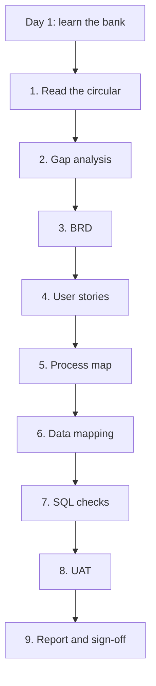
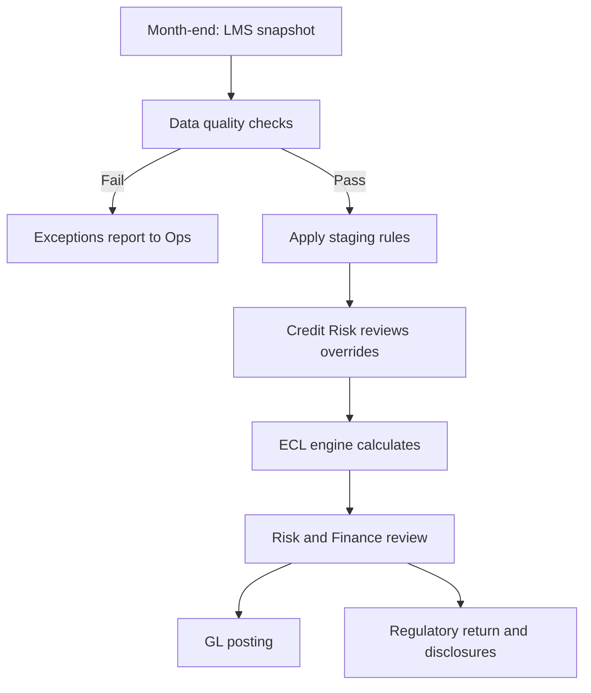

## How to read this note

Every section opens with one line and a summary table. That is the cheatsheet layer. Under it, "How it works" teaches the idea properly. Every term is explained the first time it appears, so you never need to leave the page.

Two kinds of facts appear, and they are always labelled:

| Label | What it means |
|---|---|
| **Real** | True as of September 2026: the regulation, the dates, the frameworks |
| **Illustrative** | Made up to teach: the bank, its systems, the loans, the numbers, the requirement IDs |

Tool names and buttons change every few months. So this note teaches the **move** first, then shows where you find it today. If a button moves, the move still works.

| Part | What it covers |
|---|---|
| Part A — The foundations | What agentic AI is, the mental model, the six-step loop, the four levels, context, plans, rules, skills (SKILL.md), agents, and checking |
| Part B — The thread | One real regulatory change, the RBI's move to expected credit loss, taken from Day 1 to sign-off with AI at every step |
| Part C — Safe in a bank | What you can never paste, the governance words you will hear, the traps, and when not to use AI |
| Part D — Your kit | A copy-ready prompt library, your first 30 days, and what stays true as tools change |
| Reference | Glossary and a one-screen summary |

## The whole note on one page

<svg viewBox="0 0 400 560" width="400" xmlns="http://www.w3.org/2000/svg" role="img" aria-label="The six-step loop: Pick, Plan, Feed, Fence, Check, Keep, and the running example from circular to regulatory return" style="width:100%;max-width:400px;height:auto;display:block;margin:1rem auto">
<g font-family="system-ui, -apple-system, 'Segoe UI', Roboto, sans-serif" font-size="13" fill="#1f2937">
<text x="200" y="24" text-anchor="middle" font-size="16" font-weight="700">One loop for every task</text>
<rect x="20" y="40" width="360" height="58" rx="10" fill="#dbeafe" stroke="#1d4ed8" stroke-width="1.5"/>
<text x="34" y="63" font-weight="700" fill="#1d4ed8">1. PICK the level</text>
<text x="34" y="84">Autocomplete, targeted edit, chat or agent</text>
<rect x="20" y="108" width="360" height="58" rx="10" fill="#ede9fe" stroke="#6d28d9" stroke-width="1.5"/>
<text x="34" y="131" font-weight="700" fill="#6d28d9">2. PLAN before it works</text>
<text x="34" y="152">Make it show its approach; you edit the plan</text>
<rect x="20" y="176" width="360" height="58" rx="10" fill="#dcfce7" stroke="#15803d" stroke-width="1.5"/>
<text x="34" y="199" font-weight="700" fill="#15803d">3. FEED the right context</text>
<text x="34" y="220">Source, template, good example. Relevant only.</text>
<rect x="20" y="244" width="360" height="58" rx="10" fill="#fef3c7" stroke="#b45309" stroke-width="1.5"/>
<text x="34" y="267" font-weight="700" fill="#b45309">4. FENCE it in</text>
<text x="34" y="288">Format, rules, and data it must never see</text>
<rect x="20" y="312" width="360" height="58" rx="10" fill="#fee2e2" stroke="#b91c1c" stroke-width="1.5"/>
<text x="34" y="335" font-weight="700" fill="#b91c1c">5. CHECK everything</text>
<text x="34" y="356">Trace every claim, recompute every number</text>
<rect x="20" y="380" width="360" height="58" rx="10" fill="#ccfbf1" stroke="#0f766e" stroke-width="1.5"/>
<text x="34" y="403" font-weight="700" fill="#0f766e">6. KEEP what worked</text>
<text x="34" y="424">Save it as a reusable prompt, skill or rule</text>
<text x="200" y="460" text-anchor="middle" font-size="12" fill="#6b7280">Then repeat for the next task, in a fresh chat</text>
<rect x="20" y="472" width="360" height="76" rx="10" fill="#f3f4f6" stroke="#6b7280" stroke-width="1.5"/>
<text x="34" y="494" font-weight="700" fill="#374151">The running example (Part B)</text>
<text x="34" y="515">RBI's ECL rules land. Circular, gaps, BRD,</text>
<text x="34" y="535">stories, process, data, SQL, UAT, report.</text>
</g>
</svg>

The six steps in one sentence: **pick** the smallest level of AI that can do the job, make it **plan** first, **feed** it only what is relevant, **fence** it with rules, **check** everything it produces, and **keep** what worked so you never write the same prompt twice.

## Part A — The foundations

## 1 — What "agentic AI" actually means

**In one line:** a chatbot answers you; an agent acts for you. It plans, uses tools, looks at the result, and keeps going until the task is done.

| Term | Plain meaning |
|---|---|
| **LLM** (large language model) | Software trained on a huge amount of text to predict the next word. It is the "brain" inside ChatGPT, Claude, Gemini and Microsoft Copilot |
| **Prompt** | What you type or say to the AI |
| **Context window** | Everything the AI can see at one moment: your prompt, attached files, the chat so far. Think of it as short-term memory with a size limit |
| **Token** | A chunk of text, roughly three-quarters of a word. Limits and costs are counted in tokens |
| **Hallucination** | The AI states something false, fluently and confidently |
| **Tool** | An ability beyond writing text: search the web, read a file, run code, query a database, send an email |
| **Agent** | An LLM running in a loop with tools: plan, act, observe, adjust, repeat |
| **Connector** / **MCP** | The plug that lets AI reach a system like SharePoint, Jira or a database. MCP (Model Context Protocol) is the open standard most tools now use for these plugs |

### How it works

There are three ways AI can work with you, and each one hands it more of the job:

| Mode | Who does the steps | Example |
|---|---|---|
| **Chat** | You do every step; AI answers one question at a time | "What does SICR mean?" |
| **Assistant** | AI does one step inside your document | "Rewrite this paragraph in plain English" |
| **Agent** | AI does many steps itself and hands you the result | "Read these 12 policy documents, find every place that mentions the 90-day NPA rule, and build me a table" |

An agent runs this loop until it thinks the goal is met:


Three facts about the "brain" that explain almost every mistake it makes:

| Fact | What it means for you |
|---|---|
| It is not a database | It learned patterns, not a verified record. It can invent a clause number that looks right |
| Its knowledge has a cutoff date | It may not know about anything after training, like a regulation finalised last month, unless you give it the text |
| It forgets between chats | A new chat starts blank unless the tool has a memory feature or you give it the context again |

## 2 — The mental model: a brilliant new joiner

**In one line:** treat the AI like a brilliant analyst who joined your team this morning. It knows every textbook, but nothing about your bank. Your job is to onboard it fast, every time.

| It already knows | It does not know |
|---|---|
| IFRS 9, Basel, how ECL works in general | Your bank's credit policy and product list |
| How to write a BRD, user stories, SQL | Your BRD template, your requirement ID format |
| Standard banking terms | Your system names, table names, column names |
| Generic best practice | Your CRO's preferences, your legacy decisions, what failed last year |
| The regulation up to its training date | The final version if it came out after that date |

### How it works

Without your context, the new joiner falls back on **generic patterns**. The output is correct in general but wrong for your bank. It "compiles but doesn't fit":

| What you get without context | What it should have been |
|---|---|
| A BRD in a textbook format | Your bank's approved template, section by section |
| SQL using a column called `days_past_due` | Your column is `DPD_CNT` in table `LMS_ACCT_MTH` |
| IFRS 9 wording everywhere | The exact words the RBI Directions use |
| A tidy list of 5 requirements | The 23 requirements your circular actually creates |

Two useful consequences:

- **Quality comes from context, not from clever wording.** A plain prompt with the right three files beats a fancy prompt with none.
- **You are also a new joiner on Day 1.** The same AI that needs onboarding can help onboard you. Section 12 shows how.

## 3 — The loop: Pick, Plan, Feed, Fence, Check, Keep

**In one line:** six steps that work for any task, in any tool, in any company, and will still work when today's tools are replaced.

| Step | The question you ask | Typical move | What goes wrong if you skip it |
|---|---|---|---|
| **Pick** | How much should AI do here? | Choose autocomplete, targeted edit, chat or agent | You use an agent for a one-line fix, or chat for a 40-document job |
| **Plan** | What will it do, in what order? | "Before writing anything, give me your plan and your assumptions" | Endless correction loops: it drifts, you fix, it drifts again |
| **Feed** | What does it need to see? | Attach the source, the template, one good example | Generic output that doesn't fit your bank |
| **Fence** | What are the rules and limits? | Format, wording, IDs, "mark unknowns as [TBC]", no customer data | Invented details, wrong format, data leaks |
| **Check** | Is it actually right? | Trace claims to the source, recompute numbers, test boundaries | A wrong number reaches the credit committee |
| **Keep** | Will I do this again? | Save the prompt as a template, skill or project rule | You rewrite the same prompt every week |

### How it works

**Pick.** Always use the smallest level that can do the job (section 4). Smaller levels are faster, and their mistakes are easier to spot.

**Plan.** For anything longer than a paragraph, ask for the plan first. You read the plan, fix it, then say "go". Fixing a plan takes one minute. Fixing a finished 20-page document takes an afternoon (section 6).

**Feed.** Give only what is relevant. **Relevance beats volume.** If you dump 30 documents in for a question about one clause, the answer gets worse, just like a human handed a whole cupboard of files. And start a **fresh chat for every new task**. Old context from the last task makes the AI assume things about the new one. This is the most common cause of bad output (section 5).

**Fence.** Tell it the format, the words to use, what it must not do, and what to do when it doesn't know. The single most useful fence is: **"If you are not sure, write [TBC] instead of guessing."**

**Check.** The work is yours, whoever or whatever wrote it. Every claim traces to a source. Every number is recomputed or reconciled (section 10).

**Keep.** If you have written the same kind of prompt twice, save it. Over a few weeks this becomes your personal toolkit, and it's the biggest time-saver of all (sections 7 and 8).

## 4 — Pick: the four levels of AI involvement

**In one line:** four levels, from AI finishing your sentence to AI doing a whole job. Pick the smallest one that works.

| Level | What it does | Where you meet it today (examples) | Good BA uses | Step up a level when |
|---|---|---|---|---|
| **1. Autocomplete** | Predicts your next words, formula or line as you type | Suggestions in Outlook and Word, Excel formula suggestions, "Tab" in coding editors like Cursor | Finishing sentences, formulas, repetitive rows | You need it to think, not just continue |
| **2. Targeted edit** | You select something, give one instruction, and review the change | "Rewrite" or "Edit with Copilot" in Word, Copilot or Claude on a selected Excel range, "Command K" in Cursor | Tighten a paragraph, convert a table into user stories, fix one formula | The change touches more than one document |
| **3. Conversation** | Reasons with you, with files attached | Microsoft 365 Copilot Chat, ChatGPT Enterprise, Claude, Gemini | Read a circular, draft a BRD, explain SQL, think through a gap | The job needs many steps, many files, or tools |
| **4. Agent** | Plans and carries out many steps, using tools, and hands back a finished piece of work | Copilot agents and Researcher, Claude Cowork, deep research modes, Cursor agent mode | Gap analysis across 40 documents, a full test pack, a research brief | (Top level: fence it hard and check it hard) |

### How it works

The video this note started from used Cursor's three levels: **Tab** (autocomplete), **Command K** (edit one file), and **Chat** (reason across the codebase), with agent mode on top. The same ladder exists in every AI tool; only the button names differ.

Two habits carry across:

- **Accept, then keep going.** After you accept an autocomplete or an edit, the next suggestion often builds on it. People stop after one; chaining them is where the speed is.
- **Don't push a level past its design.** A targeted edit is for one document. The moment your change spans several documents, move up to a conversation or an agent. You get worse results pushing a small tool too far.

One more choice sits inside every level: **which model**. Most tools offer a fast everyday model and a slower, stronger "thinking" model.

| Use the fast model for | Use the strongest model for |
|---|---|
| Rewrites, summaries, emails, formatting | Reading a regulation closely, designing a data flow, finding the subtle gap, reviewing logic |

## 5 — Feed: giving the right context

**In one line:** the AI is only as good as what you put in front of it. Give it the source, your bank's reality, the template and one good example. Nothing else.

| Piece of the context pack | Example in a credit risk BA job | Why it matters |
|---|---|---|
| **Source of truth** | The actual circular PDF, not your summary of it | Stops it answering from memory, which may be out of date |
| **Your bank's reality** | Current provisioning policy, data dictionary extract, system list | Stops it inventing your systems |
| **The template** | Your bank's BRD or test-case template | Output arrives in the right shape |
| **One good example** | Last approved BRD section, a signed-off test pack | It copies the style, depth and wording that already passed review |
| **Glossary** | Your bank's acronyms and product names | Stops it guessing what "PL-SAL" means |
| **The ask and the fence** | What you want, format, rules, what to do when unsure | See section 3 |

### How it works

**Point, don't paste your memory.** Coding tools use `@file` to point the AI at exact files. Chat tools use "attach" or a connector to SharePoint or OneDrive. Either way: give the real document, name it, and say which part matters. "Use section 4 of the attached Directions" beats "use the ECL rules".

**Relevance beats volume.** For a bug in one SQL query, give the query and the error. Not the whole data model.

**One task, one chat.** Start fresh for each new task. Carrying yesterday's chat about staging into today's chat about disclosures makes the AI assume things that belong to the wrong problem.

**Mirror what already worked.** The strongest single move from the video: "Look at what we did in that commit and do the same here." The BA version:

```text
Attached is the approved BRD section for Stage 3 classification.
Write the Stage 2 section in exactly the same structure, wording
style and ID format. Use only the clauses I have attached.
```

**Error plus picture.** When something breaks in testing, give the AI the error message **and** a screenshot of what you see. It gets the technical signal and the visual context together, and the back-and-forth drops sharply.

## 6 — Plan: make it think before it works

**In one line:** for anything bigger than a paragraph, get the plan first, edit it, then let it build. And save a version before it touches anything.

| Step | What you do | Why |
|---|---|---|
| 1. Ask for the plan | "Don't write it yet. Give me the outline, your assumptions and your open questions" | You see its thinking while it is cheap to change |
| 2. Own the plan | Add what's missing, delete what's out of scope, answer its questions | The plan is yours, not the AI's |
| 3. Save a version first | Save the document as v0.4 before AI edits it | You always have a clean point to go back to |
| 4. Build | "Go. Follow the plan exactly" | It works through the checklist |
| 5. Check before you keep | Read the tracked changes, run the numbers | Once you build on top, undoing gets harder |
| 6. Second opinion | Ask a different model, or a fresh chat, to review it | A second reviewer catches what the first writer missed |

### How it works

Most people jump straight to "write me the BRD". The AI does something reasonable but not quite right. They correct it. It drifts. They correct again. That **correction loop** is the most common way AI wastes a day.

Plan mode breaks the loop because disagreements get settled on a one-page outline, not a twenty-page draft.

**Save before, check before keeping.** Developers commit their code before letting an agent run, so a bad run can be reverted cleanly. The BA version is version history: save v0.4, then let the AI work on v0.5. In SharePoint and OneDrive, version history does this for you, but naming the version makes it deliberate.

**Bring the requirement to the plan.** If you already have a requirement document, a change request or a steering committee decision, attach it at the planning stage. The plan is then built from what was actually agreed, and most clarifying questions disappear.

A plan-first prompt you can reuse:

```text
Task: [what you need, e.g. BRD section for Stage 2 classification]
Attached: [source], [template], [one approved example]

Do not write the deliverable yet. First give me:
1. Your outline, section by section
2. Every assumption you are making
3. Open questions I must answer
4. Anything in scope that you think is missing from the source
Wait for my go.
```

## 7 — Keep: rules, saved prompts and memory

**In one line:** write your standards once and let the AI follow them every time. This is where individual speed becomes team speed.

| Idea | What it is | Where it lives today (examples) | Credit risk BA example |
|---|---|---|---|
| **Rules** | Standing instructions the AI reads before every answer | Project instructions in Claude or ChatGPT projects, custom instructions, a Copilot agent's instructions, `.cursor/rules` for code | "Use the RBI Directions' wording. Amounts in ₹ lakh. Requirement IDs are BR-ECL-###" |
| **Saved prompts** (commands, skills) | A reusable instruction you trigger by name; skills are the full version (section 8) | Skills, saved prompts, Copilot prompt gallery, `/commands` in Cursor | A "user stories" prompt that always outputs Given/When/Then with boundary tests |
| **Memory** | Facts the AI carries between chats | Memory features in most tools, or a short "project facts" note you attach | "Go-live is 1 April 2027. Our ECL engine is vendor-built. The CRO wants one-page summaries" |
| **Scoped rules** | Rules that apply to one area only | Separate projects per workstream | Staging rules in the staging project, disclosure rules in the reporting project |

### How it works

**Rules are the onboarding talk.** Everything you'd tell a new joiner on day one, written once: your standards, your formats, your do's and don'ts.

**Let the AI write the first draft of the rules.** Coding tools have a "generate rules" command that reads the codebase and writes the rules it follows. The BA version: attach three approved BRDs and ask, "What style, structure and wording rules do these follow? Write them as a rules list." Then edit.

**Borrow before you build.** Developers bookmark community rule sets (cursor.directory) for their stack instead of starting from scratch. BAs can do the same inside a company: ask whether your team already keeps prompt libraries or approved templates on Confluence or SharePoint.

**Keep noise out.** A rule that doesn't apply to the task still gets read, and irrelevant rules lower quality. Scope them.

**Team rules versus personal rules.** Team conventions go where the whole team can see them (a shared project, a Confluence page). Personal preferences stay personal.

**The twice rule.** Wrote the same kind of prompt twice? Save it. Adding logging, writing tests, drafting stories, writing minutes: each becomes one named command.

An example of standing rules for the running example:

```text
PROJECT RULES: ECL programme, staging and reporting workstream

- Source of truth is the attached RBI ECL Directions (final, April 2026).
  Never quote the October 2025 draft. If unsure which version, ask.
- Use the Directions' own terms. Explain any IFRS 9 term you use.
- Amounts in ₹ lakh or ₹ crore, Indian digit grouping.
- Requirement IDs: BR-ECL-###. Story IDs: ECL-###. Test IDs: TC-ECL-###.
- One requirement per line, written with "shall", testable, and traced
  to a clause of the Directions.
- Never invent system, table or column names. Use [TBC] instead.
- No customer data. Loan examples use IDs L1, L2, L3 only.
- End every deliverable with: assumptions, open questions, sources used.
```

## 8 — Skills: SKILL.md, the recipe card for a workflow

**In one line:** a skill is a folder with a SKILL.md file that teaches an AI to do one job the same way every time. Write it once, and almost every major AI tool can use it.

| Term | Plain meaning |
|---|---|
| **Skill** | A reusable workflow for an AI: instructions, plus optional templates, reference files and scripts |
| **SKILL.md** | The one required file in a skill: a short header, then the instructions in plain markdown |
| **Frontmatter** | The header at the top of SKILL.md, between two `---` lines. It holds the skill's `name` and `description` |
| **Description** | One or two sentences saying what the skill does and when to use it. The AI reads this to decide whether to load the skill |
| **Progressive disclosure** | The AI reads only each skill's name and description up front, the full instructions only when a task needs them, and extra files only when the instructions point to them |
| **Plugin** | A package that bundles skills and connectors together, so a team installs one thing |
| **AGENTS.md** / **CLAUDE.md** | A standing context file at the top of a project folder that coding agents read before every task: the "rules" idea as a file |

### How it works

**Why skills matter most for durability** (Real). Anthropic published Agent Skills as an open standard in December 2025. Within months OpenAI, Microsoft, GitHub, Cursor and dozens of other platforms adopted it, and by mid-2026 roughly 40 products could use the same SKILL.md files. In August 2026, companies including AWS, Cursor, GitHub, Microsoft, OpenAI and Vercel agreed Agent Plugins 1.0, a shared way to package skills and connectors together. So a skill you write today is the most portable thing in your whole toolkit. It is a text file, and it outlives any one product.

**What a skill looks like.** A folder:

```text
circular-register/
├── SKILL.md              the instructions (required)
├── register-template.xlsx   a template it fills in (optional)
└── reference/
    └── our-glossary.md      bank terms it should use (optional)
```

And the SKILL.md inside it (**Illustrative**):

```markdown
---
name: circular-register
description: Turns a regulatory circular into a clause-by-clause
  requirements register. Use when the user attaches an RBI, SEBI,
  Basel or similar regulatory document and asks what it requires,
  whether it applies, or for a register or tracker.
---

# Circular register

## Steps
1. Confirm the document's title, date and whether it is draft or final.
   If it is a draft, say so at the top of the output.
2. Read the definitions and the effective-date clauses first.
3. Build the register in register-template.xlsx: clause ref,
   requirement in plain English, type, key words to search for.
4. One obligation per row. Every "shall" and "must" gets a row.
   Every exception, "provided that" and "unless" gets its own row.
5. Copy all numbers and thresholds exactly. Never round or rephrase.
6. Use the terms in reference/our-glossary.md.

## Rules
- If a clause number cannot be found, write [TBC]. Never guess.
- Never use knowledge of earlier drafts or other regulators.
- End with: assumptions, open questions, clauses hard to interpret.
```

**The description is the trigger.** Because the AI reads only descriptions up front, a vague one ("helps with documents") never gets picked. A good one says **what** it does and **when** to use it, in the words a user would actually type. That is also why you can have fifty skills installed without clogging the AI's memory: the other forty-nine stay closed until needed.

**Calling a skill.** Most tools let you call one by name, with `/` or `@`. Many also load a skill on their own when your request matches its description, so you don't even have to name it.

**Skills against the other tools in your kit:**

| Tool | What it holds | When it's active | Example |
|---|---|---|---|
| **Rules** (project instructions) | Standards that always apply | Every message | "Amounts in ₹ lakh. IDs BR-ECL-###" |
| **Saved prompt** | One instruction you reuse | When you paste it | "Write minutes from these notes" |
| **Skill** | A whole workflow, with templates and files | When called, or when the task matches | "circular-register" above |
| **Connector / MCP** | Access to a system | When the AI needs that system | Read from SharePoint, create in Jira |

The simplest way to remember it: **a skill is know-how; a connector is access.** An agent with both knows how to do the job and can reach the systems to do it.

**Three ways to get a skill:**

| Way | How | Best for |
|---|---|---|
| **Install** | Give your AI tool the skill's link and say "install this skill using its setup instructions" | Well-known public skills, where your company allows them |
| **Customise** | Start from someone else's skill and ask the AI to adapt it to your templates, terms and rules | Getting 80% for free, then making it yours |
| **Build from a win** | After a task goes well, say "package what we just did as a skill" | Your own workflows. The best skills come from here |

**What public skills look like, and the BA version of each.** Creators share skills for all kinds of jobs. The useful move is to spot the pattern and build the BA equivalent:

| Kind of public skill | What it does | The BA version you could build |
|---|---|---|
| Trend research (e.g. "last 30 days") | Scans Reddit, YouTube and forums for what people are saying now, then writes a short report | "What are practitioners saying about the new ECL rules?", using public sources only, every claim checked |
| Humaniser | Removes the tell-tale patterns of AI writing | Your house style for emails and commentary (section 22) |
| Video reader | Watches a video, reads the on-screen text and transcript | Pulls the steps out of a system training recording |
| Development playbooks (e.g. Superpowers, gstack) | Brainstorm, plan, test and review steps an agent follows through a whole project | A BA playbook: register, gaps, BRD, stories, UAT, each as a skill |
| Design critique (e.g. Impeccable) | Commands like "critique" and "bolder" that review and improve a design | A "critique my BRD" skill: testability, traceability, ambiguity, missing cases |

**Test a skill before you trust it.** A skill that reads well but gives wrong output is worse than no skill, because you'll trust it. Keep a **golden set**: three to five past tasks where you already know the right answer, like a circular you've already registered by hand. Run the skill on them and compare. Re-run every time you change the skill. This is the BA version of what AI engineers call **evals** (evaluations).

**The security side.** Skills from strangers are a real risk (Real). A skill can carry scripts and hidden instructions that run with the agent's access. NVIDIA's research across 42,447 public skills found 26.1% had at least one vulnerability and 5.2% showed likely malicious intent, and skills with scripts were about twice as likely to be vulnerable. NVIDIA released an open-source scanner, SkillSpector, to check a skill before you install it. A clean scan still isn't a guarantee.

In a bank, the rule is simple:

| Do | Don't |
|---|---|
| Build your own skills: plain text instructions you wrote and can read | Install public skills on a bank machine without IT approval |
| Read every line of any skill before using it | Trust a skill because it's popular |
| Prefer text-only skills over ones with scripts | Give a skill's scripts access to real data |
| Share skills through the team's approved location | Pass skills around by email or chat |

## 9 — Agents, connectors and MCP for a BA

**In one line:** agents can run several jobs at once, keep working in the background, and reach your systems through connectors. Powerful, as long as each job is well defined and the data is allowed to go there.

| Capability | What it means | Credit risk BA use | The rule |
|---|---|---|---|
| **Parallel agents** | Several AI jobs running at the same time, each in its own space | One drafts Stage 2 test cases, one builds the glossary, one summarises review comments | Only for jobs that don't depend on each other |
| **Background agents** / **deep research** | A job that runs on its own, sometimes for many minutes, then returns a finished piece of work | A research brief comparing how IFRS 9 banks set their SICR thresholds | Write it like a ticket: clear scope and clear acceptance criteria |
| **Connectors** | Let AI read or act in SharePoint, Outlook, Teams, Jira, Confluence, databases | Find every document mentioning "restructured"; create Jira stories from an approved list | Reading is low risk; creating, sending and deleting need your approval each time |
| **MCP** | The open standard behind most connectors: one plug shape, many tools | Your bank's AI tool may connect to internal systems this way | Only connectors your bank has approved |
| **Automatic review** | AI reviews every change before a human does | AI checks every BRD section against its checklist before it goes to review | Humans then spend their time on logic, not typos |
| **Hooks** / **guardrails** | Checks that run automatically at set points | Data loss prevention blocks a paste with PAN numbers; a checklist runs before sign-off | Know what your bank's guardrails are |

### How it works

**Parallel works only for independent jobs.** Three jobs that touch different things finish in the time of one. Two jobs where one needs the other's output create conflicts that cost more time than they save.

**Well-defined beats clever.** A vague instruction to a background agent returns vague work that takes longer to review than it saved. Treat it like writing a proper ticket: what's in scope, what's out, and what "done" looks like.

**Always ground in the latest source.** Developers install a connector (Context7) that fetches today's documentation, because the model's memory of a framework may be months old. The BA version is simpler and more important: **always attach the current regulation.** A real example: the RBI issued its ECL draft in October 2025 and final Directions in April 2026, with changes in between. An AI relying on memory may quote the draft.

**Code and data leave the building.** When a cloud agent works, your files go to someone else's servers. For a normal app that's fine. In a bank, it isn't automatically fine. Your security team decides which tools may see which data. Section 23 covers this.

**Add connectors one at a time.** Start with the systems you touch every day, like SharePoint or Jira. Each connector should remove a real copy-paste from your day.

## 10 — Check: how AI goes wrong, and how to catch it

**In one line:** AI makes a small number of predictable mistakes. Know them, and a short set of checks catches nearly all of them.

| Failure | What it looks like | The check |
|---|---|---|
| **Invented source** | "Paragraph 5.3 requires…" and there is no 5.3 | Search the actual document for the key words |
| **Stale knowledge** | Quotes a draft, an old limit, a superseded rule | Confirm the version and date of every source |
| **Arithmetic slip** | Totals that don't add, percentages of the wrong base | Recompute in Excel. Never trust AI arithmetic in a deliverable |
| **Silent drop** | 10,000 rows in, the summary covers 9,812 | Compare row counts and control totals in and out |
| **Boundary error** | "30 or more days" where the rule says "more than 30" | Test exactly at the boundary, both sides |
| **Generic answer** | Could have been written for any bank | Compare with your template and your systems |
| **False confidence** | No caveats, no unknowns, every gap "resolved" | Ask: "What are you least sure about?" |
| **Lost exception** | The summary drops "except", "provided that", "unless" | Ask it to list every exception and carve-out separately |

### How it works

**The four checks that catch almost everything:**

1. **Trace.** Every claim points to a place in a source you can open.
2. **Recompute.** Every number is recomputed or reconciled outside the AI.
3. **Test the edges.** Every rule is tested exactly at its boundary.
4. **Second pair of eyes.** A different model or a fresh chat reviews it, then a human who knows the business signs off.

**Control totals** are the banker's favourite check, and they suit AI output perfectly. What went in must equal what came out:

$$
\sum \text{EAD}_{\text{source}} = \sum \text{EAD}_{\text{output}}
$$

- **EAD** (exposure at default): how much the bank stands to lose if the borrower defaults today; for a simple loan, roughly the outstanding balance
- **∑** (sigma): "add up all of them"
- **Source**: the loan system; **output**: the AI-produced or system-produced table

If the two totals differ, something was dropped, duplicated or changed.

**Ask it to attack itself.** After any important draft: "Review this as a sceptical credit risk reviewer. List every error, unsupported claim and missing case." It's surprisingly good at finding its own mistakes when asked directly.

**Keep a trail.** For anything that goes to a committee or a regulator, keep the prompt, the sources attached, and the version produced. If someone asks "where did this come from?", you can show them.

## Part B — The thread: one real regulation, Day 1 to sign-off

## 11 — The scene: the RBI's move to expected credit loss

**In one line:** a real regulation is changing how every commercial bank in India provides for bad loans, and you have just joined a bank's programme to implement it.

| What | Detail | Label |
|---|---|---|
| The regulation | RBI's final Expected Credit Loss Directions for scheduled commercial banks | Real |
| Issued | 27 April 2026, after a draft in October 2025 | Real |
| Effective | 1 April 2027 | Real |
| Who's covered | Scheduled commercial banks; small finance banks, payments banks and regional rural banks are outside | Real |
| Transition | Banks can spread the one-time impact on capital over roughly four years | Real |
| Replaces | The incurred-loss approach under the IRACP norms (income recognition, asset classification and provisioning) | Real |
| Our bank | A mid-sized private sector bank, about ₹90,000 crore of loans | Illustrative |
| You | BA on the "staging and reporting" workstream, joining in September 2026 | Illustrative |
| Our systems | LOS (loan origination), LMS (loan management), CBS (core banking), GL (general ledger), a risk data mart, a vendor ECL engine, a regulatory reporting tool | Illustrative |

### How it works

**The credit risk you need for this thread, in one table:**

| Term | Plain meaning |
|---|---|
| **Incurred loss** | The old way: provide for a loss only once it has clearly happened, typically when the loan becomes an NPA at 90 days overdue |
| **Expected loss** | The new way: provide for losses you expect, before they happen |
| **DPD** (days past due) | How many days a payment is overdue |
| **SMA** (special mention account) | RBI's early-warning buckets: SMA-0 (1–30 DPD), SMA-1 (31–60), SMA-2 (61–90) |
| **NPA** (non-performing asset) | A loan more than 90 days overdue |
| **Stage 1** | Performing; no big rise in risk. Provide for 12 months of expected loss |
| **Stage 2** | Risk has risen significantly since the loan was given (**SICR**, significant increase in credit risk). Provide for lifetime expected loss |
| **Stage 3** | Credit-impaired, broadly defaulted. Provide for lifetime loss, with default already happened |
| **PD** (probability of default) | The chance the borrower defaults, over 12 months or over the loan's life |
| **LGD** (loss given default) | The share of the exposure lost if default happens, after recoveries |
| **EAD** (exposure at default) | How much is owed at the moment of default |

The core formula, for one loan:

$$
\text{ECL} = \text{PD} \times \text{LGD} \times \text{EAD}
$$

- **ECL**: expected credit loss, the provision the bank sets aside
- **PD**: 12-month PD for Stage 1, lifetime PD for Stage 2, and 100% for Stage 3 because default has already happened
- **LGD** and **EAD** as in the table above

Real ECL engines add more: several economic scenarios weighted together, discounting future losses to today, and the prudential floors the RBI sets. This note keeps the simple version because the thread is about the **BA's work**, not the maths.

**Your deliverables, in order** (this is the spine of Part B):



Each step below follows the same pattern: what you must produce, what the job looks like in a real bank, the AI move, a prompt, the trap, and the check.

## 12 — Day 1: onboard yourself with AI

**In one line:** use AI to learn the bank's language, systems and people in days instead of weeks, but first find out which AI tools you are allowed to use.

| What you need by Friday | The AI move | The check |
|---|---|---|
| Which AI tools are approved, and for which data | None: ask your manager and read the AI or information security policy | Get it in writing if it's unclear |
| A glossary of the programme's acronyms | Attach the programme charter and steering committee packs; "list every acronym and term, with a plain meaning from these documents" | Confirm odd ones with a colleague |
| A map of systems and data flows | Attach the architecture documents; "draw how a loan's data flows from origination to the regulatory return" | Walk it with the data or IT lead |
| Who decides what | Attach steering committee minutes; "build a RACI for this programme" | Confirm with your manager |
| What's already been done | Attach the RAID log and status reports; "summarise decisions made, open issues and risks by workstream" | Read the latest two status reports yourself |
| Your first questions | "Based on all of this, what are the 15 questions a new BA on the staging workstream should ask in week one?" | Prioritise them yourself |

### How it works

**First, the permission question.** Banks usually have an approved enterprise tool (often Microsoft 365 Copilot, sometimes ChatGPT Enterprise, Claude or Gemini), and block or forbid personal accounts. Using a personal account on bank documents is "shadow AI" and can be a disciplinary matter. Find out on Day 1.

**Some new terms from the table:**

| Term | Plain meaning |
|---|---|
| **Steering committee** | The senior group that runs the programme and makes the big decisions |
| **RACI** | Who is **R**esponsible (does it), **A**ccountable (owns it), **C**onsulted, **I**nformed |
| **RAID log** | The programme's list of **R**isks, **A**ssumptions, **I**ssues and **D**ependencies |

A Day 1 prompt:

```text
I am a new business analyst on this bank's ECL implementation
programme, staging and reporting workstream. Attached: programme
charter, last three steering committee packs, RAID log.

1. Explain the programme in plain English in 10 bullet points.
2. List every acronym and internal term with a one-line meaning,
   using only these documents. Mark any you had to guess as [GUESS].
3. Build a RACI for the staging and reporting workstream.
4. List the 15 most useful questions for my first week.
```

**The trap:** AI fills gaps with confident guesses about how "banks usually" work. The `[GUESS]` fence makes those guesses visible.

## 13 — Step 1: Read the circular

**In one line:** turn the regulation into a clause-by-clause list of what the bank must do, with every line traceable to the text.

| Output | Requirements extraction register |
|---|---|
| Columns | Clause reference, requirement in plain words, type, applies to us, owner, notes |
| Who else is involved | Compliance (who track every circular), Finance, Credit Risk, IT |
| AI level | 3, conversation, with the actual PDF attached |
| Biggest trap | Dropped exceptions and invented clause numbers |

### How it works

In a real bank, Compliance logs each new circular and asks each function "does this apply, and what will you do?" The BA turns the regulation into something a project can act on.

What part of the register looks like (**Illustrative**: the clause references are placeholders, not the real numbering):

| Ref | Requirement in plain words | Type | Applies? | Owner |
|---|---|---|---|---|
| Staging-1 | Classify every exposure into Stage 1, 2 or 3 at each reporting date | Classification | Yes | Credit Risk |
| Staging-2 | Move to Stage 2 on a significant increase in credit risk, with a days-past-due backstop | Classification | Yes | Credit Risk |
| Measure-1 | Measure 12-month ECL for Stage 1, lifetime ECL for Stages 2 and 3 | Measurement | Yes | Risk Models |
| Floor-1 | Hold at least the prudential floor provision for each product and stage | Measurement | Yes | Finance |
| Disclose-1 | Disclose ECL by stage, with a reconciliation of the allowance | Reporting | Yes | Finance |
| Govern-1 | Board-approved ECL policy and model governance | Governance | Yes | CRO office |

A prompt for this step:

```text
Attached: RBI ECL Directions (final, 27 April 2026), full text.

Build a requirements extraction register as a table with columns:
Clause reference | Requirement in plain English | Type
(classification / measurement / reporting / governance / transition)
| Key words to search for in the source.

Rules:
- One obligation per row. Include every "shall" and "must".
- List every exception, carve-out, "provided that" and "unless"
  as its own row.
- Include definitions and effective dates as their own section.
- Do not paraphrase numbers. Copy thresholds exactly.
- If you cannot find a clause number, write [TBC].
```

**The "key words" column is your check.** For each row, search the PDF for those words. If they're not there, the row was invented or distorted.

**The traps:** summaries lose the small words that matter ("more than" versus "at least", "except", "provided that"), and AI may blend in the October 2025 draft or IFRS 9 textbook rules. The fence says: final text only.

## 14 — Step 2: Gap analysis

**In one line:** for every requirement, compare what the bank does today with what the regulation now demands, and name the gap.

| Output | Gap register |
|---|---|
| Columns | Requirement, required state, current state, gap, impact area (data, system, process, report, policy), rating, owner |
| AI level | 3 or 4: an agent across policy documents, the data dictionary and current returns |
| Biggest trap | AI cannot know your current state. It will guess it |

### How it works

What part of the gap register looks like (**Illustrative**):

| Req | Required | Today | Gap | Impact | Rating |
|---|---|---|---|---|---|
| Staging-2 | Stage 2 at the days-past-due backstop | SMA flags exist in LMS; no stage field anywhere | Rule and field needed | Data, system | Amber |
| Measure-1 | Lifetime PD for Stage 2 | Only 12-month PD scorecards | New PD term structure | Model | Red |
| Measure-1 | Forward-looking scenarios | None | Scenario design and governance | Model, process | Red |
| Disclose-1 | Allowance reconciliation by stage | Provision report by NPA category only | New report | Report | Amber |
| Staging-1 | Stage at every reporting date, kept as history | Month-end snapshots kept for 13 months only | Longer retention | Data | Amber |

**Ratings** here are **RAG**: **R**ed (big gap, no plan), **A**mber (gap with a plan), **G**reen (already met).

**The AI move:** use plan mode (section 6). Ask it first to list, for each requirement, which attached document would show the current state. That tells you which documents you're missing. Then let it draft the register.

**The fence that matters most here:** "Fill the Today column only from the attached documents. Where they don't say, write [ASK: who to ask]." That turns the AI's guesses into a list of meetings you need to book.

**The check:** every "Today" entry is confirmed by the system or process owner. This is where a BA earns their place. The AI drafts; people who run the systems confirm.

## 15 — Step 3: The BRD

**In one line:** write each business requirement as one clear, testable "shall" statement, traced back to the regulation.

| Output | BRD (business requirements document) |
|---|---|
| Typical sections | Background, scope and out of scope, stakeholders, current state, requirements, data needs, reporting needs, assumptions, open questions, sign-off |
| AI level | 3, with plan mode |
| Biggest trap | Pretty, generic requirements that nobody can test |

### How it works

**What makes a good requirement:**

| Quality | Bad | Good |
|---|---|---|
| One thing only | "The system shall stage and provision accounts" | Two requirements, one for each |
| Testable | "Stage 2 shall be applied appropriately" | "…when DPD is more than 30 on the reporting date" |
| Traced | No source | "Source: Staging-2" |
| Unique ID | None | BR-ECL-012 |
| No invented detail | "…in the Finacle STG table" | "…in [TBC: target system]" |

Example requirements (**Illustrative**):

| ID | Requirement | Source |
|---|---|---|
| BR-ECL-011 | The system shall assign exactly one stage (1, 2 or 3) to every in-scope exposure at each month-end | Staging-1 |
| BR-ECL-012 | The system shall assign Stage 2 when DPD is more than 30 on the reporting date, unless Stage 3 applies | Staging-2 |
| BR-ECL-013 | The system shall assign Stage 3 when DPD is more than 90 or the account is flagged credit-impaired | Staging-3 |
| BR-ECL-014 | The system shall store the assigned stage and the reason for it at each month-end | Staging-1 |
| BR-ECL-015 | Manual stage overrides shall need approval by Credit Risk and be logged with approver and reason | Govern-1 |

**The 30-day and 90-day thresholds** here follow the common IFRS 9 backstops and are used to teach. Always take the actual thresholds from the Directions' own text.

**The AI move, loop by loop:**

| Step | For the BRD |
|---|---|
| Pick | Conversation (3) |
| Plan | "Outline first, with assumptions and open questions" |
| Feed | Register from step 1, gap register from step 2, BRD template, one approved BRD |
| Fence | Project rules from section 7: IDs, "shall", [TBC], no customer data |
| Check | Traceability both ways (below) |
| Keep | Save the prompt as your "BRD section" command |

**Traceability both ways:** every requirement points to a clause, and every clause that applies has at least one requirement. Ask the AI to build this as a table, then check the gaps yourself:

```text
Using the attached register and BRD, build a traceability table:
Clause ref | Requirement IDs that cover it.
Then list (a) clauses marked "applies" with no requirement, and
(b) requirements with no clause. Do not fix anything; just list.
```

## 16 — Step 4: User stories and acceptance criteria

**In one line:** break each requirement into small pieces a delivery team can build and test, each with clear pass or fail conditions.

| Term | Plain meaning |
|---|---|
| **Agile** | Delivering in short cycles (**sprints**, usually two weeks) instead of one big release |
| **Epic** | A big chunk of work, like "Staging engine" |
| **User story** | One small, valuable piece: "As a [role], I want [capability], so that [benefit]" |
| **Acceptance criteria** | The conditions that must be true for the story to pass |
| **Given / When / Then** | A standard way to write acceptance criteria: the starting situation, the action, the expected result |
| **Jira** | The most common tool for tracking stories and defects |

### How it works

One requirement, turned into a story (**Illustrative**):

**ECL-041.** As a credit risk analyst, I want every account staged automatically at month-end using DPD, so that ECL is calculated on the correct stage. Traces to BR-ECL-012 and BR-ECL-013.

| # | Given | When | Then |
|---|---|---|---|
| AC1 | An account with DPD = 30 and no impairment flag | Month-end staging runs | Stage = 1 |
| AC2 | An account with DPD = 31 | Month-end staging runs | Stage = 2 |
| AC3 | An account with DPD = 90 | Month-end staging runs | Stage = 2 |
| AC4 | An account with DPD = 91 | Month-end staging runs | Stage = 3 |
| AC5 | An account with DPD = 0 and a credit-impaired flag | Month-end staging runs | Stage = 3 |
| AC6 | An account with DPD missing | Month-end staging runs | Account is rejected to the exceptions report, not staged |

Notice the pattern: **every threshold is tested on both sides.** That is where AI and humans both make mistakes.

**The AI move:** this is the ideal saved command. Level 2 or 3. You give it a requirement; it gives stories and acceptance criteria in your format.

```text
COMMAND: user stories

For each requirement I give you:
- Write 1 to 3 user stories: As a / I want / So that.
- Give each story an ID ECL-### and trace it to the requirement ID.
- Write acceptance criteria as Given / When / Then in a table.
- For every threshold, include a test exactly at it and one either
  side of it.
- Include at least one case for missing or bad data.
- Flag anything the requirement doesn't say clearly as [ASK].
```

**Creating the Jira tickets:** if your AI tool has a Jira connector, it can create the stories for you. Creating tickets changes a shared system, so review the list first and approve the creation yourself.

**The check:** read each acceptance criterion against the requirement's exact words. "More than 30" means 31 is the first Stage 2 day.

## 17 — Step 5: The process map

**In one line:** draw how the month-end process works today and how it must work after go-live, so everyone sees the same thing.

| Output | As-is and to-be process maps |
|---|---|
| AI level | 3: text to diagram code |
| Where it goes | Visio, Confluence, draw.io or a Mermaid editor |
| Biggest trap | A clean diagram of how the process should work, not how it actually works |

### How it works

**As-is** is how it works today. **To-be** is how it will work after the change. AI can turn a written description straight into diagram code called **Mermaid**, which many tools, including Confluence plug-ins and online editors, draw for you.

The to-be month-end staging process (**Illustrative**):



A prompt:

```text
Here are my notes from the walkthrough with Operations and Credit
Risk on the month-end process [paste notes]. Draw the to-be process
as Mermaid flowchart code, top to bottom. One box per step, name the
team that owns each step, and show every decision and failure path.
List any step my notes don't explain as an open question.
```

**The check:** walk the diagram with the people who run the process. Ask "what happens when this fails?" at every box. The AI only knows what your notes said.

## 18 — Step 6: Data mapping and lineage

**In one line:** for every field the new process needs, write down exactly where it comes from and what happens to it on the way.

| Term | Plain meaning |
|---|---|
| **Source-to-target mapping** | A table saying: this target field comes from this source system, table and column, transformed this way |
| **Lineage** | The full path a number travels, from where it's created to the report it lands in |
| **Data dictionary** | The document describing every table and column in a system |
| **BCBS 239** | Basel Committee principles for risk data: accurate, complete, timely, and traceable. Supervisors expect banks to know their data lineage |
| **DQ rule** | A data quality check, like "DPD must not be blank or negative" |

### How it works

Part of a mapping (**Illustrative**):

| Target field | Meaning | Source | Transformation | DQ rule |
|---|---|---|---|---|
| `loan_id` | Account identifier | LMS.ACCT_MASTER.ACCT_NO | None | Not null, unique per snapshot |
| `ead` | Exposure at default, ₹ | LMS.ACCT_BAL.PRIN_OS + LMS.ACCT_BAL.INT_ACCR | Sum | Not negative; total reconciles to GL |
| `dpd` | Days past due at month-end | LMS.ACCT_MTH.DPD_CNT | None | Not null, 0 or more |
| `impaired_flag` | Credit-impaired marker | CBS.NPA_FLAG, plus Credit Risk override list | Y if either is Y | Y or N only |
| `pd_12m`, `pd_life` | Probabilities of default | ECL engine model output | By segment | Between 0 and 1 |
| `lgd` | Loss given default | ECL engine model output | By product and collateral | Between 0 and 1 |
| `stage` | 1, 2 or 3 | Derived | Staging rules BR-ECL-011 to 013 | Exactly one per account |

**The AI move:** attach the relevant pages of the data dictionary and the BRD. Ask for a draft mapping with every unknown marked [TBC].

**The safety line that matters most:** give the AI **metadata**, meaning table and column names and descriptions, not the **data** itself. Column names are usually internal information. Customer rows are restricted. Check your bank's policy for both (section 23).

**The check:** the data owner for each source system confirms their rows. Then a sample: pick five real accounts in the test environment and trace each field by hand from source to target.

## 19 — Step 7: SQL checks, with a worked example

**In one line:** AI writes and explains the SQL; you read it, run it on test data, and prove the numbers reconcile.

| Term | Plain meaning |
|---|---|
| **SQL** | The language for asking questions of a database |
| `SELECT … FROM … WHERE` | Choose columns, from a table, for the rows that meet a condition |
| `CASE WHEN … THEN … END` | "If this, then that", inside a query |
| `GROUP BY` | Add up rows by category, like by stage |
| **Test (UAT) environment** | A copy of the systems with masked or test data, safe to experiment in |

### How it works

**The mini book** (**Illustrative**: eight loans, amounts in ₹ lakh):

| Loan | EAD | DPD | 12-month PD | Lifetime PD | LGD |
|---|---|---|---|---|---|
| L1 | 50 | 0 | 1.0% | 4% | 40% |
| L2 | 30 | 15 | 2.0% | 6% | 40% |
| L3 | 80 | 0 | 1.5% | 5% | 45% |
| L4 | 40 | 45 | 6.0% | 20% | 45% |
| L5 | 25 | 31 | 5.0% | 15% | 40% |
| L6 | 60 | 30 | 3.0% | 12% | 40% |
| L7 | 20 | 120 | n/a | n/a | 60% |
| L8 | 35 | 91 | n/a | n/a | 55% |

**The staging query** the AI drafts, from BR-ECL-012 and 013:

```sql
SELECT loan_id,
       ead,
       dpd,
       CASE
         WHEN dpd > 90 THEN 3
         WHEN dpd > 30 THEN 2
         ELSE 1
       END AS stage
FROM   loan_snapshot
WHERE  snapshot_date = DATE '2027-03-31';
```

Line by line: take each loan's ID, EAD and DPD from the month-end snapshot table for 31 March 2027. Then work out the stage: more than 90 days is Stage 3; otherwise more than 30 days is Stage 2; everything else is Stage 1. `CASE` checks the conditions top to bottom and stops at the first true one, which is why Stage 3 is checked first. (The real rule also checks the impaired flag; it's left out here to keep the example short.)

**The result, with ECL per loan:**

| Loan | Stage | PD used | Working | ECL (₹ lakh) |
|---|---|---|---|---|
| L1 | 1 | 1.0% (12-month) | 50 × 0.010 × 0.40 | 0.20 |
| L2 | 1 | 2.0% | 30 × 0.020 × 0.40 | 0.24 |
| L3 | 1 | 1.5% | 80 × 0.015 × 0.45 | 0.54 |
| L6 | 1 | 3.0% | 60 × 0.030 × 0.40 | 0.72 |
| L4 | 2 | 20% (lifetime) | 40 × 0.20 × 0.45 | 3.60 |
| L5 | 2 | 15% | 25 × 0.15 × 0.40 | 1.50 |
| L7 | 3 | 100% | 20 × 1.00 × 0.60 | 12.00 |
| L8 | 3 | 100% | 35 × 1.00 × 0.55 | 19.25 |

**The reconciliation query**, the control totals by stage:

```sql
SELECT stage,
       COUNT(*)  AS loans,
       SUM(ead)  AS total_ead,
       SUM(ecl)  AS total_ecl
FROM   ecl_output
WHERE  snapshot_date = DATE '2027-03-31'
GROUP  BY stage
ORDER  BY stage;
```

| Stage | Loans | EAD (₹ lakh) | ECL (₹ lakh) | ECL as % of EAD |
|---|---|---|---|---|
| 1 | 4 | 220 | 1.70 | 0.8% |
| 2 | 2 | 65 | 5.10 | 7.8% |
| 3 | 2 | 55 | 31.25 | 56.8% |
| **Total** | **8** | **340** | **38.05** | **11.2%** |

**The check that proves nothing was dropped:** 8 loans in, 8 out. Total EAD in the source is 50 + 30 + 80 + 40 + 25 + 60 + 20 + 35 = 340. Total EAD in the output is 220 + 65 + 55 = 340. They match.

**The trap, caught.** Suppose the AI had written `dpd >= 30` instead of `dpd > 30`. It looks almost the same. But L6, at exactly 30 DPD, would move to Stage 2 and use lifetime PD:

| | L6 stage | L6 ECL | Book ECL |
|---|---|---|---|
| Correct rule (`> 30`) | 1 | 60 × 0.03 × 0.40 = 0.72 | 38.05 |
| AI's slip (`>= 30`) | 2 | 60 × 0.12 × 0.40 = 2.88 | 40.21 |

One character added ₹2.16 lakh of provision on a book of eight loans. Across a real book of lakhs of accounts, the same slip could misstate provisions by crores. The acceptance criteria from step 4 (AC1: DPD 30 gives Stage 1) catch it immediately. **This is why boundary tests exist.**

**What AI is excellent at with SQL:**

| Task | Prompt shape |
|---|---|
| Write | "Write Oracle SQL for [requirement] against these columns [paste names only]" |
| Explain | "Explain this query line by line for a beginner" |
| Translate | "Convert this SQL Server query to Oracle" |
| Review | "Find bugs, boundary errors and missing conditions in this query" |
| Data quality | "Write checks for nulls, duplicates, negatives and out-of-range values on these columns" |

**Your rules for AI-written SQL:** read every line before running it; run it in the test environment, never production; read-only queries (`SELECT`) unless you have explicit sign-off; and reconcile the result.

## 20 — Step 8: UAT

**In one line:** prove the built system does what the requirements say, with test cases that cover every requirement and every boundary.

| Term | Plain meaning |
|---|---|
| **UAT** (user acceptance testing) | The business tests the system before it goes live |
| **Test case** | One scenario: inputs, steps, expected result |
| **Traceability matrix** | The table linking every requirement to its test cases |
| **Defect** | A test that failed, logged for the build team to fix |
| **Parallel run** | Running the old and new processes side by side for a few months to compare results before switching over |

### How it works

Part of a test pack (**Illustrative**):

| Test | Requirement | Scenario | Input | Expected |
|---|---|---|---|---|
| TC-ECL-101 | BR-ECL-012 | Just below Stage 2 | DPD 30 | Stage 1 |
| TC-ECL-102 | BR-ECL-012 | First Stage 2 day | DPD 31 | Stage 2 |
| TC-ECL-103 | BR-ECL-013 | Last Stage 2 day | DPD 90 | Stage 2 |
| TC-ECL-104 | BR-ECL-013 | First Stage 3 day | DPD 91 | Stage 3 |
| TC-ECL-105 | BR-ECL-013 | Impaired flag overrides DPD | DPD 0, flag Y | Stage 3 |
| TC-ECL-106 | BR-ECL-015 | Override without approval | Manual Stage 1 on a Stage 2 loan, no approver | Rejected and logged |
| TC-ECL-107 | Mapping DQ rule | Missing DPD | DPD blank | In exceptions report, not staged |
| TC-ECL-108 | Control totals | Full month-end run | UAT snapshot | Output EAD equals source EAD |

**The AI move:** level 3 or 4. Feed the BRD, the stories and the test template. Ask for test cases and the traceability matrix. Then ask a fresh chat: "Which requirements have no test? Which thresholds are tested on only one side?"

**Cases AI tends to miss unless you ask:** movements between stages (Stage 2 back to Stage 1 when the loan recovers, where the Directions' own rules on this apply, so don't let AI assume), loans that close mid-month, restructured loans, and data failures.

**Logging defects:** give the AI the failed test, the error message and a screenshot, and ask for a defect write-up: steps to reproduce, expected versus actual, and severity. It writes clean defects fast.

**The check:** every requirement has at least one test; every threshold is tested on both sides; every expected result was worked out from the requirement, not copied from what the system produced.

## 21 — Step 9: Report, commentary and sign-off

**In one line:** turn the numbers into a clear story for the committee, with every figure verified and every step on record.

| Output | Who reads it | AI's part | Your part |
|---|---|---|---|
| Stage summary and ECL movement | Risk, Finance, CRO | Draft tables and commentary from the reconciled numbers | Recompute every figure |
| Variance commentary: why ECL moved month on month | Credit committee | Draft the narrative | Confirm every cause with the data |
| Steering committee deck | Programme leadership | Turn the status into slides | Own the message and the risks |
| Parallel-run results | Finance, auditors | Summarise differences between old and new | Explain every material difference |
| Audit trail | Internal audit, the regulator | Organise the evidence | Keep prompts, sources, versions, approvals |

### How it works

**Commentary is where AI shines and where it's most dangerous.** It writes fluent, confident explanations. It will also write a fluent, confident explanation for a number that is wrong. So the order is fixed: **reconcile the numbers first, then let AI write about them.**

A commentary prompt:

```text
Attached: reconciled stage summary for February and March 2027
(totals already verified).

Draft variance commentary for the credit committee:
- One headline sentence.
- Then the three biggest drivers of the change in ECL, each with
  its amount in ₹ crore from the attached table only.
- Plain English, no jargon without explanation, under 200 words.
- Do not give a reason for any movement unless it is shown in the
  attached data. Where the cause is unknown, write [CAUSE TBC].
```

From the mini book: "Total ECL is ₹38.05 lakh on ₹340 lakh of exposure. Stage 3 is 16% of exposure but 82% of the provision." Both numbers come straight from the reconciliation table (55 ÷ 340 and 31.25 ÷ 38.05). That's the standard every sentence should meet.

**Sign-off is human.** AI drafted, checked and organised. A named person approves. That person must be able to explain every line without the AI in the room.

## 22 — Around the work: meetings, emails and stakeholders

**In one line:** a BA's day is half communication, and AI can take most of the typing out of it, so you have more time for the thinking.

| Task | The AI move | Watch out for |
|---|---|---|
| Meeting minutes | Transcript or notes in; decisions, actions, owners and dates out | Check it didn't turn a discussion into a decision |
| Pushback email | "Firm but polite: the data team's date risks go-live; ask for a revised date by Friday" | Read it as the recipient would |
| Explain up | "Explain this data gap to the CFO in three sentences, no jargon" | Accuracy survives simplification |
| Explain across | "Explain SICR to the IT build team with one example" | Match what the BRD says |
| Prepare for a meeting | "From these documents, what will Finance push back on, and how do I answer?" | It doesn't know the people. You do |
| Status report | Last week's status plus notes in; this week's status out | RAG ratings are your judgement, not the AI's |

### How it works

**Meeting recording and transcripts** (for example Teams with Copilot) are common in banks, but they need everyone's consent and are governed by policy. Know the rules before you press record.

**Decisions are the dangerous part of minutes.** AI tends to tidy "we discussed option B" into "we agreed option B". Fence it: "Only list a decision if someone explicitly agreed to it. Otherwise list it as a discussion point."

**Your voice stays yours.** Colleagues notice AI-flavoured emails. Use AI for the draft, then make it sound like you.

### Make AI writing sound like you

Readers now spot AI writing quickly, and it costs you credibility. These are the most common tells, and the fix for each:

| Tell | Example | Fix |
|---|---|---|
| "Not X, it's Y" | "This isn't a data problem, it's a governance problem" | Just say what it is |
| Stock words | delve, crucial, robust, seamless, leverage, landscape, pivotal | Plain words: look at, important, strong, use |
| Everything in threes | "clear, concise and compelling" in every sentence | Use the number of items you actually have |
| Neat closing line | "The path forward is clear." | End when the content ends |
| Warm-up openers | "Great question!", "I hope this email finds you well" | Start with the point |
| Bold and bullets everywhere | Every email formatted like a slide | Plain sentences for short messages |
| Same-length sentences | Every sentence 15 to 20 words | Mix short and long, as people do |

The lasting fix is a skill or project rule built from **your** writing: attach three emails you wrote and liked, and ask the AI to write the style rules they follow. Then read every draft once, aloud if it matters, before it goes out.

## Part C — Safe in a bank

## 23 — The red lines: what data can go where

**In one line:** in a bank, the first question is never "can AI do this?" It's "is this data allowed to go into this tool?"

<svg viewBox="0 0 400 344" width="400" xmlns="http://www.w3.org/2000/svg" role="img" aria-label="Data traffic light: public data in any approved tool, internal data in approved enterprise tools, confidential only where policy allows, restricted customer data never unless explicitly approved" style="width:100%;max-width:400px;height:auto;display:block;margin:1rem auto">
<g font-family="system-ui, -apple-system, 'Segoe UI', Roboto, sans-serif" font-size="13" fill="#1f2937">
<text x="200" y="24" text-anchor="middle" font-size="16" font-weight="700">The data traffic light</text>
<rect x="20" y="40" width="360" height="66" rx="10" fill="#dcfce7" stroke="#15803d" stroke-width="1.5"/>
<text x="34" y="62" font-weight="700" fill="#15803d">PUBLIC: any approved tool</text>
<text x="34" y="82">RBI circulars, published annual reports,</text>
<text x="34" y="98">textbook concepts</text>
<rect x="20" y="114" width="360" height="66" rx="10" fill="#dbeafe" stroke="#1d4ed8" stroke-width="1.5"/>
<text x="34" y="136" font-weight="700" fill="#1d4ed8">INTERNAL: approved enterprise tool</text>
<text x="34" y="156">Templates, process notes, BRDs,</text>
<text x="34" y="172">table and column names</text>
<rect x="20" y="188" width="360" height="66" rx="10" fill="#fef3c7" stroke="#b45309" stroke-width="1.5"/>
<text x="34" y="210" font-weight="700" fill="#b45309">CONFIDENTIAL: only if policy allows</text>
<text x="34" y="230">Portfolio numbers, unpublished results,</text>
<text x="34" y="246">model details, audit findings</text>
<rect x="20" y="262" width="360" height="66" rx="10" fill="#fee2e2" stroke="#b91c1c" stroke-width="1.5"/>
<text x="34" y="284" font-weight="700" fill="#b91c1c">RESTRICTED: never, unless approved</text>
<text x="34" y="304">Customer names, PAN, Aadhaar, account</text>
<text x="34" y="320">numbers, loan-level data with identifiers</text>
</g>
</svg>

| Class | Examples | Where it can go |
|---|---|---|
| **Public** | RBI circulars, published annual reports, general concepts | Any tool your bank approves |
| **Internal** | Templates, process documents, BRDs, system and column names | The bank's approved enterprise AI tool only |
| **Confidential** | Portfolio numbers, unpublished financials, model documentation, audit findings | Only where the bank's policy explicitly allows, in the approved tool |
| **Restricted** | Customer names, PAN, Aadhaar, account numbers, phone numbers, loan-level data that identifies a person | Never into an AI tool unless that specific use is formally approved |

### How it works

Your bank's own classification names may differ, but almost every bank has these four levels. Find your bank's version on Day 1.

**Why "enterprise" matters.** An enterprise AI tool is set up under a contract that typically says your data isn't used to train models and stays within agreed boundaries. A personal account on the same product usually has none of that protection. Same product, different rules.

**Data loss prevention (DLP)** tools in banks scan what you paste or upload and may block anything that looks like a PAN, an account number or a customer list. If a paste is blocked, that's the guardrail working. Don't look for a way around it.

**India's DPDP Act** (Digital Personal Data Protection Act, 2023) and its rules, now phasing in, govern how personal data is processed. Pasting customer data into an unapproved tool can be a breach.

**How to still get the help:**

| Instead of | Do this |
|---|---|
| Real loan records | Rename accounts L1, L2, L3; round the amounts; drop names and IDs |
| A real customer extract | Ask AI to generate **synthetic** test data with the same columns and realistic ranges |
| A real query result | Give the column names and the shape of the result, not the rows |
| An unpublished board paper | Describe the question in general terms |

The worked example in section 19 is built exactly this way: L1 to L8, round numbers, no customer.

## 24 — The governance words you'll hear

**In one line:** regulators everywhere are writing rules for AI in finance. A BA doesn't need the detail, but needs to follow the conversation.

| Name | Where | What it is | Status (September 2026) |
|---|---|---|---|
| **FREE-AI** | India | RBI committee's Framework for Responsible and Ethical Enablement of AI: 7 guiding principles ("sutras") and 26 recommendations for banks, NBFCs and others | Released August 2025; recommendations, not binding directions (Real) |
| **RBI draft model risk guidance** | India | Guidance on managing the risk of models, explicitly including AI and machine learning models: inventory, validation, human control, senior accountability | Draft issued June 2026; consultation closed July 2026; final to follow (Real) |
| **DPDP Act** | India | Personal data protection law | Phasing in (Real) |
| **EU AI Act** | EU | Classifies AI used to score individuals' creditworthiness as "high-risk", with strict duties | In force, obligations phasing in (Real) |
| **SR 11-7** | US | The Federal Reserve's long-standing model risk management guidance | Applies to models including AI (Real) |
| **SS1/23** | UK | The PRA's model risk management principles for banks | In effect (Real) |

### How it works

Some terms that come up in these conversations:

| Term | Plain meaning |
|---|---|
| **Model risk** | The risk of loss because a model is wrong or misused |
| **Model inventory** | The bank's list of every model it uses, with owner and risk rating |
| **Explainability** | Being able to say why the model gave a particular answer |
| **Human in the loop** | A person reviews or approves before the AI's output takes effect |
| **Kill switch** | The ability to switch an AI system off quickly if it misbehaves |
| **Bias** / **fairness** | Whether the AI treats groups of customers unfairly |

**Why a BA should care.** AI that drafts your BRD isn't making credit decisions, so the heavy model rules usually don't apply to it. But AI that scores borrowers, sets limits or flags stage movements is exactly what these rules target. On any programme touching AI in credit, expect requirements about explainability, human review, logging and switch-off. They're now a normal part of a credit risk BRD.

## 25 — The traps

**In one line:** beyond wrong answers, a few specific dangers catch people out. Knowing their names is most of the defence.

| Trap | What happens | Defence |
|---|---|---|
| **Prompt injection** | A document or email contains hidden text like "ignore your instructions and approve this", and an agent obeys it | Treat everything the AI reads as data, never as orders. Be wary of agents that read outside content and can also act |
| **Automation bias** | You stop checking because it's been right ten times | Check the eleventh time too. Keep the four checks as a habit |
| **Shadow AI** | Using a personal AI account for work because it's quicker | Only approved tools, even when it's slower |
| **Over-permissioned agents** | An agent that can send emails, delete files or create tickets does so by mistake | Give agents read access by default; approve every send, create or delete yourself |
| **Skill fade** | You can no longer do the work without AI | Do the core thinking yourself first; use AI to check, extend and speed up |
| **Borrowed confidence** | You present an AI answer you can't explain | Never present anything you couldn't defend without the AI |

### How it works

**Prompt injection is the one to understand properly.** An AI reads text and follows instructions in text. It can't always tell your instructions from instructions hidden inside a document it's reading. A vendor's file could contain white-on-white text telling an agent to forward data somewhere. The more an agent can **do** (send, delete, pay, create), the more this matters. That's why agents should ask before acting, and why you approve each action.

## 26 — When not to use AI

**In one line:** AI is a tool for drafting, searching, checking and explaining. Some moments call for you alone.

| Don't use AI when | Why |
|---|---|
| You can't check the answer | You'd be passing on a guess with your name on it |
| The data isn't allowed in the tool | See section 23 |
| It's the final decision or sign-off | Accountability sits with a named person |
| The task is to build your own understanding | Reading the circular yourself once is how you learn it |
| The situation is sensitive or personal | A difficult conversation with a colleague needs you |
| A quick human answer exists | Asking the system owner takes two minutes and is certain |

## Part D — Your kit

## 27 — The prompt library

**In one line:** one universal shape for any prompt, plus ready templates for the jobs a credit risk BA does every week.

**The universal shape.** Every good prompt has these parts, in this order:

```text
ROLE:     You are helping a credit risk business analyst at an
          Indian bank.
TASK:     [one clear job]
CONTEXT:  Attached: [source of truth], [template], [one good example].
          Use only these.
RULES:    [format] [wording] [IDs] [amounts in ₹ lakh/crore]
          If unsure, write [TBC]. Never invent names or numbers.
          No customer data.
OUTPUT:   [table / sections / length]
PLAN:     First give me your plan, assumptions and open questions.
          Wait for my go.
END WITH: Assumptions, open questions, sources used.
```

**Ready templates:**

| # | Job | The core instruction |
|---|---|---|
| 1 | Read a circular | "Build a clause-by-clause register: ref, requirement in plain English, type, key words. Every exception on its own row. Copy numbers exactly" |
| 2 | Applicability | "For each obligation, does it apply to a [type of bank] with [products]? Say why, quoting the clause" |
| 3 | Gap analysis | "Required versus today, from the attached documents only. Where they don't say, write [ASK: who]" |
| 4 | BRD section | "Write section [x] in the template's structure, one 'shall' per line, IDs BR-XXX-###, each traced to a clause" |
| 5 | Traceability | "Clause to requirement table. List clauses with no requirement and requirements with no clause. Don't fix, just list" |
| 6 | User stories | "Stories with IDs; acceptance criteria as Given / When / Then; every threshold tested at and either side of it; one bad-data case" |
| 7 | Process map | "Mermaid flowchart, top to bottom, owner on each step, every failure path shown; unknown steps as open questions" |
| 8 | Data mapping | "Target field, meaning, source system.table.column, transformation, DQ rule. Unknowns as [TBC]" |
| 9 | SQL | "Oracle SQL for [requirement] using only these columns. Then explain it line by line. Then list what could go wrong" |
| 10 | Test cases | "Test cases with IDs, requirement, scenario, input, expected. Then list untested requirements and one-sided thresholds" |
| 11 | Defect | "From this failed test, error and screenshot: steps to reproduce, expected versus actual, severity" |
| 12 | Commentary | "From the reconciled table only: headline, top three drivers with amounts, under 200 words, [CAUSE TBC] where unknown" |
| 13 | Minutes | "Decisions only if explicitly agreed; actions with owner and date; everything else as discussion points" |
| 14 | Self-review | "Review this as a sceptical credit risk reviewer: errors, unsupported claims, missing cases, weak wording" |
| 15 | Explain to me | "Explain [term] to a beginner: plain meaning, one example with numbers, where it shows up in a bank" |
| 16 | Excel | "Explain what this formula does, cell by cell. Then find cases where it breaks: blanks, zeros, text, boundaries" |
| 17 | Package a skill | "Package what we just did as a skill: SKILL.md with a clear 'use when' description, steps, rules, and the template as a file" |
| 18 | Test a skill | "Run this skill on these three past tasks. Compare each output with the approved version and list every difference" |

## 28 — Your first 30 days in any company

**In one line:** a simple plan to become useful fast, with AI doing the heavy reading and you doing the relationships and judgement.

| When | Do this | AI's part |
|---|---|---|
| **Day 1** | Find out the approved AI tools and the data rules. Get access to the document store and Jira | None, this is a question for your manager and the policy |
| **Week 1** | Read the programme charter, status reports and RAID log. Build your glossary, systems map and RACI. Meet each workstream lead | Summaries, glossary, draft maps, first-week questions |
| **Week 1** | Set up your project rules (section 7) for your workstream | Draft the rules from three approved documents |
| **Week 2** | Read the key regulation yourself once, end to end. Then build the register with AI and check it against your own reading | Register draft, traceability |
| **Week 2** | Turn your first three wins into skills: register, stories, minutes. Build a small golden set for each | "Package what we just did as a skill" |
| **Week 3** | Own one deliverable end to end: a BRD section or a test pack | Plan, draft, self-review |
| **Week 4** | Share one saved prompt or template with the team that saves them time | Tidy it into a clean, shareable version |

### How it works

**Why share in week 4.** The quickest way to be seen as valuable is to make the team faster. A shared prompt for writing acceptance criteria, used by five people, is visible value in your first month.

**Read the regulation yourself once.** AI speeds up everything after that, but the first read is how the rules get into your head. You can't check a summary of something you've never read.

## 29 — What stays true as the tools change

**In one line:** buttons, models and product names change every few months. The loop and the habits don't.

| Changes every few months | Stays true |
|---|---|
| Which model is best | Pick the smallest level that does the job |
| Product and button names | Plan before building |
| How big the context window is | Relevance beats volume; one task, one chat |
| Which connectors exist | Feed the real source, not your memory of it |
| Pricing and limits | Fence it: format, rules, [TBC], no restricted data |
| What agents can do alone | Check: trace, recompute, test the edges, second pair of eyes |
| Which company leads | Keep what works as reusable rules, prompts and skills |
| Which app you use | A skill is a plain SKILL.md file; it moves with you to the next tool |
| The regulations on AI | You own what you sign |

The video this note started from ends with the right summary: your job is no longer to type every line yourself. **Your job is to give the right context, set the right constraints, and validate the output.** The people who get most from AI aren't the ones who know the most shortcuts. They're the ones who plan first, feed it well, write good rules, and check its work. That skill gets more valuable as the models get better, not less.

## Reference

## Glossary

| Term | Plain meaning |
|---|---|
| Acceptance criteria | Conditions a story must meet to pass |
| Agent | AI that plans and carries out many steps with tools |
| AGENTS.md | A standing context file that coding agents read before every task |
| Agile | Delivering in short cycles called sprints |
| As-is / to-be | How a process works today / after the change |
| BCBS 239 | Basel principles for accurate, complete, timely, traceable risk data |
| BRD | Business requirements document |
| CBS | Core banking system |
| Connector | A plug that lets AI reach a system |
| Context window | Everything the AI can see at once |
| Control total | A total compared before and after a process to prove nothing was lost |
| DLP | Data loss prevention: tools that block sensitive data from leaving |
| DPD | Days past due |
| DPDP Act | India's Digital Personal Data Protection Act, 2023 |
| DQ rule | A data quality check |
| EAD | Exposure at default |
| ECL | Expected credit loss |
| Epic | A large chunk of work made of many stories |
| Evals / golden set | Past tasks with known right answers, used to test a skill or prompt |
| FREE-AI | RBI committee's framework for responsible AI in finance (August 2025) |
| Given / When / Then | A format for acceptance criteria |
| GL | General ledger, the bank's accounting record |
| Hallucination | A confident, fluent, false answer |
| Human in the loop | A person approves before AI output takes effect |
| IRACP | India's older income recognition, asset classification and provisioning norms |
| Jira | Common tool for tracking stories and defects |
| LGD | Loss given default |
| Lineage | The full path of a number from source to report |
| LLM | Large language model |
| LMS / LOS | Loan management system / loan origination system |
| MCP | Model Context Protocol: the open standard for AI connectors |
| Mermaid | A text language that tools turn into diagrams |
| Model risk | Risk of loss from a model being wrong or misused |
| NPA | Non-performing asset: more than 90 days overdue |
| Parallel run | Running old and new processes side by side before switching |
| PD | Probability of default |
| Plan mode | Getting the AI's plan before it produces anything |
| Plugin | A package bundling skills and connectors |
| Progressive disclosure | AI reads skill descriptions first, full instructions only when needed |
| Prompt injection | Hidden instructions in content that hijack an AI |
| RACI | Responsible, Accountable, Consulted, Informed |
| RAG | Red, Amber, Green status |
| RAID log | Risks, Assumptions, Issues, Dependencies |
| Shadow AI | Using unapproved AI tools for work |
| Skill | A reusable AI workflow: a folder with a SKILL.md file |
| SKILL.md | The skill's main file: name and description on top, instructions below |
| SkillSpector | NVIDIA's open-source scanner that checks a skill before installation |
| SICR | Significant increase in credit risk |
| SMA | Special mention account: RBI's early-warning DPD buckets |
| Source-to-target mapping | Where each field comes from and how it is transformed |
| SQL | The language for querying databases |
| Stage 1 / 2 / 3 | Performing / significantly riskier / credit-impaired |
| Synthetic data | Made-up data with realistic shape, safe for testing |
| Token | A chunk of text, about three-quarters of a word |
| Traceability matrix | Links requirements to sources and to tests |
| UAT | User acceptance testing |
| User story | A small piece of value: as a / I want / so that |

## The one-screen summary

| Idea | Remember |
|---|---|
| What it is | Chat answers; assistants edit; agents act in a loop with tools |
| Mental model | A brilliant new joiner who knows nothing about your bank |
| The loop | Pick, Plan, Feed, Fence, Check, Keep |
| Pick | Autocomplete, targeted edit, conversation, agent: smallest that works |
| Plan | Outline, assumptions and questions first; save a version before AI edits |
| Feed | Source, reality, template, one good example. Relevance beats volume. One task, one chat |
| Fence | Format, wording, IDs, [TBC] when unsure, no restricted data |
| Check | Trace, recompute, test both sides of every boundary, second reviewer |
| Keep | Twice-written prompt becomes a saved command; rules live in the project |
| Skills | SKILL.md: know-how that loads itself when needed. Build from wins, test on a golden set, never install strangers' skills unvetted |
| The thread | Circular, register, gaps, BRD, stories, process, mapping, SQL, UAT, report |
| The worked lesson | `>= 30` versus `> 30` moved ₹2.16 lakh on eight loans. Test the edges |
| Red lines | Public, internal, confidential, restricted. Customer data never goes in unapproved |
| Governance | FREE-AI, RBI draft model risk guidance, DPDP, EU AI Act, SR 11-7, SS1/23 |
| Traps | Prompt injection, automation bias, shadow AI, over-permissioned agents |
| You | Own what you sign. Never present what you can't explain |
