## How to read this note

Every section opens with one line and a summary table. That is the cheatsheet layer. Under it, "How it works" teaches the idea properly, in the order things actually happen. The harder ideas get a worked example with real numbers. Every term is explained the first time it appears, so you never need to leave the page.

Two kinds of numbers appear, and they are always labelled:

| Label | What it means |
|---|---|
| **Real** | Taken from the actual project's code and output tables |
| **Illustrative** | Made-up numbers that teach a method; not from any real system, bank or client |

| Part | What it covers |
|---|---|
| The thread | How everything connects into one story |
| Part A — The lending chain | Lentra AI, Jana Small Finance Bank, and Project 1: a loan from application to capital |
| Part B — AI under control | Project 2 (Trelis Family) and Project 3 (the evidence-grounded agent) |
| Part C — Machine learning, the map | Every stage and every common algorithm, big picture, for a complete beginner |
| Part D — Skills | Every skill on my resume, in plain words, with where I used it |
| Reference | Key numbers, glossary, one-screen summary |

## The thread — how it all connects

**In one line:** my work follows one loan through its whole life — how it is approved, how it is watched in the book, how its risk is measured — and around that chain sit the AI systems I build and the machine learning that powers the models.

<svg viewBox="0 0 400 470" width="400" xmlns="http://www.w3.org/2000/svg" role="img" aria-label="How my work connects: a loan is approved at Lentra, watched at Jana, and measured in Project 1; AI projects and the machine learning map support the chain" style="width:100%;max-width:400px;height:auto;display:block;margin:1rem auto">
<defs><marker id="ar1" viewBox="0 0 10 10" refX="8" refY="5" markerWidth="7" markerHeight="7" orient="auto"><path d="M0,0 L10,5 L0,10 z" fill="#6b7280"/></marker></defs>
<g font-family="system-ui, -apple-system, 'Segoe UI', Roboto, sans-serif" font-size="14" fill="#1f2937">
<text x="200" y="24" text-anchor="middle" font-size="16" font-weight="700">One loan, one story</text>
<rect x="20" y="40" width="360" height="62" rx="10" fill="#f3f4f6" stroke="#6b7280" stroke-width="1.5"/>
<text x="36" y="64" font-weight="700" fill="#374151">1. The loan is approved</text>
<text x="36" y="86">Lentra AI: policy turned into a working system</text>
<line x1="200" y1="102" x2="200" y2="124" stroke="#6b7280" stroke-width="2" marker-end="url(#ar1)"/>
<rect x="20" y="128" width="360" height="62" rx="10" fill="#f3f4f6" stroke="#6b7280" stroke-width="1.5"/>
<text x="36" y="152" font-weight="700" fill="#374151">2. The loan is watched</text>
<text x="36" y="174">Jana: portfolio analytics for the risk committee</text>
<line x1="200" y1="190" x2="200" y2="212" stroke="#6b7280" stroke-width="2" marker-end="url(#ar1)"/>
<rect x="20" y="216" width="360" height="62" rx="10" fill="#eff6ff" stroke="#3b82f6" stroke-width="1.5"/>
<text x="36" y="240" font-weight="700" fill="#1d4ed8">3. The loan's risk is measured</text>
<text x="36" y="262">Project 1: PD, LGD, EAD, ECL, capital</text>
<rect x="20" y="304" width="174" height="84" rx="10" fill="#f5f3ff" stroke="#8b5cf6" stroke-width="1.5"/>
<text x="107" y="328" text-anchor="middle" font-weight="700" fill="#6d28d9">AI under control</text>
<text x="107" y="350" text-anchor="middle">Projects 2 and 3</text>
<text x="107" y="370" text-anchor="middle" font-size="13">secure, grounded, tested</text>
<rect x="206" y="304" width="174" height="84" rx="10" fill="#fffbeb" stroke="#f59e0b" stroke-width="1.5"/>
<text x="293" y="328" text-anchor="middle" font-weight="700" fill="#b45309">Machine learning</text>
<text x="293" y="350" text-anchor="middle">The full map</text>
<text x="293" y="370" text-anchor="middle" font-size="13">problem to final model</text>
<line x1="107" y1="304" x2="150" y2="282" stroke="#8b5cf6" stroke-width="1.5" stroke-dasharray="4 3"/>
<line x1="293" y1="304" x2="250" y2="282" stroke="#f59e0b" stroke-width="1.5" stroke-dasharray="4 3"/>
<rect x="20" y="404" width="360" height="52" rx="10" fill="#ecfdf5" stroke="#10b981" stroke-width="1.5"/>
<text x="200" y="427" text-anchor="middle" font-weight="700" fill="#047857">The common skill</text>
<text x="200" y="447" text-anchor="middle">Turn a rule into something built, then prove it works</text>
</g>
</svg>

| Piece | Where it sits in the story | The skill it proves |
|---|---|---|
| Lentra AI | The loan is born: application to decision | Turning lending policy into exact specifications and testing them |
| Jana Small Finance Bank | The loan lives in the book: watched every month | Portfolio analytics, from the Oracle database to the risk committee |
| Project 1 | The loan's risk is measured | The whole credit risk chain, built end to end on real data |
| Projects 2 and 3 | Around the chain: building with AI | AI kept secure, grounded in evidence and under human control |
| Machine learning map | Underneath the models | How any model is built, from a problem statement to a final choice |

**The one pattern across everything:** a rule is written down (a lending policy, a metric definition, a model, a safety rule), it is built into something that runs, and then it is tested against answers worked out in advance. Every section below shows that pattern once.

---

## Part A — The lending chain

**In one line:** a loan is approved (Lentra), watched in the book (Jana), and its risk is measured (Project 1).

## Lentra AI

**Business Analyst (Product Management) — B2B lending platform · Pune · April to October 2021**

**In one line:** I turned banks' lending policies into precise specifications for a loan system, then tested that what was built matched them.

| What I did | In plain words |
|---|---|
| Mapped end-to-end workflows for a loan origination platform | Drew every step a loan goes through, from application to decision, across bank clients, product and engineering |
| Turned lending policy, eligibility and calculations into functional specifications | Wrote exactly how the system must apply each rule and calculation, plus the data and connections it needs |
| Ran UAT and loan calculation checks before go-live | Built test packs with the right answers worked out in advance, tracked defects with engineering until fixed, and got sign-off |

### How it works — the business setting

Lentra sells software to banks. The software is a **loan origination system (LOS)**: the system a bank uses to take a loan from application to approval. **B2B SaaS** means software sold to businesses (here, banks) and used online, rather than installed on each bank's own machines.

Every bank has a **lending policy**: a written document that says who may borrow, how much, at what price, and on what conditions. The policy is written for people. A computer cannot read it. The business analyst's job is to be the translator between the two.

| Who | What they have | What they need |
|---|---|---|
| The bank (client) | A lending policy in plain words | A system that applies it exactly, every time |
| Product | A platform that can be configured | To know exactly what to configure |
| Engineering | Code | Rules precise enough to build, with no guessing |
| The business analyst | Sits in the middle | Turns the first column into something the third can build |

### How it works — a loan's journey through the LOS

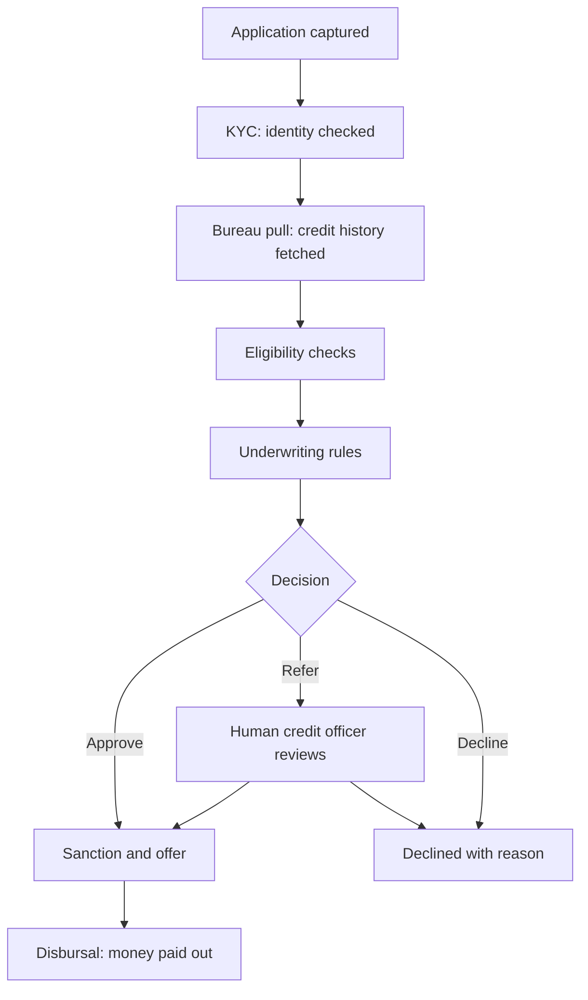

This is a typical LOS journey. Each box is a step I would map, with who does it, what data it needs and what it hands to the next step.

| Term | Plain meaning |
|---|---|
| KYC, know your customer | Checking the borrower is who they say they are |
| Credit bureau | A company that keeps everyone's borrowing history (in India, for example, CIBIL) |
| Bureau pull | The system fetching the applicant's credit report and score |
| Eligibility criteria | The conditions a borrower must meet, such as minimum income |
| Underwriting rule layer | The logic that approves, refers or declines each application |
| Refer | Neither approve nor decline automatically; send to a person to decide |
| Sanction | The bank formally agreeing to lend a stated amount on stated terms |
| Disbursal | Paying the loan money out |

### Worked example — from policy line to test case

This example is illustrative, to show the method. It is not any client's actual policy.

**Step 1: the policy says, in plain words:** "The applicant's total monthly loan repayments, including the new loan, must not exceed half of their net monthly income."

**Step 2: turn it into a precise rule.** This ratio has a name in Indian lending: **FOIR, fixed obligations to income ratio**.

$$
\text{FOIR} = \frac{\text{existing EMIs} + \text{new EMI}}{\text{net monthly income}} \le 50\%
$$

- **EMI, equated monthly instalment:** the fixed amount paid every month on a loan
- **Net monthly income:** take-home pay after tax

**Step 3: specify every calculation the rule depends on.** The new EMI is not given; the system must calculate it:

$$
\text{EMI} = \frac{P \times r \times (1+r)^n}{(1+r)^n - 1}
$$

- **P:** the loan amount
- **r:** the monthly interest rate (annual rate ÷ 12)
- **n:** the number of months

**Step 4: work the right answer out in advance.** Applicant: net income ₹80,000 a month, existing EMIs ₹15,000, asking for ₹5,00,000 at 12% a year over 36 months.

| Calculation | Value |
|---|---|
| Monthly rate r | 12% ÷ 12 = 1% |
| New EMI | ₹16,607 |
| Total EMIs | ₹15,000 + ₹16,607 = ₹31,607 |
| FOIR | ₹31,607 ÷ ₹80,000 = 39.5% |
| Rule | 39.5% ≤ 50% → passes |

**Step 5: write the specification line.** A good specification leaves nothing to guess:

| Specification item | What it must say |
|---|---|
| Inputs | Net monthly income (from which document), existing EMIs (from the bureau report or declared, and which wins if they differ) |
| Calculation | The EMI formula above, the rounding rule (to the rupee, rounded up or to nearest) |
| Rule | FOIR ≤ 50% passes; above it declines or refers (the policy decides which) |
| Edge cases | Income missing, zero existing loans, joint applicants |
| Output | Pass or fail, the FOIR value, and the reason code shown to the credit officer |

**Step 6: the test pack.** Test cases are written *before* testing, with the expected result already worked out:

| Case | Income | Existing EMIs | New EMI | Expected FOIR | Expected result |
|---|---|---|---|---|---|
| Clear pass | ₹80,000 | ₹15,000 | ₹16,607 | 39.5% | Pass |
| Exactly on the line | ₹80,000 | ₹23,393 | ₹16,607 | 50.0% | Pass (≤ includes equal) |
| Just over | ₹80,000 | ₹23,500 | ₹16,607 | 50.1% | Fail |
| Missing income | — | ₹15,000 | ₹16,607 | — | Refer, reason "income not verified" |

The "exactly on the line" case matters most. Systems often get boundaries wrong: the policy says "must not exceed" (≤) and a developer writes "less than" (<). The case at exactly 50% catches it.

**Step 7: defects.** If the system returns "Fail" for the 50.0% case, that is a **defect**: the system does something different from the specification. It is logged, fixed by engineering, and the case is run again until it passes.

### How it works — UAT and go-live

| Term | Plain meaning |
|---|---|
| Functional specification (FSD) | A document stating exactly how the system must behave |
| BRD, business requirements document | What the business needs, before deciding how the system does it |
| UAT, user acceptance testing | The business testing the system on realistic cases before it goes live |
| Test pack | A set of test cases with expected results written beforehand |
| Defect | Something the system does differently from the specification |
| Sign-off | The client formally agreeing the system is ready |
| Go-live | The day a client starts using the system for real |

**Why expected results must be written first:** if you work out the answer after seeing what the system produced, you tend to accept whatever it produced. Writing the answer first makes the test honest.

**Why it matters:** this is the start of every loan. If the policy is translated wrongly, every loan the system approves afterwards carries that mistake.

---

## Jana Small Finance Bank

**Manager — Loan Product and Portfolio Analytics · Bengaluru · November 2021 to March 2022**

**In one line:** my main work was portfolio analytics on the retail lending book — personal and SME loans — turned into monthly reports and the dashboards for the credit committee, which met twice a month with the senior risk committee, including the CRO.

| What I did | In plain words |
|---|---|
| Portfolio analytics on the retail book | Tracked how the loans were behaving: DPD buckets, PAR, vintages, and the same numbers cut by zone, region, state and branch |
| Credit committee dashboards and presentations | Two credit committee meetings a month, attended by the senior risk committee including the CRO; I built the dashboards and presentations for them |
| Monthly reports | The regular monthly report pack on the book |
| Automated portfolio reporting in SQL | Reports that were built by hand from manual extracts now ran on a schedule; turnaround fell by 30% |
| One definition per metric | Worked with retail and SME teams to turn credit policy into consistent reporting definitions |
| Reconciled a metric computed differently across sources | Found why two systems gave different numbers for the same thing, and fixed it |
| Tools | Oracle database (SQL), KNIME for workflows, Excel for the final reports |

**About the numbers and tables in this section:** the work above is mine. The database tables, SQL, KNIME steps and every number are **illustrative** — a typical picture of how a small finance bank's portfolio analytics works, built to explain the ecosystem. They are not Jana's actual schema or figures.

### The setting — what a small finance bank is

A **small finance bank (SFB)** is a type of bank licensed by the RBI to serve people and businesses that big banks often under-serve: small borrowers, micro and small enterprises, lower-income households. Many SFBs, Jana included, grew out of microfinance companies.

Two RBI rules shape an SFB's book:

| Rule | What it means for the book |
|---|---|
| Priority sector lending | 75% of lending must go to priority sectors such as agriculture, micro and small enterprises, and weaker sections |
| Small ticket sizes | At least half the loan book must be loans of up to ₹25 lakh |

So an SFB's book is made of many small loans, spread across many branches. That is exactly why portfolio analytics matters so much there: no single loan decides anything, the *pattern* across thousands of loans does.

| Term | Plain meaning |
|---|---|
| Retail lending book | All the bank's retail loans, viewed together |
| Personal loan | An unsecured loan to an individual, repaid in monthly EMIs |
| SME loan | A loan to a small or medium business; often larger, sometimes secured |
| CRO, chief risk officer | The executive in charge of all risk in the bank |
| Credit committee | The senior group that reviews the loan book and approves credit decisions and policy changes |

### The monthly cycle

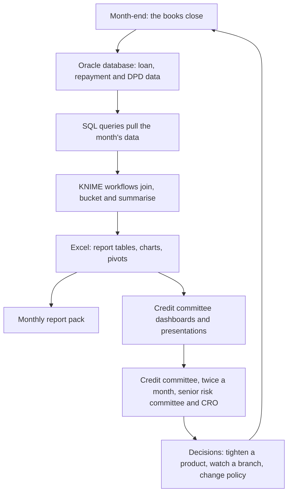

The loop matters: the committee's decisions change how loans are made next month, and next month's numbers show whether the decision worked.

### The data ecosystem — where the numbers live

A bank's loan data lives in an **Oracle database**: a large, widely used database that stores data in tables (rows and columns) and is queried with SQL. No single table holds "the portfolio". The picture is built by joining many tables.

This is a **typical** set of tables in a lending database. The names are illustrative.

| Table (illustrative) | One row per | Key columns | What it answers |
|---|---|---|---|
| `LOAN_ACCOUNT` | Loan | loan ID, customer ID, product code, branch code, sanction amount, disbursal date, tenure, interest rate | What was lent, to whom, where |
| `CUSTOMER` | Borrower | customer ID, age, income, occupation, bureau score | Who the borrower is |
| `PRODUCT_MASTER` | Product | product code, product name, category (personal or SME), secured or unsecured | What kind of loan |
| `BRANCH_MASTER` | Branch | branch code, branch name, state, region, zone | Where the loan sits in the geography |
| `DISBURSEMENT` | Payout | loan ID, date, amount | When money went out |
| `REPAYMENT_SCHEDULE` | Instalment due | loan ID, due date, EMI, principal part, interest part | What was supposed to be paid |
| `REPAYMENT_TXN` | Payment received | loan ID, payment date, amount | What was actually paid |
| `DPD_SNAPSHOT` | Loan per month-end | loan ID, snapshot date, DPD, principal outstanding, overdue amount, asset classification | How late each loan was at each month-end |
| `COLLECTION_TXN` | Collection activity | loan ID, date, amount collected, mode | What collections recovered |
| `WRITE_OFF` | Written-off loan | loan ID, date, amount, later recoveries | What was lost, and what came back |
| `SME_BORROWER` | SME business | turnover, industry, years in business | The business behind an SME loan |

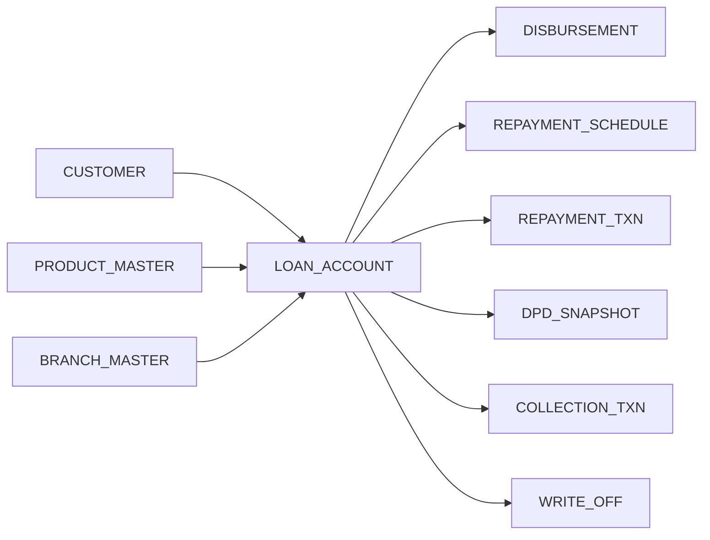

`LOAN_ACCOUNT` is the hub: every other table connects to it through the **loan ID**. A **key** is the column two tables share so they can be joined.

**The most important table is the month-end snapshot.** Portfolio analytics compares months: how many loans were late last month versus this month, how a batch of loans aged. That only works if the bank keeps a frozen copy of every loan's state at each month-end. Today's live tables only show *now*; the snapshot shows *history*.

### How a number is built — one query, end to end

To answer "how much of each zone's book is in each DPD bucket this month-end?", the query joins three tables, puts each loan in a bucket, and adds up the balances.

```sql
-- Illustrative: month-end book by zone and DPD bucket (Oracle SQL)
SELECT
    b.zone,
    p.category,                                   -- PERSONAL or SME
    CASE
        WHEN s.dpd = 0              THEN '0 Regular'
        WHEN s.dpd BETWEEN 1  AND 30 THEN '1 SMA-0'
        WHEN s.dpd BETWEEN 31 AND 60 THEN '2 SMA-1'
        WHEN s.dpd BETWEEN 61 AND 90 THEN '3 SMA-2'
        ELSE                              '4 NPA'
    END                                 AS dpd_bucket,
    COUNT(*)                            AS loans,
    SUM(s.principal_outstanding)        AS outstanding
FROM dpd_snapshot s
JOIN loan_account   l ON l.loan_id     = s.loan_id
JOIN branch_master  b ON b.branch_code = l.branch_code
JOIN product_master p ON p.product_code = l.product_code
WHERE s.snapshot_date = DATE '2022-01-31'
GROUP BY b.zone, p.category,
    CASE
        WHEN s.dpd = 0              THEN '0 Regular'
        WHEN s.dpd BETWEEN 1  AND 30 THEN '1 SMA-0'
        WHEN s.dpd BETWEEN 31 AND 60 THEN '2 SMA-1'
        WHEN s.dpd BETWEEN 61 AND 90 THEN '3 SMA-2'
        ELSE                              '4 NPA'
    END
ORDER BY b.zone, p.category, dpd_bucket;
```

| Part of the query | What it does |
|---|---|
| `FROM ... JOIN ...` | Brings the snapshot, loan, branch and product tables together on their keys |
| `CASE ... END` | Puts each loan in a DPD bucket |
| `WHERE snapshot_date = ...` | Picks one month-end |
| `GROUP BY` | Adds up loans and balances per zone, product and bucket |

### KNIME — workflows without writing code

**KNIME** is a visual data tool. Instead of writing code, you connect boxes called **nodes** on a canvas; each node does one job, and data flows through them left to right. Once built, the workflow runs the same way every month.

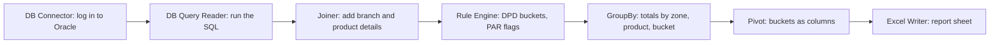

| Node (typical) | Job |
|---|---|
| DB Connector | Connects to the Oracle database |
| DB Query Reader | Runs a SQL query and brings back the rows |
| Joiner | Joins two tables on a key |
| Rule Engine | Applies if-then rules, such as "DPD over 90 → NPA" |
| GroupBy | Adds up or counts per group |
| Pivot | Turns rows into columns (for example, one column per DPD bucket) |
| Excel Writer | Writes the result into an Excel file |

**Why a workflow beats doing it by hand:** the steps are saved, visible and repeatable. The same logic runs every month, so numbers are comparable, and nobody has to remember which filter they applied last time. This is where turnaround time drops.

**Excel** is the last mile: formatting the tables, pivot tables for drill-downs, charts, and the pages that go into the report pack and the committee presentation.

### The portfolio analytics toolkit

Each tool below answers one question the credit committee asks. All numbers are illustrative.

#### 1. DPD buckets — how late is each loan?

**In one line:** every loan is placed in a bucket by how many days its payment is overdue.

**DPD, days past due,** counts how many days a payment is overdue. The RBI buckets:

| Bucket | Days past due | What it signals |
|---|---|---|
| Regular | 0 | Paying on time |
| SMA-0 | 1–30 | Slipped, often a one-off |
| SMA-1 | 31–60 | A pattern starting |
| SMA-2 | 61–90 | Close to default |
| NPA | More than 90 | Non-performing: the loan has gone bad |

- **SMA, special mention account:** RBI's early-warning labels for overdue loans before they turn bad
- **NPA, non-performing asset:** a loan more than 90 days overdue

#### 2. PAR — how much of the book is at risk?

**In one line:** PAR is the share of the book held by loans that are overdue beyond a number of days.

$$
\text{PAR}_{X+} = \frac{\text{outstanding of all loans more than X days overdue}}{\text{total outstanding}}
$$

**PAR, portfolio at risk,** comes from microfinance and is a standard SFB measure. The key detail: it counts the **whole outstanding balance** of a late loan, not just the missed instalment. A loan that has missed one ₹5,000 EMI still has, say, ₹1 lakh at risk.

**Worked example (illustrative):** a book of ₹500 crore.

| Measure | Loans counted | Outstanding | PAR |
|---|---|---|---|
| PAR 1+ | Any payment overdue | ₹40 crore | 8.0% |
| PAR 30+ | More than 30 days overdue | ₹22 crore | 4.4% |
| PAR 60+ | More than 60 days overdue | ₹16 crore | 3.2% |
| PAR 90+ | More than 90 days overdue (the NPAs) | ₹12 crore | 2.4% |

The missed instalments inside that ₹40 crore might total only ₹3 crore. Reporting "₹3 crore overdue" would hide the real risk; PAR shows ₹40 crore of the book is wobbling.

| Measure | Question it answers |
|---|---|
| PAR 1+ | How much of the book has slipped at all? The earliest warning |
| PAR 30+ | How much is in real trouble? The most watched number |
| PAR 90+ | How much has gone bad? Equals the NPA book |
| GNPA ratio | NPA outstanding ÷ total outstanding |
| NNPA ratio | NPAs after subtracting the provisions already set aside, ÷ net advances |

#### 3. Vintage analysis — is the new lending better or worse?

**In one line:** group loans by the month they were disbursed, then track each group's bad rate as it ages.

A **vintage** (or cohort) is all loans disbursed in the same month. **MOB, months on book,** is how many months since disbursal. The vintage table compares every batch at the same age, which is fair: a loan disbursed last month cannot have gone bad yet.

**Worked example (illustrative):** share of each vintage that has ever been 30+ DPD.

| Vintage | MOB 3 | MOB 6 | MOB 9 | MOB 12 |
|---|---|---|---|---|
| Jan 2021 | 0.4% | 1.2% | 2.0% | 2.6% |
| Apr 2021 | 0.5% | 1.4% | 2.3% | — |
| Jul 2021 | 0.9% | 2.4% | — | — |
| Oct 2021 | 1.3% | — | — | — |

Read down a column: at MOB 3, each newer vintage is worse (0.4% → 1.3%). Something changed in how loans were made after mid-2021: a policy change, a new sourcing channel, a region pushing volume. Vintage analysis catches this *months* before it shows in the overall NPA ratio, because the whole book is dominated by older, seasoned loans.

**Why this beats the overall NPA ratio:** when a bank grows fast, the book fills with young loans that have not had time to go bad, so the NPA ratio looks great. Vintages remove that illusion.

#### 4. Roll rates — where are late loans heading?

**In one line:** the share of loans in one bucket that move to the next bucket a month later.

**Worked example (illustrative):** ₹20 crore sits in SMA-0 this month. History says:

| Move | Roll rate | Amount |
|---|---|---|
| SMA-0 → SMA-1 next month | 25% | ₹5 crore |
| SMA-1 → SMA-2 the month after | 40% | ₹2 crore |
| SMA-2 → NPA the month after | 50% | ₹1 crore |

So about ₹1 crore of today's SMA-0 loans is likely to be NPA in three months. Roll rates turn today's early delinquency into a forecast of tomorrow's NPAs, which is what lets the committee act early. The reverse moves (back to regular) are called **cures**.

#### 5. Collection efficiency — are we collecting what is due?

**In one line:** the amount collected in the month divided by the amount due.

**Worked example (illustrative):** ₹60 crore of EMIs fell due this month and ₹57 crore was collected: collection efficiency is 95%. A fall from 98% to 95% in one zone is an early signal, often before DPD moves. Banks track it with and without arrears (older overdue amounts).

#### 6. Geography — where is the problem?

**In one line:** every measure above, cut by zone, region, state and branch, to find where a problem sits.

**Worked example (illustrative):**

| Zone | Book | PAR 30+ | GNPA | Collection efficiency |
|---|---|---|---|---|
| North | ₹120 crore | 3.1% | 1.9% | 97% |
| South | ₹180 crore | 3.8% | 2.2% | 96% |
| East | ₹90 crore | **7.9%** | **4.1%** | **91%** |
| West | ₹110 crore | 3.5% | 2.0% | 97% |

East stands out on every measure. The next step is a **drill-down**: open East by region, then state, then branch. Often the problem is concentrated — two or three branches, one product, one quarter's vintages — rather than spread evenly. That turns "East is bad" into "these three branches, since this policy change", which is something the committee can act on.

#### 7. Product — personal versus SME

The same measures, cut by product, because the two books behave differently:

| | Personal loans | SME loans |
|---|---|---|
| Ticket size | Small | Larger |
| Security | Usually none | Sometimes collateral |
| What drives default | Job loss, over-borrowing | Business cash flow, the local economy |
| What to watch | Vintages, early DPD, bureau behaviour | Sector concentration, larger single exposures |

#### 8. Growth and concentration

How fast the book is growing, average ticket size, the share of the top borrowers or top branches, and the mix by product and geography. Fast growth in one place is not bad on its own, but it is where the next vintage problem usually starts.

### The monthly reports and the credit committee pack

The report pack and the committee presentation used the toolkit above. A typical structure for such a pack:

| Page | What it shows | The question it answers |
|---|---|---|
| Book summary | Outstanding, disbursements, growth, mix by product | How big is the book and where is it growing? |
| Asset quality | DPD buckets, PAR 1+/30+/90+, GNPA and NNPA, trend over months | Is the book getting better or worse? |
| Vintages | Vintage curves by product | Is new lending as good as old lending? |
| Flows | Roll rates and cures | How much will turn bad in the next few months? |
| Collections | Collection efficiency by zone and product | Are we collecting what is due? |
| Geography | Zone and region league table, flagged outliers | Where is the problem? |
| Watchlist | Branches, products or large SME exposures needing attention | What needs a decision today? |

**Why a presentation, not just a report:** a report holds every number; the committee has limited time. The presentation tells the story: what changed this month, why, and what decision is needed. Every chart earns its place by answering a question someone in the room will ask.

### Definitions and reconciliation

A number like GNPA sounds exact. It isn't, until every choice behind it is written down.

| Choice hidden inside one metric | Option A | Option B |
|---|---|---|
| Which date? | Month-end | The day the report was run |
| Counted how? | Per loan account | Per customer (one customer may have three loans) |
| Written-off loans? | Included | Excluded |
| Which amount? | Principal only | Principal plus unpaid interest |
| Which loans? | All retail | Retail excluding staff loans |

If two teams choose differently, both are "right" and management still sees two numbers. A **reporting definition** fixes every choice, taken from the credit policy.

**Worked example (illustrative) — a reconciliation.** The dashboard says the NPA book is ₹42 crore; the core banking extract says ₹45 crore. A **reconciliation** proves two numbers that should match really do, and explains every rupee of the gap.

| Step | Finding | Gap explained | Gap left |
|---|---|---|---|
| Start | Dashboard ₹42 crore vs extract ₹45 crore | — | ₹3.0 crore |
| 1 Align the date | Dashboard used the run date; three loans were paid up after month-end | ₹1.2 crore | ₹1.8 crore |
| 2 Align the amount | Extract included unpaid interest; dashboard used principal only | ₹1.5 crore | ₹0.3 crore |
| 3 Align the scope | Extract included staff loans the policy excludes | ₹0.3 crore | ₹0 |

The fix is not to pick one number. It is to agree the definition and make both sources compute it that way.

| Term | Plain meaning |
|---|---|
| Oracle database | A widely used database that stores data in tables, queried with SQL |
| SQL | The language used to pull and summarise data from databases |
| Key | The column two tables share so they can be joined, such as loan ID |
| Month-end snapshot | A frozen copy of every loan's state at a month-end |
| KNIME | A visual tool for building data workflows from connected nodes |
| Node | One step in a KNIME workflow |
| DPD | Days past due: how late a payment is |
| PAR | Portfolio at risk: outstanding of late loans ÷ total outstanding |
| GNPA / NNPA | Bad loans as a share of the book, before / after provisions |
| Vintage | All loans disbursed in the same month |
| MOB | Months on book: months since disbursal |
| Roll rate | Share of loans moving to the next, worse bucket in a month |
| Cure | A late loan returning to regular |
| Collection efficiency | Amount collected ÷ amount due |
| Drill-down | Opening a number into its parts: zone → region → state → branch |
| Reporting definition | The exact rule for calculating a number |
| Reconciliation | Proving two numbers match, and explaining any gap |

**Why it matters:** in a bank of many small loans, risk shows up as a pattern before it shows up as a loss. Portfolio analytics finds the pattern early, and puts it in front of the people who can act on it.

---
## Project 1 — Retail credit risk system

**In one line:** I built, in Python, the whole chain a bank runs on a loan book — who will default, what a default costs, how much to set aside, how much capital to hold, and how to watch the book — on 466,285 real loans, with every shortcut stated openly.

| Question | Answer |
|---|---|
| Data | 466,285 personal loans from LendingClub, a US lending platform that made its loan records public; issued 2007 to 2014; 75 columns per loan |
| Question the main model answers | Will this loan default within 12 months of being issued? |
| Built | Default definition, sample split, WoE binning, two PD models, a 600-point scorecard, an 8-grade rating scale, validation, stability checks, a two-stage LGD model, EAD, lifetime PD, IFRS 9 staging and ECL, a CECL comparison, Basel IRB capital, portfolio monitoring, a dashboard and a small AI analyst |
| Built with | Python: pandas, scikit-learn, statsmodels, scipy; 25 automated test files |
| Status | Live; every number below is **real**, from the project's output tables, unless marked illustrative |

### The project in one picture

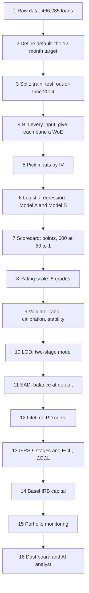

The chain has three blocks. Steps 1–9 build and prove the **PD** model: the chance of default. Steps 10–11 build **LGD** and **EAD**: how much is lost and on how much. Steps 12–16 use all three: provisions, capital and monitoring.

| Term | Plain meaning |
|---|---|
| PD, probability of default | The chance a borrower stops paying within a year |
| LGD, loss given default | The share of the money owed that is lost if they default |
| EAD, exposure at default | How much is owed at the moment of default |
| EL, expected loss | PD × LGD × EAD: the loss expected on average |
| Provision (ECL) | Money set aside today, from profit, for losses expected later |
| Capital | The bank's own money, held to survive a bad year, not an average one |

**The key idea behind the whole chain:** expected loss is the *average* cost of lending, so it is priced in and provided for. Capital covers the *unexpected* loss: the bad year. Provisions follow accounting rules (IFRS 9; in India, Ind AS 109). Capital follows banking regulation (Basel).

### Step 1 — The raw data

**In one line:** one row per loan, 75 columns, frozen at a snapshot in January 2016.

Each row is one loan. The columns fall into two very different groups, and keeping them apart is the first rule of the project:

| Group | Examples | Can the PD model use it? |
|---|---|---|
| **Known at application** | Loan amount, term, interest rate, grade, income, DTI, home ownership, purpose, credit enquiries, credit utilisation | Yes |
| **Known only later** | Loan status, payments received, recoveries, last payment date, outstanding principal | **No** — only for defining default, LGD and EAD |
| Identifiers and free text | Loan ID, URL, job title, description | No |

**Why the "known later" columns are banned from the PD model:** the model will be used on the day of application, when none of that exists. If a model learns from "total payments received", it looks brilliant in testing and is useless in real life. This mistake is called **leakage**. The project writes the variable groups into a configuration file and the code **refuses to run** if a banned column reaches the PD model.

| Term | Plain meaning |
|---|---|
| DTI, debt-to-income | Monthly debt payments as a share of monthly income |
| Grade and sub-grade | LendingClub's own risk rating, A (safest) to G, each split 1–5 |
| Credit enquiries | How many times lenders checked the borrower's credit recently |
| Revolving utilisation | How much of their credit card limits they are using |
| Leakage | Using information in training that won't exist at the moment of prediction |

### Step 2 — Define default: the target

**In one line:** a loan is "bad" if it reached a default status, and it counts for the model only if that happened within 12 months of issue.

The data has no "default date", only a status and a last payment date. So the project builds the target in three moves:

| Move | Rule, exactly as coded |
|---|---|
| 1 Which loans defaulted? | Status is Charged Off, Default, or Late (31–120 days), or the older "does not meet credit policy: Charged Off" |
| 2 When did they default? | Estimated default date = last payment date + 3 months (roughly when 90 days overdue is reached); if there is no payment date, the issue date |
| 3 Within 12 months? | Default within 0–12 months of issue → `default_12m = 1`; otherwise 0 |

**Why 12 months:** both IFRS 9 Stage 1 and Basel work with a one-year PD. The model answers exactly the question those rules ask.

**Real result:**

| Item | Loans | Share |
|---|---|---|
| All loans | 466,285 | 100% |
| Never defaulted | 415,317 | 89.07% |
| Ever defaulted | 50,968 | 10.93% |
| … within 12 months (the target) | **16,018** | **3.44%** |
| … after 12 months | 34,950 | 7.50% |

By year of issue (called the **vintage**), the 12-month default rate fell from 6.56% (2008) to 3.18% (2013), then 3.44% for 2014: the early book was small and risky, and LendingClub tightened as it grew.

### Step 3 — Split the data

**In one line:** build on 2007–2013, check on a hidden slice of the same years, then test on 2014 as if it were the future.

| Sample | Loans | Defaults | Default rate | Used for |
|---|---|---|---|---|
| Train (80% of 2007–2013) | 184,525 | 6,329 | 3.43% | Building everything |
| Test (20% of 2007–2013) | 46,132 | 1,582 | 3.43% | Checking on unseen loans from the same years |
| Out-of-time (all of 2014) | 235,628 | 8,107 | 3.44% | Checking on a later year, like real life |

- **Stratified split:** the 80/20 split keeps the default rate the same in both parts (3.43% and 3.43%), so neither is luckier
- **Out-of-time (OOT):** a model is always used on *future* loans; testing on a later year is the honest test
- **Fixed seed:** the random split uses a fixed seed (42), so the same split comes out every run
- The code checks that no loan ID appears in two samples

Every rule learned in the next steps (bins, WoE, model weights) is learned on **train only**, then applied unchanged to test and OOT.

### Step 4 — Bin every input and give each band a weight of evidence

**In one line:** each input is cut into bands, and each band gets a number saying how strongly it points to good or bad borrowers.

Raw inputs are messy: income runs from tiny to millions, with outliers and blanks, and the link to default is rarely a straight line. So each input is cut into **bands** (bins) first. How the project cuts them:

| Rule | How it works in the code |
|---|---|
| Start fine | Numbers are first cut into 20 equal-sized bands |
| Merge until sensible | Neighbouring bands are merged until every band holds at least 5% of loans **and** risk moves in one direction only (called **monotonic**) |
| Categories | Categories with under 5% of loans are grouped into "OTHER" |
| Missing values | Blanks get their own band, called MISSING, rather than being guessed |
| Smoothing | +0.5 is added to counts so no band divides by zero |

Then each band gets its **weight of evidence (WoE)**:

$$
\text{WoE} = \ln\left(\frac{\%\ \text{of all good loans that fall in this band}}{\%\ \text{of all bad loans that fall in this band}}\right)
$$

- **Good:** did not default within 12 months; **bad:** did
- **ln:** the natural logarithm; it makes "twice as many goods" and "twice as many bads" equal in size, opposite in sign

| WoE | Reads as |
|---|---|
| Positive | The band holds more than its share of good loans: safer than average |
| Zero | The band tells you nothing |
| Negative | The band holds more than its share of bad loans: riskier than average |

**Real example — annual income, as the project binned it:**

| Income band (USD) | WoE | Reading |
|---|---|---|
| Under 40,000 | −0.32 | Riskier than average |
| 40,000 – 50,000 | −0.14 | Slightly riskier |
| 50,000 – 65,000 | −0.03 | About average |
| 65,000 – 75,000 | +0.10 | Slightly safer |
| 75,000 – 102,200 | +0.23 | Safer |
| Over 102,200 | +0.43 | Safest |
| MISSING | −1.14 | Much riskier: an unknown income is a warning sign |

The pattern rises smoothly: more income, safer borrower. That smoothness is what the merging rule enforces.

**Why banks do this:** WoE bands tame outliers and blanks, make risk move in one clear direction, and put every input on the same scale (the log of a good-to-bad ratio). Every band can be explained to a credit committee and a regulator.

### Step 5 — Pick the inputs: information value

**In one line:** IV scores a whole input by how differently goods and bads are spread across its bands; weak inputs are dropped.

WoE scores one band. **Information value (IV)** scores the whole input, by adding up every band:

$$
\text{IV} = \sum_{\text{bands}} \big(\%\ \text{goods} - \%\ \text{bads}\big) \times \text{WoE}
$$

**How to read that in plain words.** For each band, ask two things: *how different* are the shares of goods and bads here (the first bracket), and *how strongly* does that point one way (the WoE). Multiply, then add up across bands. Both parts always carry the same sign, so every band adds a positive amount. An input whose bands all hold goods and bads in the same proportion scores zero: it cannot tell them apart.

**Worked example (illustrative):** an input with two bands.

| Band | % of goods | % of bads | Difference | WoE | Contribution |
|---|---|---|---|---|---|
| Band 1 | 80% | 60% | +0.20 | ln(0.80/0.60) = +0.29 | 0.20 × 0.29 = 0.058 |
| Band 2 | 20% | 40% | −0.20 | ln(0.20/0.40) = −0.69 | −0.20 × −0.69 = 0.139 |
| **IV** | | | | | **0.197** |

That is a **medium** input. The rule-of-thumb scale the project uses:

| IV | Strength |
|---|---|
| Below 0.02 | Useless: dropped |
| 0.02 – 0.1 | Weak |
| 0.1 – 0.3 | Medium |
| 0.3 – 0.5 | Strong |
| Above 0.5 | Suspicious: too good, check for leakage |

**Real IV ranking (top of 48 inputs tested):**

| Input | IV | Strength |
|---|---|---|
| Grade | 0.294 | Medium |
| Interest rate | 0.277 | Medium |
| Credit enquiries, last 6 months | 0.076 | Weak |
| Sub-grade | 0.074 | Weak |
| Annual income | 0.060 | Weak |
| Loan purpose | 0.051 | Weak |
| Total current balance | 0.038 | Weak |
| Home ownership | 0.034 | Weak |
| Total revolving limit | 0.026 | Weak |
| Term | 0.025 | Weak |
| DTI | 0.023 | Weak |
| Revolving utilisation | 0.021 | Weak |
| Employment length and the rest | below 0.02 | Useless |

**The selection rules, in order:**

| Rule | Effect |
|---|---|
| Keep IV ≥ 0.02 | 12 inputs survive |
| Drop unstable inputs | Total current balance and total revolving limit are dropped: they are missing for loans before late 2012, so they would behave differently over time |
| Leakage check | The code confirms none of the survivors is a "known later" column |
| **Model B** (full) | The 10 inputs left |
| **Model A** (fundamentals) | The same, minus grade, sub-grade and interest rate: 7 inputs |

**Why two models:** grade, sub-grade and interest rate are LendingClub's *own* risk assessment. Model A asks "how well can we rank borrowers from their fundamentals alone?" Model B asks "how well with everything?" The gap between them shows how much of the signal was already in the platform's pricing.

### Step 6 — Predict default: logistic regression

**In one line:** logistic regression adds up the evidence into one score, then turns that score into a probability between 0 and 1.

Build it up from three ideas.

**Idea 1 — probability, odds, log-odds.** They are three ways of saying the same thing:

| Probability of default | Odds (bad : good) | Log-odds |
|---|---|---|
| 50% | 1 : 1 | 0 |
| 20% | 1 : 4 | −1.39 |
| 3.4% | 1 : 28 | −3.34 |
| 1% | 1 : 99 | −4.60 |

Probability is stuck between 0 and 1. Log-odds can be any number, positive or negative. That makes log-odds the natural thing to build by **adding**.

**Idea 2 — add up the evidence.** Start from a base value, then let each input push it up or down by its weight:

$$
z = b_0 + b_1 \cdot \text{WoE}_1 + b_2 \cdot \text{WoE}_2 + \dots + b_{10} \cdot \text{WoE}_{10}
$$

- **z:** the log-odds of default for this borrower
- **b₀, the intercept:** the starting point when every WoE is zero (an average borrower)
- **b₁ … b₁₀, the coefficients:** how hard each input pushes; the model learns them from the training loans

**Idea 3 — turn it back into a probability:**

$$
\text{PD} = \frac{1}{1 + e^{-z}}
$$

This S-shaped curve (the **sigmoid**) turns any z into a number between 0 and 1.

**How the weights are learned.** The model tries weights, computes a PD for every one of the 184,525 training loans, and checks how well those PDs match what actually happened. It keeps adjusting until the match is as good as it can get. That method is called **maximum likelihood**: choose the weights that make the real outcomes most likely.

**Real Model B weights:**

| Input | Coefficient | p-value | Significant? |
|---|---|---|---|
| Intercept | −3.338 | < 0.001 | Yes |
| Annual income | −0.920 | < 0.001 | Yes |
| Credit enquiries | −0.748 | < 0.001 | Yes |
| Loan purpose | −0.718 | < 0.001 | Yes |
| Grade | −0.618 | < 0.001 | Yes |
| DTI | −0.489 | < 0.001 | Yes |
| Home ownership | −0.466 | < 0.001 | Yes |
| Interest rate | −0.236 | 0.001 | Yes |
| Revolving utilisation | −0.224 | 0.018 | Yes |
| Sub-grade | −0.107 | 0.088 | No |
| Term | −0.017 | 0.853 | No |

**How to read this table:**

- **Every coefficient is negative, and that is correct.** WoE is positive for *safe* bands; the model predicts *default*. So a safer band (positive WoE) × a negative weight pushes z down, lowering the PD. A positive coefficient would mean something is wrong, and the code flags any.
- **The intercept −3.338** is the log-odds of an average borrower: 1 ÷ (1 + e<sup>3.338</sup>) = **3.43%**, exactly the training default rate.
- **p-value:** the chance of seeing a weight this far from zero if the input truly had no effect. Below 0.05 is called significant. Sub-grade and term are not significant *once grade and interest rate are in*, because they repeat the same information. They were kept in Model B as built; in a production model they would be candidates to drop.

**Worked example (real weights) — two borrowers:**

| Input | Safe borrower | Push on z | Risky borrower | Push on z |
|---|---|---|---|---|
| Grade | A | −0.65 | E | +0.38 |
| Interest rate | under 6.92% | −0.33 | 19.72% or more | +0.17 |
| Enquiries | none | −0.12 | 2 or more | +0.45 |
| Income | over 102,200 | −0.39 | under 40,000 | +0.29 |
| Purpose | credit card | −0.23 | other | +0.31 |
| Home | mortgage | −0.09 | rent | +0.09 |
| DTI | under 9.45 | −0.08 | 26.72 or more | +0.14 |
| Utilisation | under 28.9% | −0.04 | 87.7% or more | +0.06 |
| Sub-grade, term | — | about 0 | — | about 0 |
| **z** | −3.338 − 1.92 | **−5.26** | −3.338 + 1.91 | **−1.43** |
| **PD** | | **0.52%** | | **19.3%** |

The same average starting point, pushed in opposite directions by the evidence: one borrower lands at half a percent, the other at nearly one in five.

**Why logistic regression, not a fancier model:** every decision has to be explained ("declined mainly because of many recent credit enquiries and low income"). With WoE inputs, each push can be read line by line, as in the table above. That is why it remains the standard for bank scorecards.

### Step 7 — The scorecard: turn the model into points

**In one line:** the log-odds are rescaled into points so that a higher score means safer, 600 points means odds of 50 to 1, and every 20 points doubles the odds.

A PD of 0.0052 is hard to use at a branch. Points are easy: add them up, compare with a cut-off. The scorecard is the same model, re-expressed.

**The two anchors the project chose:**

| Anchor | Value | Meaning |
|---|---|---|
| Base score | 600 points at odds of 50 : 1 | A borrower scoring 600 has 50 goods for every bad |
| PDO, points to double the odds | 20 | Every 20 extra points, the odds of being good double |

| Score | Odds (good : bad) | PD |
|---|---|---|
| 560 | 12.5 : 1 | 7.4% |
| 580 | 25 : 1 | 3.8% |
| 600 | 50 : 1 | 2.0% |
| 620 | 100 : 1 | 1.0% |
| 640 | 200 : 1 | 0.5% |

**The formula behind it.** The score is a straight-line rescaling of the log-odds of being good:

$$
\text{Score} = \text{Offset} + \text{Factor} \times \ln(\text{odds of good})
$$

$$
\text{Factor} = \frac{\text{PDO}}{\ln 2} = \frac{20}{0.693} = 28.85
$$

$$
\text{Offset} = 600 - 28.85 \times \ln 50 = 487.12
$$

- **Factor:** how many points one unit of log-odds is worth; dividing PDO by ln 2 is what makes 20 points = double the odds
- **Offset:** the shift that puts 600 exactly at 50 : 1

**Splitting the points across the inputs.** The total is shared out so that each band of each input carries its own points:

$$
\text{Points for a band} = \frac{\text{Offset} - \text{Factor} \times b_0}{10} + \text{Factor} \times (-b) \times \text{WoE}
$$

- The first part is a fixed **base** of 58.34 points per input (the offset and intercept shared evenly across the 10 inputs)
- The second part adds or removes points according to how safe the band is

**Worked example (real):** grade A has WoE +1.054 and the grade weight is −0.618. Points = 58.34 + 28.85 × 0.618 × 1.054 = 58.34 + 18.8 = **77**. Grade E: 58.34 + 28.85 × 0.618 × (−0.622) = **47**.

**Real grade points in the scorecard:**

| Grade | A | B | C | D | E | OTHER (F, G) |
|---|---|---|---|---|---|---|
| Points | 77 | 65 | 57 | 50 | 47 | 41 |

**The two borrowers again, now scored:** the safe borrower's points add up to **639**, which works back to odds of 193 : 1, a PD of 0.51%. The risky borrower scores **528**: odds of 4.1 : 1, a PD of 19.5%. The same answers as the logistic regression (tiny differences come from rounding each band's points), because the scorecard *is* the model.

### Step 8 — The rating scale: eight grades

**In one line:** the scores are cut into eight equal-sized grades, and the default rate must rise steadily from grade 1 to grade 8.

**Real master scale (training loans):**

| Grade | Score range | Loans | Defaults | Default rate |
|---|---|---|---|---|
| 1 (safest) | 614–639 | 21,930 | 189 | 0.86% |
| 2 | 604–613 | 23,998 | 321 | 1.34% |
| 3 | 597–603 | 22,475 | 437 | 1.94% |
| 4 | 591–596 | 21,074 | 531 | 2.52% |
| 5 | 584–590 | 24,353 | 751 | 3.08% |
| 6 | 577–583 | 22,564 | 972 | 4.31% |
| 7 | 568–576 | 23,203 | 1,204 | 5.19% |
| 8 (riskiest) | 522–567 | 24,928 | 1,924 | 7.72% |

The default rate rises at every step, 0.86% to 7.72%, a nine-fold spread. That is called **rank ordering**, and the code checks it holds. A bank uses a scale like this to set policy by grade: approve grades 1–5 automatically, refer 6–7, price 8 higher or decline.

### Step 9 — Validate the model: does it work?

**In one line:** a PD model must pass three tests — it must **rank** risky borrowers above safe ones, its PDs must be **accurate** (calibrated), and it must stay **stable** as new borrowers arrive — on loans it has never seen.

Think of a weather forecaster. **Ranking** asks: on the days she said "high chance of rain", did it rain more than on the days she said "low"? **Calibration** asks: on all the days she said "30%", did it rain on about 30% of them? **Stability** asks: is she still forecasting for the same kind of climate she learned on? A model can pass one test and fail another, so all three are checked.

| Test | Question | Measures | Checked on |
|---|---|---|---|
| Ranking (discrimination) | Are defaulters scored riskier than good borrowers? | AUC, Gini, KS | Train, test, OOT |
| Calibration | Do predicted PDs match actual default rates? | Brier score, Hosmer–Lemeshow | Train, test, OOT |
| Stability | Do today's borrowers look like the training ones? | PSI, CSI | Train vs OOT |

#### Ranking — AUC and Gini

**AUC, area under the ROC curve.** Pick one loan that defaulted and one that didn't, at random. AUC is the chance the model gave the defaulter the higher PD. A coin toss scores 0.5; a perfect model scores 1.

**Where the name comes from:** slide a cut-off from the riskiest score to the safest. At each cut-off, plot the share of defaulters caught against the share of good loans wrongly caught. That line is the **ROC curve**, and the area under it is the AUC.

**Gini** is the same idea rescaled so that random is 0 and perfect is 1:

$$
\text{Gini} = 2 \times \text{AUC} - 1
$$

**Real results:**

| Model | Sample | AUC | Gini |
|---|---|---|---|
| Model A (fundamentals, 7 inputs) | Train | 0.651 | 0.301 |
| | Test | 0.648 | 0.297 |
| | Out-of-time 2014 | 0.636 | 0.271 |
| **Model B (full, 10 inputs)** | Train | 0.684 | 0.368 |
| | Test | 0.682 | 0.363 |
| | **Out-of-time 2014** | **0.692** | **0.385** |

**How to read it:**

- **Test ≈ train** for both models: the model has not memorised its training loans. A big drop from train to test would be **overfitting**.
- **Model B beats Model A** by about 0.07 of Gini: LendingClub's own grade and rate carry real extra signal.
- **Model B holds up in 2014**, even slightly higher than in training. The project's explanation: the 2014 loans have had less time to default, so the defaults seen so far are concentrated in the riskiest loans, which makes ranking look sharper. It is a good sign, not proof of a better model.
- **Why ~0.38 is modest, and honest:** every loan here was already *approved* by LendingClub. The riskiest applicants were turned away and never appear in the data, so there is less to separate. Consumer scorecards on approved-only data typically land in this range.

#### Ranking — KS

**KS, Kolmogorov–Smirnov:** sort loans from riskiest to safest, walk down the list, and at each point compare the share of all defaulters you have passed with the share of all good loans you have passed. KS is the widest gap.

**Worked example (real, using the eight grades on the training loans):**

| Walking down to grade | % of all bads passed | % of all goods passed | Gap |
|---|---|---|---|
| 8 | 30.4% | 12.9% | 17.5 |
| 7 | 49.4% | 25.3% | 24.2 |
| **6** | **64.8%** | **37.4%** | **27.4** |
| 5 | 76.6% | 50.6% | 26.0 |
| 4 | 85.0% | 62.1% | 22.9 |
| 1 | 100% | 100% | 0 |

The three riskiest grades hold 37% of all loans but 65% of all defaults. The widest gap, 27.4 points, sits there. The exact loan-by-loan KS on training is **0.274**; on 2014 it is **0.284**.

#### Calibration — Brier score and Hosmer–Lemeshow

**Brier score:** the average of (predicted PD − actual outcome)², where the outcome is 1 for default and 0 otherwise. Lower is better. On its own the number means little, so compare it with a model that knows nothing and predicts 3.43% for everyone: that scores 0.0331. Model B scores **0.0326** on test. Better, but only a little, which is normal when defaults are rare.

**Hosmer–Lemeshow (HL) test:** sort loans into ten groups by predicted PD, then compare predicted defaults with actual defaults in each group. The test returns a **p-value**: the chance of seeing gaps this big if the model were perfectly calibrated. Above 0.05 passes; below fails.

| Model B | HL p-value | Result |
|---|---|---|
| Train | 0.0004 | Fails |
| Test | 0.494 | Passes |
| Out-of-time 2014 | 0.0012 | Fails |

**Why it fails, and why that is not the end of the story:** the test asks whether there is *any* gap at all. With 184,525 or 235,628 loans, it detects gaps far too small to matter in practice. That is why HL is always read together with a grade-by-grade comparison, like the master scale above, where predicted and actual line up in order. The project also tried two standard fixes, intercept recalibration (shifting all PDs so the average matches) and Platt scaling (refitting the probability curve); at this sample size the test still flagged a gap. Stating that openly is part of good model risk practice.

#### Stability — PSI and CSI

**PSI, population stability index:** compares how scores were spread in training with how they are spread now.

$$
\text{PSI} = \sum_{\text{bands}} (\text{now}\% - \text{then}\%) \times \ln\left(\frac{\text{now}\%}{\text{then}\%}\right)
$$

**Worked example (illustrative):** a score band held 25% of borrowers in training and 30% now: (0.30 − 0.25) × ln(1.2) = 0.009. Add every band's contribution.

| PSI | Reading |
|---|---|
| Below 0.1 | Stable |
| 0.1 – 0.25 | Watch it |
| Above 0.25 | The population has shifted; review the model |

**CSI, characteristic stability index,** is the same calculation on one input at a time, to find *which* input moved.

**Real results (train vs 2014):** score PSI **0.005** (Model A) and **0.007** (Model B), both stable. The input that moved most was DTI, with CSI **0.042**, still well inside "stable".

### Step 10 — LGD: how much is lost when a loan defaults?

**In one line:** for every defaulted loan, measure how much of the balance was never recovered; then model it in two stages, because most loans recover nothing at all.

**How LGD is measured from the data (real, exactly as coded):**

$$
\text{LGD} = \frac{\text{balance at default} - \text{recoveries after charge-off}}{\text{balance at default}}
$$

- **Balance at default:** amount lent − principal repaid before default
- **Recoveries:** money collected after the loan was charged off
- Clipped between 0 and 1

**Real LGD picture, 50,968 defaulted loans:**

| Measure | Value |
|---|---|
| Mean LGD | 93.0% |
| Median LGD | 100% |
| Loans with total loss (LGD = 100%) | 52.2% |
| Loans with some recovery | 47.8% |
| Mean recovery rate | 7.0% |

These are unsecured loans: no house or car to sell. Once charged off, little comes back.

**Why two stages.** Half the loans sit exactly at 100% loss; the rest are spread a little below it. A single straight-line model fitted through that lump would predict almost the same number for everyone. So the project splits the question in two, a design called a **hurdle model**:

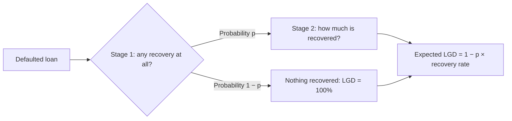

| Stage | Model | Target | Trained on |
|---|---|---|---|
| 1 | Logistic regression | Was anything recovered? (yes or no) | All defaulted loans in the training split |
| 2 | Gradient boosting regressor | What share was recovered? | Only loans with some recovery |

- **Gradient boosting:** a model built from many small decision trees, each correcting the errors of the ones before (the machine learning map in Part C explains it)
- **Inputs:** 13 application-time features such as grade, interest rate, term, income, DTI, purpose, WoE-binned with "any recovery" as the target
- **Split:** 40,774 defaulted loans to train, 10,194 to test

**Worked example (illustrative, the combining rule):** Stage 1 says a 50% chance of any recovery; Stage 2 says that, if there is recovery, 14% comes back. Expected recovery = 0.50 × 0.14 = 7%, so LGD = 93%.

**Real result:** across ten groups of test loans sorted by predicted LGD, predicted and actual LGD differ by at most **0.8 percentage points** (for example 90.7% predicted vs 91.5% actual in the lowest group). The Stage 1 classifier's AUC was about 0.64.

### Step 11 — EAD: how much is owed at default?

**In one line:** for a term loan, EAD is simply the principal still unpaid at default.

LendingClub loans are **term loans**: a fixed amount, repaid in instalments, with no extra limit to draw. So:

| Loan | EAD, exactly as coded |
|---|---|
| Defaulted | Amount lent − principal repaid |
| Still performing | Outstanding principal today |

**Real results on defaulted loans:**

| Segment | Mean EAD (USD) | Mean EAD ratio (EAD ÷ amount lent) |
|---|---|---|
| All | 10,782 | 72% |
| 36-month loans | 7,765 | 66% |
| 60-month loans | 16,233 | 82% |
| Grade A | 7,466 | 61% |
| Grade G | 17,438 | 85% |

Riskier and longer loans default earlier in their life, while more of the balance is still owed.

**The synthetic CCF demonstration.** Credit cards and overdrafts *do* have an undrawn limit, and borrowers usually draw more of it as they head into trouble. The share of the unused limit drawn before default is the **CCF, credit conversion factor**. LendingClub has no such products, so the project simulated 5,000 revolving accounts to show the method: a straight-line model found CCF ≈ 0.198 + 0.475 × utilisation. It is labelled **synthetic** everywhere, and no number from it feeds the real results.

### Step 12 — Lifetime PD: default over the whole life of the loan

**In one line:** from the whole book's history, work out the chance of default in each month since issue, then stack the months into a curve.

**The hazard idea.** For each month since issue, ask: of the loans still alive at the start of this month, what share defaults during it? That monthly rate is the **hazard**. Staying alive through many months is multiplying the "survived" chances; the rest is the **cumulative PD**.

$$
\text{Cumulative PD at month } m = 1 - \prod_{t=1}^{m} (1 - \text{hazard}_t)
$$

- **∏:** multiply together, month after month

**Real portfolio curve (all 466,285 loans):**

| Months since issue | Cumulative PD |
|---|---|
| 12 | 3.44% |
| 18 | 6.70% |
| 24 | 8.82% |
| 36 | 10.64% |
| 60 | 10.93% |

Defaults peak in the second year. Months 2 and 3 show zero, a side effect of the target rule: default is dated three months after the last payment, so nothing can default in months 2–3.

**From the portfolio to each loan.** Each loan gets its own lifetime PD by scaling the portfolio curve by how risky it is:

$$
\text{Loan lifetime PD} = \text{portfolio cumulative PD at the loan's remaining term} \times \frac{\text{loan's 12-month PD}}{\text{portfolio 12-month PD}}
$$

A loan twice as risky as average gets twice the curve, capped at 100%. **Remaining term** is counted from the snapshot date, January 2016.

**Assumptions to know:** one curve for the whole book, with no link to the economy; and loans still running are counted as survivors, so later months may look safer than they will turn out.

### Step 13 — IFRS 9: stages and provisions, on the 2014 book

**In one line:** each 2014 loan is put in Stage 1, 2 or 3 by clear rules, then gets 12 months, a lifetime, or its full loss provided for.

IFRS 9 is the accounting rule that says how much to set aside for expected losses. India's version is **Ind AS 109**.

**The staging rules, exactly as coded:**

| Stage | Rule |
|---|---|
| **Stage 3** (credit-impaired) | The loan has a default status |
| **Stage 2** (significant increase in credit risk) | Not Stage 3, and any of: current PD is at least **2×** its PD at origination; current PD above **6%**; status is Late (the 30+ days backstop) |
| **Stage 1** (performing) | Everything else |

- **SICR, significant increase in credit risk:** the trigger for Stage 2
- **Origination PD, a proxy:** the PD each loan had when issued was never stored, so the project uses the average PD of the loan's LendingClub grade as a stand-in

**Real staging of the 2014 book (235,628 loans, snapshot January 2016):**

| Stage | Loans | Share | EAD (USD) | Mean 12-month PD |
|---|---|---|---|---|
| Stage 1 | 189,633 | 80.5% | 1,417 million | 2.73% |
| Stage 2 | 26,554 | 11.3% | 169 million | 7.64% |
| Stage 3 | 19,441 | 8.3% | 240 million | 100% |
| Total | 235,628 | | 1,827 million | |

**How the provision is calculated, per loan:**

| Stage | Provision (ECL) |
|---|---|
| Stage 1 | 12-month PD × LGD × EAD × discount factor |
| Stage 2 | Lifetime PD × LGD × EAD × discount factor |
| Stage 3 | LGD × EAD (the default has happened) |

- **Discount factor:** money lost in the future is worth less today. The project discounts at each loan's own interest rate (its **EIR, effective interest rate**), over half the remaining term as a simple stand-in for when default would happen
- **LGD** comes from the two-stage model; **EAD** from step 11

**Real result:**

| Stage | Provision (USD) | Coverage (provision ÷ EAD) |
|---|---|---|
| Stage 1 | 30.3 million | 2.1% |
| Stage 2 | 24.4 million | **14.4%** |
| Stage 3 | 223.8 million | 93.2% |
| **Total** | **278.5 million** | **15.2%** |

**The cliff effect, in real numbers:** a loan moving from Stage 1 to Stage 2 jumps from about 2% to about 14% coverage, nearly seven times more, because the provision switches from one year of loss to a whole lifetime. That jump is why the Stage 2 rules are watched so closely.

**Three comparisons the project makes (real):**

| Measure | What it covers | Amount (USD) | Share of EAD |
|---|---|---|---|
| Basel 12-month expected loss | PD × LGD × EAD on every loan, one year | 58.7 million | 3.2% |
| IFRS 9 staged ECL | Stages as above | 278.5 million | 15.2% |
| US CECL | Lifetime loss on **every** performing loan from day one | 327.5 million | 17.9% |

**CECL** is the US rule: no stages, lifetime loss for everyone. It needs **USD 49.0 million** more than IFRS 9, all of it from Stage 1 loans getting lifetime rather than 12-month cover.

**Scenario weighting, as a demonstration only.** IFRS 9 asks banks to weigh several economic futures. The project shows the method on a three-loan test example: baseline, upside and downside scenarios (PDs × 1.0, 0.85 and 1.5) weighted 50%, 20% and 30%. It is not run on the full book.

### Step 14 — Basel capital: what to hold for a bad year

**In one line:** each loan's PD and LGD go into the Basel IRB formula, which asks how bad defaults could get in a 1-in-1,000 bad year; the bank holds capital for the gap between that and the average.

Under the **IRB, internal ratings-based approach**, a bank puts its own PD and LGD into the regulator's formula. The project uses the formula for **"other retail"** loans, which fits unsecured instalment loans:

$$
K = \text{LGD} \times \left[ N\!\left( \frac{G(\text{PD}) + \sqrt{R}\; G(0.999)}{\sqrt{1-R}} \right) - \text{PD} \right]
$$

$$
\text{RWA} = K \times 12.5 \times \text{EAD}
$$

**What each piece does, in plain words:**

| Piece | Meaning |
|---|---|
| G(PD) | Turns the PD into a "how many standard deviations" number |
| G(0.999) | The 1-in-1,000 bad year, as a number of standard deviations (3.09) |
| R, correlation | How much borrowers default *together* when the economy turns; for other retail it slides from 16% (low PD) to 3% (high PD) |
| N(…) | Turns it back into a probability: the **PD in a very bad year** |
| − PD | Removes the average loss, which provisions already cover |
| × LGD | The share lost |
| K | Capital needed per dollar of exposure |
| × 12.5 | Converts K into **RWA, risk-weighted assets** (12.5 = 1 ÷ 8%) |

The project floors PD at 0.03%, as Basel requires, and caps LGD at 100%.

**Worked example (real inputs, grade C averages):** PD 3.54%, LGD 93.7%. The formula gives R = 0.068, a bad-year PD of 14.9%, and K = 93.7% × (14.9% − 3.54%) = 10.7%. Risk weight = 10.7% × 12.5 = **134%**. (The table below shows 130% for grade C because it averages each loan's own result rather than plugging in the average PD.)

**Real results, 2014 book:**

| Measure | Value |
|---|---|
| Total EAD | USD 1.83 billion |
| IRB risk-weighted assets | USD 2.29 billion |
| **Average IRB risk weight** | **125.6%** |
| Standardised approach (flat 75% for retail) | USD 1.37 billion RWA |
| Minimum total capital (8% of IRB RWA) | USD 183.6 million |
| Minimum Tier 1 capital (6%) | USD 137.7 million |
| Minimum CET1 capital (4.5%) | USD 103.3 million |

| LendingClub grade | A | B | C | D | E | F | G |
|---|---|---|---|---|---|---|---|
| IRB risk weight | 94% | 115% | 130% | 136% | 139% | 145% | 146% |

**Why IRB demands more than the standardised 75%:** the standardised weight assumes an ordinary retail book. This book loses about 93% of what defaults, far more than ordinary. The IRB formula sees that LGD and charges for it. For a high-loss book, the bank's own numbers are *stricter* than the regulator's default.

**Downturn stress (real):** Basel expects LGD to reflect a downturn. The project adds 8 percentage points to every LGD (capped at 100%). RWA rises to USD 2.45 billion (134% average risk weight), and minimum capital rises by **USD 12.7 million**.

- **CET1, Tier 1, total capital:** layers of capital from highest quality (shareholders' equity) outwards; Basel sets a minimum for each as a share of RWA

**Assumption to know:** the formula is applied to all 235,628 loans in the 2014 book, each with its model PD, including loans already in default. A bank would treat defaulted loans separately. It is a simplification, and the note says so.

### Step 15 — Portfolio monitoring

**In one line:** watch the book the way a risk committee would — by vintage, by delinquency status and by grade — to see how loans age and where losses come from.

This is portfolio analytics on real data: the same toolkit as the Jana section, applied to LendingClub.

**Vintage curves (real).** Loans are grouped by year of issue and followed month by month since issue (**MOB, months on book**). Cumulative default rate at fixed ages:

| Vintage | Loans | MOB 12 | MOB 18 | MOB 24 |
|---|---|---|---|---|
| 2007 | 603 | 5.1% | 13.9% | 19.4% |
| 2008 | 2,393 | 6.6% | 11.4% | 15.3% |
| 2009 | 5,281 | 4.6% | 7.3% | 9.9% |
| 2010 | 12,537 | 3.5% | 6.2% | 8.3% |
| 2011 | 21,721 | 3.6% | 6.5% | 9.0% |
| 2012 | 53,367 | 3.7% | 7.2% | 10.2% |
| 2013 | 134,755 | 3.2% | 6.3% | 9.3% |
| 2014 | 235,628 | 3.4% | 6.8% | 8.1% |

**How to read it:** compare vintages at the same age. The crisis-era 2007 and 2008 loans were far worse at every age. From 2010 the book settled at about 3.5% by MOB 12. The 2014 figure at MOB 24 is lower partly because those loans had barely reached two years by the snapshot.

**Delinquency status by vintage (real, a snapshot proxy):**

| Vintage | Current | Late 31–120 days | Charged off or default | Fully paid |
|---|---|---|---|---|
| 2012 | 6.5% | 0.4% | 15.2% | 77.7% |
| 2013 | 44.7% | 1.3% | 11.1% | 41.9% |
| 2014 | 67.3% | 2.1% | 6.2% | 23.2% |

Older vintages have mostly finished (paid or charged off); 2014 is still mostly running.

**LendingClub grade to outcome (real, selected grades):**

| Grade | Loans | Fully paid | Still current | Late | Defaulted |
|---|---|---|---|---|---|
| A | 74,769 | 48.8% | 47.1% | 0.8% | 3.4% |
| C | 124,664 | 36.8% | 50.8% | 2.7% | 9.8% |
| E | 35,221 | 30.0% | 48.9% | 4.5% | 16.6% |
| G | 3,128 | 29.4% | 41.2% | 5.7% | 23.8% |

**Expected loss by grade (real, 2014 book):**

| Grade | EAD (USD m) | Mean PD | 12-month EL (USD m) | EL as % of EAD |
|---|---|---|---|---|
| A | 221 | 1.1% | 2.1 | 1.0% |
| B | 390 | 2.1% | 6.8 | 1.7% |
| C | 508 | 3.5% | 15.1 | 3.0% |
| D | 403 | 5.1% | 17.0 | 4.2% |
| E | 216 | 6.3% | 11.4 | 5.3% |
| F | 66 | 8.4% | 4.6 | 6.9% |
| G | 22 | 8.2% | 1.6 | 7.1% |

Grades C and D hold under half the EAD but most of the expected loss.

**An honest limit:** LendingClub gives one snapshot of each loan, not a month-by-month history. So true roll rates (how many loans move from one bucket to the next each month) cannot be calculated; the status table above is a stand-in, and the grade table tracks origination grade to final outcome rather than month-to-month migration.

### Step 16 — The dashboard and the AI analyst

**The dashboard:** one self-contained web page bringing together the headline numbers, the pipeline map, validation, the master scale, staging, ECL, capital, vintages and stability, each panel with a short explainer.

**The AI analyst:** a small command-line assistant that answers questions about the project's own results. It finds the relevant passages in the project's documents using **local embeddings** (text turned into numbers on the machine, with no outside service) and passes them to Google's Gemini model to write the answer. It needs an API key to run live.

### What is real, what is a proxy, what is a demonstration

| Status | Components |
|---|---|
| **Real, on the full data** | Target, samples, WoE binning, PD Models A and B, scorecard, master scale, validation, stability, two-stage LGD, EAD, lifetime PD curve, IFRS 9 staging and ECL, CECL comparison, Basel capital and downturn, vintage curves, dashboard |
| **Proxy** | Origination PD (grade average); delinquency status by vintage and grade-to-outcome tables instead of monthly roll rates |
| **Demonstration only** | CCF on 5,000 synthetic revolving accounts; scenario weighting on a three-loan example |
| **Needs a manual step** | The AI analyst needs an API key |

### The results — and what they mean

| Result | Value | What it means |
|---|---|---|
| Loans | 466,285, issued 2007–2014 | A real, public book |
| 12-month default rate | 3.44% | The target the PD model predicts |
| Model B out-of-time AUC / Gini / KS | 0.692 / 0.385 / 0.284 | Ranks 2014 borrowers well, on a book already screened by LendingClub |
| Model A out-of-time Gini | 0.271 | Fundamentals alone rank less well; grade and rate add signal |
| Score PSI, train vs 2014 | 0.007 | The population stayed stable |
| Scorecard | 600 points at 50 : 1, PDO 20; scores 522–639 | Every 20 points doubles the odds |
| Master scale | 8 grades, 0.86% → 7.72% default rate | Rank ordering holds at every step |
| Mean LGD | 93.0%; 52.2% of defaults lose everything | Unsecured loans recover little |
| IFRS 9 provision, 2014 book | USD 278.5 million, 15.2% of EAD | Stage 2 coverage 14.4% vs Stage 1 2.1% |
| CECL vs IFRS 9 | USD 49.0 million more | Lifetime cover on Stage 1 loans |
| IRB risk weight | 125.6% vs 75% standardised | High LGD makes IRB stricter |
| Minimum total capital | USD 183.6 million; +12.7 million under downturn LGD | What the bank would hold for a bad year |

**Why it matters:** it shows the full credit risk chain, end to end, on real data: every step built, every number traceable to code, and every shortcut named rather than hidden.

---
## Part B — AI under control

**In one line:** two systems that use AI the way a bank would need it — secure by design, grounded in evidence, and never trusted blindly.

| Principle | Project 2 shows it by | Project 3 shows it by |
|---|---|---|
| Security built in, not added later | The database itself enforces who sees what, on every table | Rate limits and fixed rules on what it may answer |
| AI suggests, something checks | A caregiver approves every AI-read document; safety alerts use fixed rules, never AI | A verifier removes any unsupported claim |
| Proven, not assumed | A scheduler that cannot double-send; sent history that cannot be edited | A 22-case test harness |

## Project 2 — Trelis Family

**In one line:** a private family-care operating system — medicines, routines, activities and health records for the people you care for — run from one console, with reminders and replies on WhatsApp and AI kept behind human review.

| Question | Answer |
|---|---|
| Brand thought | *Steady care for the people you love.* |
| Name history | Parents Health OS → Trelis Sr → **Trelis Family** (spelled with one L, on purpose) |
| Who it is for | Any family: a care profile can be a parent, the family admin themself, a spouse or another family member |
| Where it lives | trelis-family.vercel.app, installable on a phone as an app |
| Built on | Next.js 16 and React 19 (the app), Supabase (database, sign-in, file storage), WhatsApp Cloud API (messages), Google Gemini 3.5 Flash-Lite (document reading) |
| Scale of the build | 25 database tables across five areas, 14 database migrations, 7 main API routes |
| Status | Work in progress: medicines, routines and records are live; activities are built and deployed but switched off until launch |

### How it grew — the rebrand

It started as **Parents Health OS**, built for my own parents. It became **Trelis Sr**, and is now **Trelis Family**, because the same console works for anyone in a family, not only parents.

A rebrand touches two kinds of names, and the project treats them differently:

| Kind of name | Examples | Renamed? |
|---|---|---|
| What people see | Product name, website address, repository, logo, app name on the phone | Yes: all Trelis Family |
| What the machinery depends on | Database table names, API paths, the WhatsApp webhook address, environment variable names, the internal package name | **No**, on purpose |

**Why not rename everything:** the database, WhatsApp's settings and the live scheduler all point at those internal names. Renaming them for looks could break reminders in production. An old internal name is not a branding mistake; it is a stable address.

### The family model

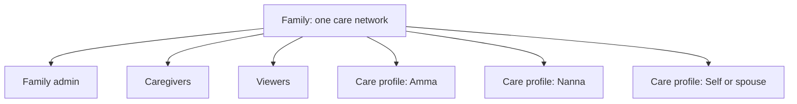

| In the database | What people see | What they can do |
|---|---|---|
| `family_members` with role `owner` | **Family admin** | Everything, including managing the family |
| role `caregiver` | Caregiver | Look after care profiles day to day |
| role `viewer` | Viewer | See, not change |
| `care_recipients` | **Care profile** | The person being cared for |

A care profile is not only for parents. The admin can add one for themselves using the "Self" relationship.

### What the app looks like

| Tab | What it holds |
|---|---|
| **Today** | A greeting, today's reminder timeline (medicines, routines), a vitals summary, recent documents |
| **Care** | Three care tracks: Medications, Routines, Activities |
| **Records** | Vitals and health observations; health documents with AI extraction |
| **Family** | Care profiles, family members, profile management |

Plus a public landing page, a privacy policy at `/privacy` (for India's DPDP Act 2023), and an **offline** page: the app installs on a phone as a **PWA**, so it opens like an app and shows a friendly page without internet.

### How it works — the architecture

<svg viewBox="0 0 400 560" width="400" xmlns="http://www.w3.org/2000/svg" role="img" aria-label="Trelis Family architecture: phone and WhatsApp, the Next.js app on Vercel, Supabase database and storage, Gemini, and the one-minute scheduler" style="width:100%;max-width:400px;height:auto;display:block;margin:1rem auto">
<defs><marker id="ar3" viewBox="0 0 10 10" refX="8" refY="5" markerWidth="6" markerHeight="6" orient="auto"><path d="M0,0 L10,5 L0,10 z" fill="#6b7280"/></marker></defs>
<g font-family="system-ui, -apple-system, 'Segoe UI', Roboto, sans-serif" font-size="13" fill="#1f2937">
<text x="200" y="24" text-anchor="middle" font-size="16" font-weight="700">Trelis Family, end to end</text>
<rect x="12" y="40" width="180" height="70" rx="10" fill="#ecfdf5" stroke="#10b981" stroke-width="1.5"/>
<text x="102" y="64" text-anchor="middle" font-weight="700" fill="#047857">Caregiver's phone</text>
<text x="102" y="84" text-anchor="middle">The app (PWA)</text>
<text x="102" y="100" text-anchor="middle" font-size="12">Today · Care · Records · Family</text>
<rect x="208" y="40" width="180" height="70" rx="10" fill="#ecfdf5" stroke="#10b981" stroke-width="1.5"/>
<text x="298" y="64" text-anchor="middle" font-weight="700" fill="#047857">Parent's WhatsApp</text>
<text x="298" y="84" text-anchor="middle">Reminders with buttons</text>
<text x="298" y="100" text-anchor="middle" font-size="12">Taken · Skipped · Snooze</text>
<line x1="102" y1="110" x2="150" y2="150" stroke="#6b7280" stroke-width="1.5" marker-end="url(#ar3)"/>
<line x1="298" y1="110" x2="250" y2="150" stroke="#6b7280" stroke-width="1.5" marker-end="url(#ar3)"/>
<text x="330" y="136" font-size="11" fill="#6b7280">Meta webhook</text>
<rect x="12" y="152" width="376" height="120" rx="10" fill="#eff6ff" stroke="#3b82f6" stroke-width="1.5"/>
<text x="200" y="176" text-anchor="middle" font-weight="700" fill="#1d4ed8">Next.js app on Vercel</text>
<text x="200" y="198" text-anchor="middle">Screens + API routes (server only)</text>
<text x="200" y="220" text-anchor="middle" font-size="12">/api/analyze · /api/documents/remove</text>
<text x="200" y="238" text-anchor="middle" font-size="12">/api/whatsapp/send · /reminders/run · /webhook</text>
<text x="200" y="256" text-anchor="middle" font-size="12">/api/activities/programme/start · /schedules/materialize</text>
<line x1="100" y1="272" x2="100" y2="306" stroke="#6b7280" stroke-width="1.5" marker-end="url(#ar3)"/>
<line x1="300" y1="272" x2="300" y2="306" stroke="#6b7280" stroke-width="1.5" marker-end="url(#ar3)"/>
<rect x="12" y="308" width="200" height="130" rx="10" fill="#f5f3ff" stroke="#8b5cf6" stroke-width="1.5"/>
<text x="112" y="332" text-anchor="middle" font-weight="700" fill="#6d28d9">Supabase</text>
<text x="112" y="354" text-anchor="middle">PostgreSQL, 25 tables</text>
<text x="112" y="374" text-anchor="middle">Row-level security on all</text>
<text x="112" y="394" text-anchor="middle">Sign-in (Auth)</text>
<text x="112" y="414" text-anchor="middle">Private file storage</text>
<text x="112" y="430" text-anchor="middle" font-size="12">pg_cron: every minute</text>
<rect x="228" y="308" width="160" height="130" rx="10" fill="#fffbeb" stroke="#f59e0b" stroke-width="1.5"/>
<text x="308" y="332" text-anchor="middle" font-weight="700" fill="#b45309">Outside services</text>
<text x="308" y="356" text-anchor="middle">WhatsApp Cloud API</text>
<text x="308" y="374" text-anchor="middle" font-size="12">sends reminders</text>
<text x="308" y="400" text-anchor="middle">Google Gemini</text>
<text x="308" y="418" text-anchor="middle" font-size="12">reads documents</text>
<rect x="12" y="456" width="376" height="90" rx="10" fill="#f3f4f6" stroke="#6b7280" stroke-width="1.5"/>
<text x="200" y="480" text-anchor="middle" font-weight="700" fill="#374151">The rules that keep it safe</text>
<text x="200" y="502" text-anchor="middle" font-size="12">AI extractions wait for a caregiver's approval</text>
<text x="200" y="520" text-anchor="middle" font-size="12">No reminder is ever sent twice (compare-and-swap)</text>
<text x="200" y="538" text-anchor="middle" font-size="12">Safety alerts use fixed rules, never AI</text>
</g>
</svg>

| Part | Job |
|---|---|
| **Next.js** | The framework for the app: the screens people see, plus **API routes**, small server programs the app and outside services call |
| **Vercel** | Where the app is hosted; runs the API routes on demand (**serverless**) |
| **Supabase** | A hosted PostgreSQL database with sign-in and file storage built in |
| **pg_cron** | A clock inside the database that calls the scheduler every minute |
| **WhatsApp Cloud API** | Meta's official way for an app to send and receive WhatsApp messages |
| **Gemini** | Google's AI model, used only to read health documents |

### The data model — 25 tables in five areas

| Area | Tables | What they hold |
|---|---|---|
| Core family and care | 7 | Caregiver profiles, families, family members and roles, care profiles, consent records, health conditions, health observations (vitals) |
| Medications | 3 | The medicine, its schedule, and each dose event |
| Routines | 3 | The routine, its schedule, and each occurrence |
| Documents and AI | 2 | Uploaded documents, and the AI's extraction of each |
| Activities | 10 | The activity library, the programme, its days and variants, the programme clock, schedules, events, sent messages, replies, caregiver alerts |

**The pattern used three times: definition → schedule → event.** A medicine is defined once (its name and dose). Its schedule says when ("8 am and 8 pm daily"). Each actual dose is an **event** with its own status. Keeping these apart means history is never lost: changing tomorrow's schedule does not rewrite yesterday's doses.

The database changes were made through **14 migrations**: numbered scripts that each change the database one step, applied in order, so the database can be rebuilt exactly and every change is on record.

### Track 1 — Medications (live)

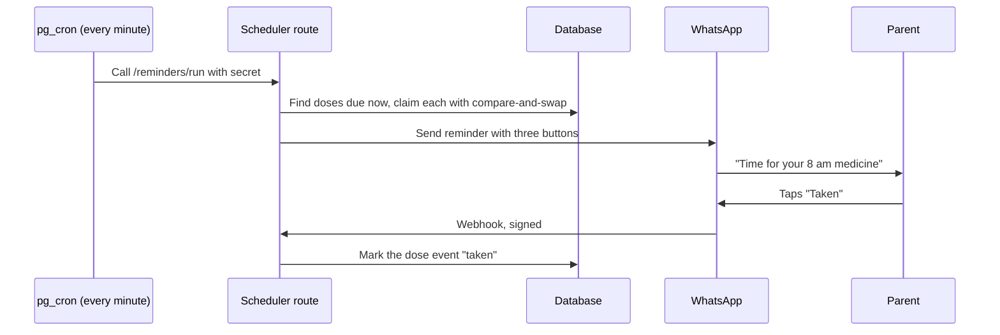

| Status of a dose | Meaning |
|---|---|
| pending | Due, not yet answered |
| taken | The parent tapped Taken |
| skipped | The parent tapped Skipped |
| snoozed | Remind again later (the event stores when) |
| missed | No answer in time |

Each button carries a small code, such as `med:<dose ID>:taken`, so when the tap comes back the app knows exactly which dose it belongs to, without guessing. Phone numbers are stored in international format (+91…).

### Track 2 — Routines (live)

The same machinery as medications, for daily care routines: exercise, physiotherapy, hydration, diet, breathing exercises, sleep and hygiene. Statuses are pending, completed, skipped, snoozed and missed; buttons carry `routine:<ID>:completed` and so on.

### Track 3 — Activities and the 100-day programme (built, switched off)

**In one line:** a 100-day programme of gentle daily activities for Amma and Nanna, delivered on WhatsApp, fully built and deployed, and deliberately switched off until launch.

| Programme fact | Value |
|---|---|
| Length | 100 days, in four 25-day phases: Start → Strength → Step Up → It's Yours |
| Rest days / activity days | 14 / 86 |
| New / revisit activities | 60 / 26 |
| Together / parallel / independent | 15 / 30 / 55 |
| Checkpoints | Days 1, 30, 60 and 100 |
| Daily extra | Amma gets a daily **Thought** (a reflective prompt); Nanna gets a daily **Puzzle**, with the answer sent the next morning |
| Loaded so far | 127 activities in the library; 100 days; 200 day variants (one per parent per day) |

**How a day would run:**

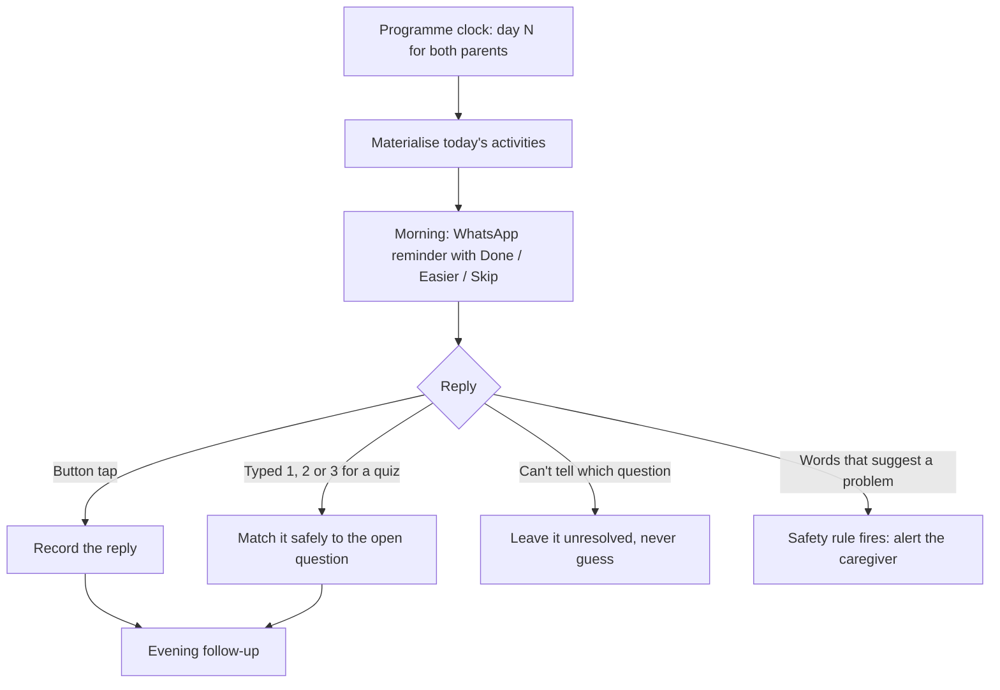

**The design choices, and why:**

| Choice | Why |
|---|---|
| One shared **programme clock** for both parents | They move through the programme together, day by day |
| Ad-hoc activities do **not** move the clock | An extra activity on Tuesday doesn't shift the programme's day numbers |
| **Materialise** each day's schedule | The day's activities are created as real rows only when needed, from the programme definition |
| Sent messages are stored as **immutable snapshots** | What was sent can never be edited afterwards; the record is trustworthy |
| Replies are **append-only** | New replies are added, never overwritten |
| Ambiguous replies stay **unresolved** | A wrong guess is worse than no answer |
| Safety detection uses **fixed keyword rules, no AI** | A safety alert must be predictable and explainable every time |
| Caregiver alerts are **idempotent** | The same problem never triggers a flood of alerts |
| One **switch** controls all activity sending | Nothing goes out until the switch is deliberately turned on |

**Where it stands:** the switch (`WHATSAPP_ACTIVITY_DELIVERY_ENABLED`) is **off** in production, and no programme run has started. Before launch: Meta must approve three message templates (morning reminder, evening follow-up, caregiver alert), the caregiver's WhatsApp number must be set, a controlled test must pass, then the switch goes on and a Season 1 start date is chosen. The programme starts only by a deliberate action, never automatically.

- **Message template:** WhatsApp only lets businesses start a conversation with a message format Meta has approved in advance

### Records — the documents AI pipeline (live)

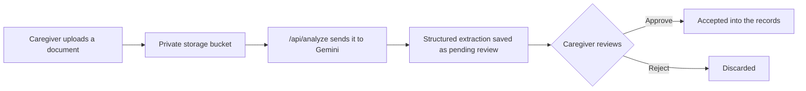

| Safeguard | What it does |
|---|---|
| Private bucket | Files are never publicly reachable |
| Structured output | Gemini must answer in a fixed format the code can check, not free text |
| Factual, non-alarmist instruction | The AI extracts what the document says; it does not diagnose or alarm |
| Review status | Every extraction starts as `pending_review`; only a person moves it to approved or rejected |
| Immutability trigger | A database rule stops the core fields of an extraction being quietly changed later |
| Purge | Removing a document deletes the file and everything linked to it |

**Activities are not health records.** A parent tapping "Done" on a walk is engagement, not a clinical observation, so the two live in separate parts of the database.

### The scheduler — one clock, no double-sends

**In one line:** every minute, the database's clock calls one scheduler route, which safely claims whatever is due and sends it exactly once.

| Detail | How it works |
|---|---|
| Trigger | Supabase `pg_cron` calls `/api/whatsapp/reminders/run` every minute |
| Who may call it | Only a caller holding a secret token (a **bearer secret**) |
| Order | Medications, then routines, then activities (only if the switch is on) |
| No double-sends | **Compare-and-swap lease**: a reminder is claimed only if nobody else has claimed it |
| Crash recovery | A claim older than 5 minutes is treated as abandoned and reclaimed |

**Compare-and-swap, step by step.** Two runs of the scheduler overlap and both see the same due reminder.

| Moment | Run 1 | Run 2 |
|---|---|---|
| Both look | Sees "unclaimed" | Sees "unclaimed" |
| Run 1 claims | "Claim it if still unclaimed" → succeeds | — |
| Run 2 claims | — | "Claim it if still unclaimed" → fails: already claimed |
| Result | Sends once | Does nothing |

This property, that doing something twice has the same effect as doing it once, is called **idempotency**.

### The webhook — proving a message is really from WhatsApp

A **webhook** is a message one system pushes to another when something happens. WhatsApp calls the app's webhook when a parent taps a button, and when a message is delivered or read. Anyone on the internet could send a fake one, so there are two checks:

| Check | When | How |
|---|---|---|
| Handshake | Once, when the webhook is set up | Meta sends a challenge with a verify token; the app answers only if the token matches its own |
| Signature | On every message | Meta attaches an **HMAC SHA-256 signature**: a code calculated from the message and a secret only Meta and the app know. The app recalculates it; if the codes differ, the message is rejected |

Delivery statuses only move forward, sent → delivered → read, never backwards, even if WhatsApp's updates arrive out of order.

### Security, end to end

| Layer | What protects it |
|---|---|
| Sign-in | Supabase Auth, with the session kept in secure cookies |
| Every table | **Row-level security**: the database itself checks, row by row, that the person asking belongs to that family |
| Server-only powers | A few server jobs (webhook, scheduler, document reading) need to bypass family rules; they use a separate **service-role** key that never reaches the browser, and a guard stops it being bundled into browser code by mistake |
| Logs | Phone numbers are masked |
| Consent | A consent log for India's DPDP Act 2023, and a public privacy policy |
| Private content | The programme's raw content notebooks are kept out of the code repository entirely |

**Row-level security, illustrated** (a simplified example of the kind of rule, not the exact policy):

```sql
-- Illustrative: a caregiver may read a care profile only in their own family
CREATE POLICY family_can_read ON care_recipients
FOR SELECT
USING (
    family_id IN (
        SELECT family_id FROM family_members WHERE user_id = auth.uid()
    )
);
```

Most apps check permissions in their screens; if one screen forgets, data leaks. Here the database refuses, whatever the screen does.

### Where it stands

| Done | Deliberately off | Still to do before activities launch |
|---|---|---|
| Rebrand to Trelis Family | Activity WhatsApp sending | Meta template approval |
| Four-tab app, onboarding, PWA, offline page | The real 100-day programme run | Caregiver WhatsApp number |
| Medications and routines, live on WhatsApp | | A controlled test |
| Records: upload, AI extraction, review, purge | | Turn the switch on |
| Vitals logging | | Choose the Season 1 start date |
| Activities: schema, library, programme import, caregiver UI, scheduling, WhatsApp sending code, replies and safety, deployed | | |
| Privacy policy | | |

### The tech stack

| Layer | Technology |
|---|---|
| App | Next.js 16 (App Router), React 19, TypeScript |
| Look and feel | Tailwind CSS 4, Framer Motion, Lucide icons; fonts Fraunces and Atkinson Hyperlegible |
| Database, sign-in, files | Supabase (PostgreSQL) |
| AI | Google Gemini 3.5 Flash-Lite, through the Google GenAI SDK |
| Messaging | WhatsApp Cloud API |
| Hosting | Vercel |
| Phone app | PWA: web manifest and service worker |

| Term | Plain meaning |
|---|---|
| PWA, progressive web app | A website that installs on a phone and behaves like an app |
| API route | A small server program the app or an outside service can call |
| Serverless | Code that runs on demand in the cloud, without a server you manage |
| PostgreSQL | A widely used database |
| Migration | A numbered script that changes the database one step, in order |
| Row-level security (RLS) | The database itself checks, row by row, who may see each record |
| Service role | A special key for trusted server jobs that may bypass row-level security |
| pg_cron | A scheduler inside the database that runs jobs on a timetable |
| Webhook | A message one system pushes to another when something happens |
| HMAC SHA-256 signature | A code proving a message came from someone holding the shared secret |
| Compare-and-swap (CAS) | Update a record only if nobody changed it in between |
| Lease | A time-limited claim on a job, so a crashed job can be taken over |
| Idempotency | Doing something twice has the same effect as doing it once |
| Immutable | Can never be changed after it is written |
| Append-only | New records are added; old ones are never overwritten |
| Feature flag (switch) | A setting that turns a feature on or off without changing code |
| Human review | AI suggests; a person decides |
| DPDP Act 2023 | India's Digital Personal Data Protection Act |

**Why it matters:** it is a real product running in production, built end to end, where every risky part — messaging, health data, AI — has a named safeguard, and the unfinished part is switched off rather than half-live.

---

## Project 3 — Evidence-grounded AI agent

**In one line:** a chat assistant on my website that answers questions about my work only from a verified record, shows where each answer came from, and refuses anything it can't back.

| Question | Answer |
|---|---|
| Problem | AI chatbots invent things; this one must never claim what can't be proven |
| Evidence | 15 verified records: my positioning, projects, analytics work, experience, education and skills |
| Tested with | A 22-case test harness |

### How it works — why AI invents things

A large language model (LLM) writes the most likely next words, based on patterns it learned. It has no built-in sense of "I don't actually know this". Asked about a person it has never seen, it will often produce a fluent, confident, invented answer. This is called **hallucination**.

The fix is not to trust the model more. It is to change the job: the model is no longer asked "what do you know?", only "write an answer from *these* facts", and then the answer is checked.

### How it works — the pipeline

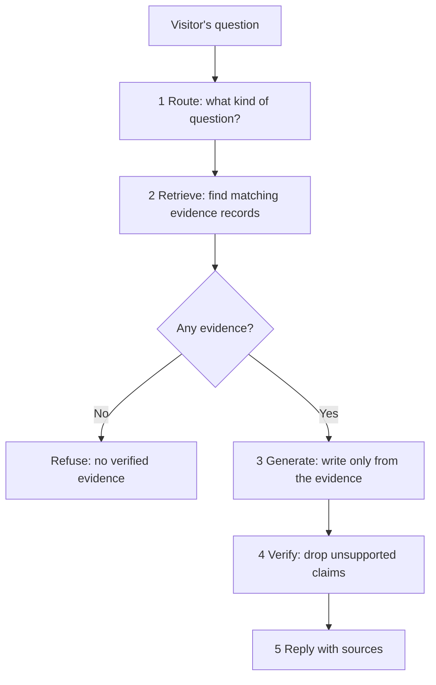

| Step | What happens |
|---|---|
| 1 Route | Works out what kind of question it is: a project, experience, skills, education, role fit, limitations or unknown |
| 2 Retrieve | Finds the matching evidence records |
| 3 Generate | Writes the answer from that evidence only, using Google's Gemini 3.5 Flash model (or a fixed local answer if the model is unavailable) |
| 4 Verify | Removes any statement the evidence doesn't support; if nothing matches, it refuses |
| 5 Reply | Streams the answer with its sources |

**Why each step exists:**

| Step | The failure it prevents |
|---|---|
| Route | Searching the wrong kind of evidence for the question |
| Retrieve | The model answering from its memory instead of the record |
| Generate from evidence only | Fluent answers built on nothing |
| Verify | A claim slipping through that the evidence does not say |
| Refuse | Guessing when the honest answer is "I don't know" |
| Fixed local answer | The site breaking if the model service is down |

### How it works — finding the right evidence

**Retrieval** has to find the right records for a question worded in any way. It uses **embeddings**: each piece of text is turned into a list of numbers such that texts with similar meaning get similar numbers. "What did he automate?" and "reporting automation in SQL" share almost no words but land close together. The question is turned into numbers the same way, and the closest records are picked. It runs **locally**, on the server, with no outside search service.

| Term | Plain meaning |
|---|---|
| Embedding | Text turned into a list of numbers, so similar meanings sit close together |
| Similarity search | Finding the stored texts whose numbers sit closest to the question's |
| Grounding | Tying every statement to a source the reader can check |

### Worked example — one answer, one refusal

Illustrative, to show the behaviour.

| | Question about SQL work | Question about something not on record |
|---|---|---|
| Route | Experience | Unknown |
| Retrieve | The experience record for Jana | No matching record |
| Generate | Writes that reporting was automated in SQL, with turnaround down 30% | Skipped |
| Verify | Each sentence checked against the Jana record; all supported | — |
| Reply | The answer, citing the Jana record | "I don't have verified public evidence for that." |

### How it works — the test harness

A **test harness** is a fixed set of questions with the right behaviour written down in advance, run after every change. It is the same idea as a UAT test pack at Lentra, applied to AI.

| Test, 22 cases | Result |
|---|---|
| Found the right evidence | 17 of 17 |
| Refused when it should | 10 of 10 |
| Rejected claims about retired projects | 3 of 3 |
| Citations valid | 17 of 17 |
| Sources relevant | 17 of 17 |

**Why refusal is tested separately:** a system that always answers can score well on answerable questions and still invent things on the rest. Testing that it refuses when it should is what proves it is safe.

| Term | Plain meaning |
|---|---|
| LLM, large language model | An AI model that writes text by predicting likely next words |
| Hallucination | A model stating something false as if it were true |
| Intent routing | Sorting a question into a type before answering it |
| Retrieval | Looking up the relevant facts before writing, instead of relying on the model's memory |
| RAG, retrieval-augmented generation | Retrieve the facts first, then let the model write from them |
| Citation check | Every claim must point to a real evidence record |
| Refusal control | When there's no evidence, it says: "I don't have verified public evidence for that." |
| Test harness | A fixed set of questions with the right behaviour written down in advance, run after every change |
| Streaming | Sending the answer word by word as it is written, so the visitor isn't left waiting |
| Rate limit | At most 10 questions a minute per visitor, to stop abuse |

**Why it matters:** it is AI built the way a bank needs it: grounded, cited, tested, and allowed to say "I don't know".

---
## Part C — Machine learning, the map

**In one line:** the whole machine learning ecosystem in one place — from a business problem to a final, monitored model — with every stage, every common algorithm and every term explained in plain words, big picture first.

This part is a **map**, not a deep dive. It shows where everything sits and why it exists, with as little maths as possible. All numbers here are **illustrative**. Project 1 is one real journey through this map; the step names below are the same ones it used.

### What machine learning is

**Ordinary software** follows rules a person wrote: "if income is below ₹20,000, decline". **Machine learning** is different: you give the computer many past examples with the answers, and it *finds* the rules itself. Then it applies them to new cases.

| | Ordinary program | Machine learning |
|---|---|---|
| You provide | Rules | Examples with answers |
| The computer produces | Answers | Rules (a **model**) |
| Good when | The rules are known and few | The rules are many, subtle, or unknown |

- **Model:** the learned rules, stored as numbers, that turn inputs into a prediction
- **Features:** the inputs (income, age, loan amount)
- **Target (label):** the answer to predict (defaulted or not)
- **Training:** the process of learning the model from examples

### The kinds of machine learning

| Kind | You have | It learns to | Examples |
|---|---|---|---|
| **Supervised: classification** | Examples with a category answer | Predict a category | Default or not; fraud or not; spam or not |
| **Supervised: regression** | Examples with a number answer | Predict a number | Loss amount; house price; next month's sales |
| **Unsupervised: clustering** | Examples, no answers | Group similar things | Customer segments |
| **Unsupervised: dimension reduction** | Many features | Squeeze them into fewer | Summarising 50 inputs into 5 |
| **Unsupervised: anomaly detection** | Mostly normal examples | Spot the odd ones | Unusual transactions |
| **Reinforcement learning** | A goal and feedback | Choose actions that earn rewards | Game-playing, robotics |

Most business problems, and all of credit risk modelling, are **supervised**.

### The whole journey on one page

<svg viewBox="0 0 400 600" width="400" xmlns="http://www.w3.org/2000/svg" role="img" aria-label="The machine learning journey in six phases: frame, data, features, model, evaluate, ship" style="width:100%;max-width:400px;height:auto;display:block;margin:1rem auto">
<defs><marker id="ar4" viewBox="0 0 10 10" refX="8" refY="5" markerWidth="6" markerHeight="6" orient="auto"><path d="M0,0 L10,5 L0,10 z" fill="#6b7280"/></marker></defs>
<g font-family="system-ui, -apple-system, 'Segoe UI', Roboto, sans-serif" font-size="13" fill="#1f2937">
<text x="200" y="24" text-anchor="middle" font-size="16" font-weight="700">From a problem to a live model</text>
<rect x="12" y="40" width="376" height="76" rx="10" fill="#eff6ff" stroke="#3b82f6" stroke-width="1.5"/>
<text x="28" y="64" font-weight="700" fill="#1d4ed8">1 Frame the problem</text>
<text x="28" y="86">Business question → ML question, target,</text>
<text x="28" y="104">success measure, baseline</text>
<line x1="200" y1="116" x2="200" y2="130" stroke="#6b7280" stroke-width="2" marker-end="url(#ar4)"/>
<rect x="12" y="132" width="376" height="76" rx="10" fill="#ecfdf5" stroke="#10b981" stroke-width="1.5"/>
<text x="28" y="156" font-weight="700" fill="#047857">2 Get and understand the data</text>
<text x="28" y="178">Collect, explore (EDA), clean, check leakage,</text>
<text x="28" y="196">split into train / validation / test</text>
<line x1="200" y1="208" x2="200" y2="222" stroke="#6b7280" stroke-width="2" marker-end="url(#ar4)"/>
<rect x="12" y="224" width="376" height="76" rx="10" fill="#f0fdfa" stroke="#14b8a6" stroke-width="1.5"/>
<text x="28" y="248" font-weight="700" fill="#0f766e">3 Build features</text>
<text x="28" y="270">Encode, scale, transform, create,</text>
<text x="28" y="288">select the useful ones</text>
<line x1="200" y1="300" x2="200" y2="314" stroke="#6b7280" stroke-width="2" marker-end="url(#ar4)"/>
<rect x="12" y="316" width="376" height="76" rx="10" fill="#f5f3ff" stroke="#8b5cf6" stroke-width="1.5"/>
<text x="28" y="340" font-weight="700" fill="#6d28d9">4 Model</text>
<text x="28" y="362">Baseline, try many algorithms, handle</text>
<text x="28" y="380">imbalance, tune, control overfitting</text>
<line x1="200" y1="392" x2="200" y2="406" stroke="#6b7280" stroke-width="2" marker-end="url(#ar4)"/>
<rect x="12" y="408" width="376" height="76" rx="10" fill="#fffbeb" stroke="#f59e0b" stroke-width="1.5"/>
<text x="28" y="432" font-weight="700" fill="#b45309">5 Evaluate and choose</text>
<text x="28" y="454">Right metrics, threshold, explain it,</text>
<text x="28" y="472">pick the champion, validate on held-out data</text>
<line x1="200" y1="484" x2="200" y2="498" stroke="#6b7280" stroke-width="2" marker-end="url(#ar4)"/>
<rect x="12" y="500" width="376" height="76" rx="10" fill="#fff1f2" stroke="#f43f5e" stroke-width="1.5"/>
<text x="28" y="524" font-weight="700" fill="#be123c">6 Ship and watch</text>
<text x="28" y="546">Document, deploy, monitor drift and</text>
<text x="28" y="564">performance, retrain when needed</text>
<text x="200" y="594" text-anchor="middle" font-size="12" fill="#6b7280">Real projects loop back: evaluation often sends you back to features</text>
</g>
</svg>

---

### Phase 1 — Frame the problem

**In one line:** turn a vague business wish into one precise question a model can answer, and decide up front how success will be judged.

**Worked example (illustrative).** The business says: "We're losing too much money on bad loans." That is not yet a machine learning question. Framing turns it into one:

| Framing question | Answer for this example |
|---|---|
| What exactly do we predict? | Will a new applicant miss three EMIs in a row within 12 months of disbursal? |
| For what unit? | One loan application |
| When is the prediction made? | At the moment of application, before approval |
| Classification or regression? | Classification: yes or no |
| What information is allowed? | Only what is known at application (no leakage) |
| How will it be used? | Approve, refer or decline, and set the price |
| How is success judged? | Ranks bad loans above good ones (AUC), PDs match reality (calibration), fewer losses at the same approval rate |
| What is the baseline? | Today's approval rules, or "predict the average default rate for everyone" |

- **Baseline:** the simplest possible answer to beat. A model that cannot beat a simple rule is not worth running

**The most common framing mistake:** predicting something that is easy to predict but not useful, or defining the target loosely ("bad customer") so that it means different things in different months. A target must be written down as precisely as a reporting definition.

### Phase 2 — Get and understand the data

#### Collect

Gather historical examples where the answer is already known: past applications and what happened to them. Each row is one example; each column is a feature or the target. The data must cover a long enough period for the outcome to happen (for a 12-month default question, loans at least 12 months old).

#### Explore: EDA

**EDA, exploratory data analysis,** is looking hard at the data before modelling. The questions it answers:

| Question | What you look at |
|---|---|
| How big, and how rare is the target? | Row count; share of positives (the **target rate**) |
| What does each feature look like? | Its spread: minimum, maximum, average, typical value |
| What is missing? | Share of blanks per column, and whether blanks mean something |
| Are there strange values? | Outliers: an income of ₹10 crore, an age of 150 |
| Which features move with the target? | Target rate by band of each feature |
| Which features move together? | Correlation between features |
| Does anything change over time? | Everything above, by month or year |

**The statistics you meet here, in plain words:**

| Term | Plain meaning | Example |
|---|---|---|
| Mean | The average: add up, divide by the count | Average income |
| Median | The middle value when sorted; not pulled by extremes | Typical income, when a few people earn crores |
| Mode | The most common value | Most common loan purpose |
| Percentile | The value below which a given share of data falls | The 90th percentile income: 90% earn less |
| Range | Largest minus smallest | |
| Standard deviation | How far values typically sit from the average | Small: everyone similar. Large: widely spread |
| Distribution | The overall shape of the values | Most incomes low, a long tail of high ones |
| Skew | A lopsided distribution with a long tail on one side | Income is right-skewed |
| Normal distribution | The symmetric bell curve many measurements follow | Heights, measurement errors |
| Correlation | How strongly two things move together, from −1 to +1 | Loan amount and EMI: close to +1 |
| Pearson correlation | Measures straight-line movement together; pulled by outliers | |
| Spearman correlation | Uses ranks instead of values; safer with skew and outliers | |
| Outlier | A value far from the rest | |
| IQR, interquartile range | The spread of the middle half of the data; a common outlier rule flags values far beyond it | |

**Correlation is not causation:** two things moving together does not mean one causes the other. Ice-cream sales and drownings both rise in summer; neither causes the other.

#### Clean

| Problem | Common fixes | Watch out |
|---|---|---|
| Duplicate rows | Remove them | Make sure they are true duplicates |
| Missing values | Drop the column (if mostly empty); fill with the median or most common value (**imputation**); or give "missing" its own flag or band | Missingness often carries meaning (an income not declared) |
| Outliers | Cap them at a percentile (**winsorising**); transform (take the log); or bin | Some outliers are real and important |
| Wrong types | Dates stored as text, numbers stored as text | Parse carefully (two-digit years!) |
| Messy categories | "Salaried", "salaried ", "SALARIED" | Standardise spellings |

#### Leakage — the silent killer

**Leakage** is when training data contains information that would not exist at the moment of prediction. The model looks brilliant in testing and fails in real use.

| Leak | Why it leaks |
|---|---|
| "Total payments received" in a default model | Only known after the loan runs |
| "Collections team assigned" | Only happens after trouble starts |
| Scaling or filling blanks using the whole dataset before splitting | Test data quietly shapes the training |
| Random split on time-ordered data | The model sees the future during training |

**The defence:** for every feature, ask "would I know this at the moment of prediction?" If not, it goes.

#### Split the data

**In one line:** hide some data from the model so you can test it honestly.

| Part | Typical share | Used for |
|---|---|---|
| **Training set** | 60–80% | Learning the model |
| **Validation set** | 10–20% | Comparing models and tuning settings |
| **Test set** | 10–20% | One final, honest check, touched once at the end |

| Split style | When to use |
|---|---|
| Random | Examples are independent, no time order |
| **Stratified** | The target is rare; keeps the same target rate in every part |
| **Time-based / out-of-time** | Anything used on future cases, like credit: train on older periods, test on a later one |

**Cross-validation** squeezes more out of limited data. Split the training data into, say, 5 equal parts (**folds**). Train on 4, check on the 5th; repeat 5 times so each part is checked once; average the 5 scores. The average is more reliable than one lucky or unlucky split.

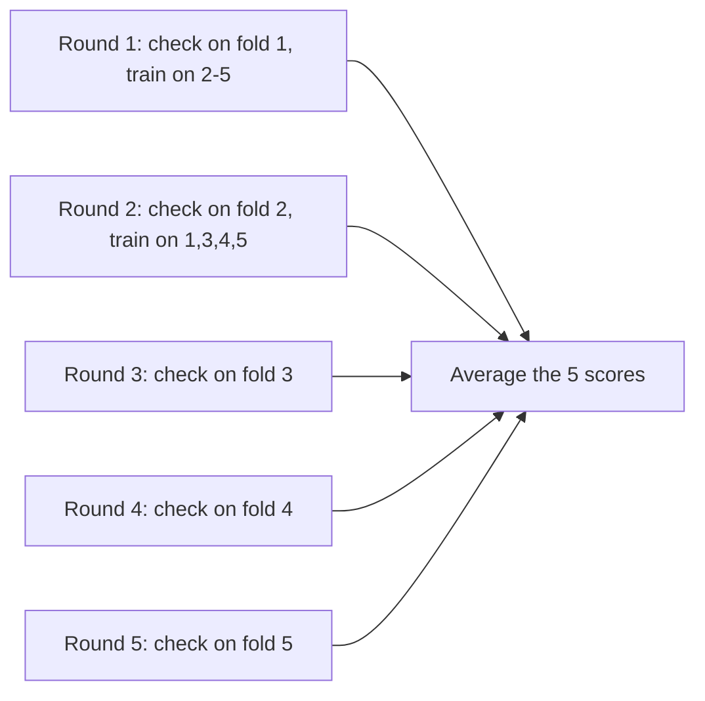

**The golden rule:** everything the model learns — including how to fill blanks, scale numbers or bin features — is learned from the training set only, then applied unchanged to validation and test.

### Phase 3 — Build features

**In one line:** turn raw columns into inputs a model can use well.

#### Encoding categories

Models work with numbers, so categories must become numbers.

| Method | How | Good for |
|---|---|---|
| **One-hot encoding** | One yes/no column per category: "is_salaried", "is_self_employed" | Categories with no order, few values |
| **Ordinal (label) encoding** | Number the categories in order: low = 1, medium = 2, high = 3 | Categories with a natural order |
| **Target encoding** | Replace each category with the target rate seen for it | Many categories; needs care to avoid leakage |
| **WoE encoding** | Replace each band with its weight of evidence | Credit scorecards (Project 1) |

#### Scaling numbers

Some models care about the size of numbers. Income in lakhs and age in years sit on very different scales; a model that measures distances would let income drown out age.

| Method | What it does |
|---|---|
| **Standardisation** | Subtract the mean, divide by the standard deviation: most values land between about −3 and +3 |
| **Normalisation (min-max)** | Squeeze values into 0 to 1 |

| Needs scaling | Does not need scaling |
|---|---|
| Linear and logistic regression with regularisation, KNN, SVM, neural networks, k-means, PCA | Decision trees, random forests, gradient boosting |

#### Transforming and creating features

| Technique | Example |
|---|---|
| Log transform | Income → log(income), to tame a long tail |
| Binning | Age → age bands |
| Ratios | EMI ÷ income, loan ÷ property value |
| Dates | Months since the account opened; month of year |
| Aggregates | Number of late payments in the last 12 months |
| Interactions | Income × employment type |

**Feature engineering is where domain knowledge pays off.** A credit analyst knows that FOIR or utilisation matter; a model given those ratios directly learns faster and more reliably.

#### Selecting features

More features are not always better: weak ones add noise, and correlated ones confuse the model.

| Family | How it works | Examples |
|---|---|---|
| **Filter** | Score each feature on its own, keep the best | IV, correlation with target, chi-square test |
| **Wrapper** | Try subsets of features with a model, keep the best subset | Recursive feature elimination |
| **Embedded** | The model picks while it trains | L1 regularisation, tree importance |

**Multicollinearity:** two or more features carry almost the same information (grade and interest rate). The model can't tell which deserves the credit, so its weights become unstable. **VIF, variance inflation factor,** measures it; a common rule is to worry above about 5.

### Phase 4 — Model

#### Start with a baseline

Before any clever model, build a dumb one: predict the average default rate for everyone, or use today's rule. Every later model must beat it, or it is not adding value.

#### How a model learns — the core idea

Every supervised model works the same way underneath:

| Piece | Plain meaning |
|---|---|
| **Parameters** | The numbers inside the model that it learns (the weights of a regression, the splits of a tree) |
| **Loss function** | A score of how wrong the model is on the training data; lower is better |
| **Optimisation** | The method that adjusts the parameters to lower the loss |
| **Gradient descent** | The most common method: nudge each parameter a little in the direction that reduces the loss, and repeat many times — like walking downhill in fog by feeling the slope under your feet |
| **Hyperparameters** | Settings *you* choose before training (tree depth, learning rate); the model does not learn them |

| Common loss | Used for | Idea |
|---|---|---|
| Log loss (cross-entropy) | Classification | Punishes confident wrong predictions hard |
| Mean squared error | Regression | Average of squared misses; big misses count extra |

#### The algorithm cheatsheet

| Algorithm | Kind | How it thinks, in one line | Strengths | Weaknesses | Explainable? |
|---|---|---|---|---|---|
| Linear regression | Regression | Draws the best straight line through the data | Simple, fast, readable | Only straight-line patterns | Very |
| Logistic regression | Classification | Adds up weighted evidence, squashes it into a probability | The credit standard; readable, stable | Misses complex patterns unless features are engineered | Very |
| Decision tree | Both | Asks a series of yes/no questions | Easy to picture, handles mixed data | Overfits easily, unstable | Yes |
| Random forest | Both | Many trees on random slices of data, vote together | Strong, robust, little tuning | Slower, harder to explain | Partly |
| Gradient boosting (XGBoost, LightGBM, CatBoost) | Both | Trees built one after another, each fixing the last one's errors | Usually the most accurate on tables | Needs tuning, can overfit | Partly |
| K-nearest neighbours (KNN) | Both | Looks at the K most similar past cases | Simple idea | Slow on big data, needs scaling | Somewhat |
| Naive Bayes | Classification | Combines each feature's evidence as if independent | Fast, good for text | The independence assumption rarely holds | Somewhat |
| Support vector machine (SVM) | Both | Finds the widest gap separating the classes | Strong on medium data | Slow on big data, hard to explain | Hardly |
| Neural network | Both | Layers of simple units that learn patterns step by step | Images, text, sound, very complex patterns | Needs lots of data, a black box | Hardly |
| K-means | Clustering | Groups points around K centres | Simple, fast | You must choose K; round clusters only | Yes |
| Hierarchical clustering | Clustering | Merges the closest groups step by step into a tree | No need to choose K first | Slow on big data | Yes |
| DBSCAN | Clustering | Groups dense areas, leaves sparse points as noise | Odd-shaped clusters, finds outliers | Sensitive to its settings | Somewhat |
| PCA | Dimension reduction | Rotates the data to find the few directions holding most of the variation | Fewer, uncorrelated features | New features are hard to name | Partly |
| Isolation forest | Anomaly detection | Odd points are easy to isolate with few random splits | Fast anomaly finder | Needs tuning of the expected share of anomalies | Somewhat |

#### Each algorithm in a paragraph

**Linear regression.** Predicts a number as a base value plus a weight × each feature. Training finds the weights that make the squared misses smallest. Read a weight as "one more unit of this feature adds this much to the prediction, holding the others still". Good first model for any number target.

**Logistic regression.** The same weighted sum, but it predicts the **log-odds** of a yes, then turns it into a probability with an S-shaped curve (the sigmoid). Read a weight as "this feature raises or lowers the odds". The workhorse of credit scoring because every decision can be explained. Project 1 walks through it in full.

**Decision tree.** A flowchart the model builds itself: "Is income below ₹30,000? If yes, is the enquiry count above 3?" and so on, until each branch ends in a prediction. Each question is chosen to split the data into the purest groups. **Gini impurity** and **entropy** are the two usual purity scores. Deep trees memorise the data, so depth is limited.

**Random forest.** Grow hundreds of trees, each on a random sample of rows (**bootstrap**) and random subsets of features, then average their answers. Each tree is a little wrong in its own way; together, their errors cancel. Combining models like this is called **ensembling**; this kind is **bagging**.

**Gradient boosting.** Build small trees one after another. Each new tree focuses on the mistakes the previous trees still make, and a **learning rate** controls how much each tree is trusted. The result is usually the most accurate model on table-shaped data. XGBoost, LightGBM and CatBoost are popular versions. This kind of ensembling is **boosting**. Project 1's LGD model uses one.

**K-nearest neighbours.** To predict a new case, find the K most similar past cases and take a vote (or an average). No training at all; all the work happens at prediction time.

**Naive Bayes.** Uses probability rules to combine each feature's evidence, assuming each feature acts independently. The assumption is usually wrong, yet it works surprisingly well, especially for text such as spam filtering.

**Support vector machine.** Draws the boundary between classes that leaves the widest possible gap on each side. With a **kernel**, it can bend the boundary into curves.

**Neural network.** Layers of simple units (**neurons**). Each neuron takes a weighted sum of its inputs and passes it through an **activation function** that adds a bend. Stacking layers lets the network build complex patterns out of simple ones. Training runs examples through, measures the loss, and sends the error backwards to adjust every weight (**backpropagation**). Deep networks with many layers power image recognition and large language models.

| Neural network term | Plain meaning |
|---|---|
| Neuron | One unit: weighted sum of inputs, then an activation |
| Layer | A row of neurons; input, hidden and output layers |
| Activation function | Adds the bend: ReLU (zero below, straight above), sigmoid (0 to 1), softmax (probabilities across several classes) |
| Epoch | One full pass through the training data |
| Batch | A small group of examples processed together before one weight update |
| Learning rate | How big each weight adjustment is |
| Optimiser | The update method, such as SGD or Adam |
| Dropout | Randomly switching off some neurons during training, to stop memorising |
| Early stopping | Stop training when the validation score stops improving |

**K-means.** Choose K, drop K centre points, assign every example to its nearest centre, move each centre to the middle of its group, and repeat until nothing moves. The **elbow method** helps choose K.

**PCA, principal component analysis.** Finds new directions through the data that capture the most variation, so 50 correlated features can be summarised by a handful of components.

**Forecasting (time series).** When the data is a sequence over time (monthly collections, daily transactions), special models use the series' own past: **moving averages**, **exponential smoothing** and the **ARIMA** family. Tree models can forecast too, using past values as features. The key rule: always test on a later period.

#### Try many models, fairly

Train several candidate algorithms on the same training data, score them on the same validation data (or with cross-validation), and compare. A typical order:

| Round | Candidates | Why |
|---|---|---|
| 1 | Baseline, logistic (or linear) regression | The bar to beat, and a readable benchmark |
| 2 | Decision tree, random forest | Capture non-straight patterns |
| 3 | Gradient boosting | Usually the strongest on tables |
| 4 | Neural network, if the data is large or unstructured | Complex patterns, images, text |

#### Overfitting and underfitting

| | Underfitting | Good fit | Overfitting |
|---|---|---|---|
| What happens | Too simple to catch the pattern | Catches the pattern | Memorises noise in the training data |
| Training score | Poor | Good | Excellent |
| Validation score | Poor | Good, close to training | Much worse than training |
| Fix | More features, a more flexible model | — | Simpler model, more data, regularisation |

This is the **bias–variance trade-off**. **Bias** is error from being too simple; **variance** is error from being too sensitive to the particular training data. A good model balances the two.

**Regularisation** discourages over-complex models:

| Technique | Where | What it does |
|---|---|---|
| L2 (ridge) | Linear and logistic regression, networks | Shrinks all weights towards zero |
| L1 (lasso) | Linear and logistic regression | Shrinks some weights exactly to zero, dropping those features |
| Tree limits | Trees and boosting | Maximum depth, minimum examples per leaf |
| Dropout, early stopping | Neural networks, boosting | Stop memorising |

#### Tune the hyperparameters

**In one line:** try different settings for each model, judge each on validation data, keep the best, and never touch the test set while doing it.

| Model | Key hyperparameters |
|---|---|
| Logistic regression | Regularisation strength and type (L1 or L2) |
| Decision tree | Maximum depth, minimum examples per leaf |
| Random forest | Number of trees, depth, features tried per split |
| Gradient boosting | Number of trees, learning rate, depth, share of rows and features per tree |
| KNN | K, the distance measure |
| Neural network | Layers, neurons per layer, learning rate, batch size, epochs, dropout |

| Search method | How it works | Trade-off |
|---|---|---|
| **Grid search** | Try every combination from a list | Thorough but slow |
| **Random search** | Try random combinations | Often as good, much faster |
| **Bayesian search** (for example Optuna) | Learns from each try which settings look promising next | Efficient for expensive models |

Each setting is judged with cross-validation, so one lucky split doesn't pick the winner.

#### Class imbalance — when the thing you care about is rare

**In one line:** when only a few examples are positive (2% fraud, 3% default), a model can look accurate by ignoring them, so you change the measure, the weights, the data or the threshold.

**The trap (illustrative):** 1,000 transactions, 20 fraudulent. A model that says "not fraud" every time is **98% accurate** and catches zero fraud.

| Remedy | Big-picture idea | Note |
|---|---|---|
| **Use the right metric** | Judge by recall, precision, AUC or PR-AUC, not accuracy | Always the first fix |
| **Stratified split** | Keep the same rare-case share in every part | So the test set has enough positives |
| **Class weights** | Tell the model a missed positive costs more than a false alarm | Simple, no data changes |
| **Undersampling** | Use fewer of the common class | Faster, but throws data away |
| **Oversampling** | Repeat rare examples | Can cause memorising |
| **SMOTE** | Create new, synthetic rare examples between existing similar ones | A smarter oversample |
| **Threshold moving** | Flag at a lower probability, such as 0.2 instead of 0.5 | Trades false alarms for catches |

**Two rules:** resample the **training** data only, never validation or test, or the scores become fiction. And after resampling or weighting, the predicted probabilities are no longer true probabilities, so **recalibrate** them if the probability itself is used (as a PD is).

### Phase 5 — Evaluate and choose

#### Measuring a classifier: the confusion matrix

**Worked example (illustrative):** 1,000 applicants, 100 of whom actually default. The model flags 150 as risky.

| | Actually defaulted | Actually repaid |
|---|---|---|
| **Flagged risky** | 60 (**true positive**) | 90 (**false positive**, false alarm) |
| **Not flagged** | 40 (**false negative**, missed) | 810 (**true negative**) |

| Metric | Question | Calculation | Value |
|---|---|---|---|
| Accuracy | How many were right overall? | (60 + 810) ÷ 1,000 | 87% |
| **Precision** | Of those flagged, how many really defaulted? | 60 ÷ 150 | 40% |
| **Recall** (sensitivity) | Of real defaulters, how many were caught? | 60 ÷ 100 | 60% |
| Specificity | Of good borrowers, how many were left alone? | 810 ÷ 900 | 90% |
| **F1 score** | One balance of precision and recall | 2 × 0.40 × 0.60 ÷ (0.40 + 0.60) | 0.48 |

Note that "flag no one" would score 90% accuracy, *higher* than this model, while catching nobody. That is why accuracy alone misleads on rare targets.

#### Threshold — where the line is drawn

A classifier gives a probability; a **threshold** turns it into a decision. Moving it trades one error for the other (illustrative):

| Threshold | Flagged | Recall | Precision |
|---|---|---|---|
| 0.5 | 60 | 35% | 58% |
| 0.3 | 150 | 60% | 40% |
| 0.1 | 400 | 88% | 22% |

The right threshold depends on **costs**: what a missed defaulter costs versus what a wrongly declined good customer costs. That is a business decision, informed by the model.

#### Threshold-free measures

| Measure | What it tells you |
|---|---|
| **ROC curve and AUC** | How well the model ranks positives above negatives across every threshold; 0.5 random, 1 perfect |
| **Gini** | 2 × AUC − 1; the credit industry's favourite |
| **KS** | The widest gap between the positives and negatives caught as you move down the ranked list |
| **PR curve and PR-AUC** | Precision against recall; more honest than ROC when positives are very rare |
| **Log loss** | Punishes confident wrong probabilities |
| **Brier score** | Average squared gap between probability and outcome |
| **Calibration curve** | Predicted probability against actual rate; a good model lies on the diagonal |

#### Measuring a regression model

**Worked example (illustrative):** three predictions of loss amount.

| Case | Actual | Predicted | Miss |
|---|---|---|---|
| 1 | 100 | 90 | 10 |
| 2 | 200 | 230 | −30 |
| 3 | 300 | 300 | 0 |

| Metric | Meaning | Value here |
|---|---|---|
| **MAE**, mean absolute error | Average size of a miss | (10 + 30 + 0) ÷ 3 = 13.3 |
| **RMSE**, root mean squared error | Like MAE but big misses count extra | √((100 + 900 + 0) ÷ 3) = 18.3 |
| **MAPE** | Average miss as a percentage of the actual | (10% + 15% + 0%) ÷ 3 = 8.3% |
| **R²** | Share of the variation the model explains; 1 is perfect, 0 is no better than the average | |

#### Explain the model

Stakeholders, customers and regulators need to know *why*.

| Technique | What it shows |
|---|---|
| Coefficients | For linear and logistic models: each feature's push |
| Feature importance | For trees: how much each feature improved the splits |
| Permutation importance | Shuffle one feature; the more the score drops, the more the model relied on it |
| **SHAP values** | For any model: how much each feature pushed *this one* prediction up or down |
| Partial dependence plot | How the prediction changes as one feature changes, on average |
| Reason codes | The top reasons for a credit decision, given to the customer |

#### Choose the champion

**Worked example (illustrative):** results on validation data.

| Model | AUC | Stable over time? | Explainable? | Speed |
|---|---|---|---|---|
| Logistic regression | 0.74 | Yes | Fully | Instant |
| Decision tree | 0.68 | No | Fully | Instant |
| Random forest | 0.78 | Yes | Partly | Fast |
| Gradient boosting | 0.80 | Yes | Partly (with SHAP) | Fast |
| Neural network | 0.79 | Mostly | Hardly | Fast |

The highest score does not automatically win. A bank might choose logistic regression as the **champion** because every decline must be explained, and keep gradient boosting as a **challenger**, a benchmark that shows how much accuracy is being given up. Choose on score, stability, explainability, speed and the rules you work under.

#### Validate on data it has never seen

Only now, once, score the chosen model on the untouched **test set**, and on an **out-of-time** sample if the model will be used on future cases. If the score holds, the model is ready. If not, go back; don't keep tweaking against the test set, or it stops being a fair test.

### Phase 6 — Ship and watch

| Step | What happens |
|---|---|
| Document | What the model predicts, the data, the choices made and why, the results, the limits. In banks, **model risk management** requires this, and an independent team re-checks it |
| Deploy | **Batch** (score all loans every night) or **real-time** (score each application through an API in milliseconds) |
| Monitor | Watch the inputs, the scores and the real outcomes every month |
| Retrain | When performance slips, rebuild on fresh data |

| What drifts | Plain meaning | How to spot it |
|---|---|---|
| **Data drift** | The inputs change: new customer types, a new channel | PSI and CSI |
| **Concept drift** | The link between inputs and outcome changes: a recession makes the same borrower riskier | Falling AUC, predicted vs actual rates parting |

- **MLOps:** the practices and tools that keep models running reliably in production: versioning, automated retraining, monitoring

### The statistics toolkit you meet along the way

| Term | Plain meaning |
|---|---|
| Population and sample | Everyone you care about; the part you actually have |
| Sampling bias | Your sample is not like the population (approved-only loans, for example) |
| Hypothesis test | A formal check of whether a pattern could be chance |
| Null hypothesis | The "nothing is going on" assumption the test tries to reject |
| p-value | If nothing were going on, the chance of seeing a result this extreme; small (below 0.05) suggests something is |
| Statistical significance | A p-value below the chosen cut-off; not the same as *important* |
| Confidence interval | A range that likely holds the true value, such as 3.2% to 3.6% |
| t-test | Compares two averages |
| Chi-square test | Checks whether two categories are linked |
| Law of large numbers | With more data, averages settle near the truth; also why huge samples make tiny gaps "significant" |

### The machine learning dictionary

| Term | Plain meaning |
|---|---|
| Accuracy | Share of all predictions that were right |
| Activation function | The bend a neuron adds to its weighted sum |
| AUC | Chance a random positive is ranked above a random negative |
| Backpropagation | Sending the error backwards through a network to adjust weights |
| Bagging | Many models on random samples, averaged (random forest) |
| Baseline | The simple answer every model must beat |
| Batch | A group of examples processed together in training |
| Bias (error) | Error from a model being too simple |
| Boosting | Models built in sequence, each fixing the last (gradient boosting) |
| Calibration | Whether predicted probabilities match real rates |
| Champion and challenger | The model in use; the one trying to beat it |
| Class imbalance | One outcome far rarer than the other |
| Class weights | Making errors on the rare class cost more in training |
| Classification | Predicting a category |
| Clustering | Grouping similar examples without answers |
| Concept drift | The input-to-outcome relationship changes |
| Confusion matrix | The four-box table of right and wrong predictions |
| Cross-validation | Rotating which part of the data is held out, then averaging |
| Data drift | The inputs change over time |
| Decision tree | A model of yes/no questions |
| Deployment | Putting a model into real use |
| Dimension reduction | Summarising many features in fewer |
| Dropout | Switching off random neurons in training to prevent memorising |
| EDA | Exploratory data analysis: studying data before modelling |
| Embedding | Text or items turned into numbers so similar things sit close together |
| Ensemble | Combining several models |
| Epoch | One pass through all the training data |
| F1 score | A single balance of precision and recall |
| False negative / positive | A missed case / a false alarm |
| Feature | An input to the model |
| Feature engineering | Creating better inputs from raw data |
| Feature importance | How much the model relied on each feature |
| Gini | 2 × AUC − 1 |
| Gradient boosting | Trees built in sequence, each correcting the previous ones |
| Gradient descent | Adjusting parameters step by step downhill on the loss |
| Grid / random / Bayesian search | Ways of trying hyperparameter settings |
| Hyperparameter | A setting chosen before training |
| Imputation | Filling in missing values |
| K-means | Clustering around K centres |
| KNN | Predicting from the K most similar past cases |
| KS | Widest gap between positives and negatives caught down a ranked list |
| L1 / L2 regularisation | Penalties that shrink weights (L1 can drop features) |
| Label (target) | The answer to predict |
| Leakage | Using information that won't exist at prediction time |
| Learning rate | How big each training adjustment is |
| Linear regression | Predicting a number with a weighted straight line |
| Log loss | A loss that punishes confident wrong probabilities |
| Logistic regression | Predicting a probability from weighted evidence |
| Loss function | The score of how wrong a model is |
| MAE / RMSE / MAPE | Average miss; average with big misses weighted up; average miss as a percentage |
| Model | The learned rules that turn inputs into predictions |
| Multicollinearity | Features carrying the same information |
| Naive Bayes | Combining feature evidence assuming independence |
| Neural network | Layers of neurons that learn complex patterns |
| Normalisation | Squeezing values into 0 to 1 |
| One-hot encoding | One yes/no column per category |
| Out-of-time test | Testing on a later period than training |
| Outlier | A value far from the rest |
| Overfitting | Memorising the training data, failing on new data |
| Parameter | A number the model learns |
| PCA | Finding the few directions that hold most of the variation |
| Precision | Of those flagged, the share that were right |
| PR-AUC | Area under the precision–recall curve; useful for rare targets |
| PSI / CSI | How much the score / one input's spread has shifted |
| R² | Share of variation a regression explains |
| Random forest | Many random trees voting together |
| Recall | Of all real positives, the share caught |
| Regression | Predicting a number |
| Regularisation | Discouraging over-complex models |
| ROC curve | Catch rate against false-alarm rate across all thresholds |
| SHAP | Each feature's push on one specific prediction |
| Sigmoid | The S-curve that turns any number into 0 to 1 |
| SMOTE | Creating synthetic rare-class examples |
| Standardisation | Rescaling to mean 0, standard deviation 1 |
| Stratified split | Keeping the target rate equal across splits |
| Supervised learning | Learning from examples with answers |
| SVM | Finding the widest-gap boundary between classes |
| Test set | Data held back for one final, honest check |
| Threshold | The probability above which a case is flagged |
| Training set | Data the model learns from |
| Underfitting | Too simple to catch the pattern |
| Unsupervised learning | Finding structure in data without answers |
| Validation set | Data used to compare and tune models |
| Variance (error) | Error from being too sensitive to the training data |
| VIF | A measure of multicollinearity |

---

## Part D — Technical skills

**In one line:** every skill on my resume, in plain words, tied to where I used it.

<svg viewBox="0 0 400 300" width="400" xmlns="http://www.w3.org/2000/svg" role="img" aria-label="Skills map: four skill groups and where each was used" style="width:100%;max-width:400px;height:auto;display:block;margin:1rem auto">
<g font-family="system-ui, -apple-system, 'Segoe UI', Roboto, sans-serif" font-size="14" fill="#1f2937">
<text x="200" y="24" text-anchor="middle" font-size="16" font-weight="700">Four skill groups</text>
<rect x="12" y="40" width="182" height="116" rx="10" fill="#eff6ff" stroke="#3b82f6" stroke-width="1.5"/>
<text x="103" y="66" text-anchor="middle" font-weight="700" fill="#1d4ed8">Credit risk</text>
<text x="103" y="90" text-anchor="middle">PD, LGD, EAD, ECL</text>
<text x="103" y="110" text-anchor="middle">IRB capital, scorecards</text>
<text x="103" y="138" text-anchor="middle" font-size="12" fill="#6b7280">Project 1, Jana</text>
<rect x="206" y="40" width="182" height="116" rx="10" fill="#f3f4f6" stroke="#6b7280" stroke-width="1.5"/>
<text x="297" y="66" text-anchor="middle" font-weight="700" fill="#374151">Business analysis</text>
<text x="297" y="90" text-anchor="middle">Specs, workflows</text>
<text x="297" y="110" text-anchor="middle">UAT, stakeholders</text>
<text x="297" y="138" text-anchor="middle" font-size="12" fill="#6b7280">Lentra, Jana</text>
<rect x="12" y="168" width="182" height="116" rx="10" fill="#fffbeb" stroke="#f59e0b" stroke-width="1.5"/>
<text x="103" y="194" text-anchor="middle" font-weight="700" fill="#b45309">Data and engineering</text>
<text x="103" y="218" text-anchor="middle">SQL, KNIME, Python</text>
<text x="103" y="238" text-anchor="middle">APIs, Next.js</text>
<text x="103" y="266" text-anchor="middle" font-size="12" fill="#6b7280">Jana, Projects 1–3</text>
<rect x="206" y="168" width="182" height="116" rx="10" fill="#f5f3ff" stroke="#8b5cf6" stroke-width="1.5"/>
<text x="297" y="194" text-anchor="middle" font-weight="700" fill="#6d28d9">Applied AI</text>
<text x="297" y="218" text-anchor="middle">RAG, guardrails</text>
<text x="297" y="238" text-anchor="middle">Evaluation, ML</text>
<text x="297" y="266" text-anchor="middle" font-size="12" fill="#6b7280">Projects 1–3</text>
</g>
</svg>

### Credit risk and regulation

| Skill | Plain meaning | Where I used it |
|---|---|---|
| PD, LGD, EAD | Chance of default; share lost; amount owed at default | Project 1 |
| RWA, risk-weighted assets | Loans scaled by riskiness; capital is held as a percentage of them | Project 1 |
| IFRS 9 and Ind AS 109 ECL | Accounting rules for setting aside expected loan losses; Ind AS 109 is India's version | Project 1 |
| SICR and staging | Moving a loan to Stage 2 when its risk has risen significantly since it was given | Project 1 |
| Basel III IRB capital | Capital calculated from the bank's own risk estimates | Project 1 |
| Scorecards (WoE, IV) | Points-based credit scores; weight of evidence and information value measure how predictive each input is | Project 1 |
| Model validation and monitoring (AUROC, Gini, KS, PSI) | Checks that a model ranks well (AUROC, Gini, KS) and that today's customers still resemble the ones it learned from (PSI) | Project 1 |
| Lifetime PD term structures | The chance of default in each future year of a loan's life | Project 1 |
| Portfolio provisioning | Setting aside money for expected losses across the whole book | Project 1 |
| Portfolio analytics | DPD, PAR, vintages, roll rates, geography and product cuts of a loan book | Jana, Project 1 |

### Business analysis

| Skill | Plain meaning | Where I used it |
|---|---|---|
| BRDs and functional specifications | What the business needs; exactly how the system must behave | Lentra |
| Requirements elicitation | Drawing out what people really need through conversations, workshops and documents | Lentra |
| Data mapping specifications | Which source field feeds which target field, and how it is transformed | Lentra |
| Gap and impact analysis | What's missing today, and what a change will affect | Lentra, Jana |
| Workflow mapping | Drawing each step of a process and who does it | Lentra |
| Rules and decision logic | Writing business rules precisely enough to build | Lentra |
| UAT planning and test packs | Planning business testing with expected results written first | Lentra |
| Release validation | Confirming a release works before and after it goes live | Lentra |
| Stakeholder management | Keeping business, product, engineering and risk leadership aligned | Lentra, Jana |
| Waterfall and agile | Delivering in fixed phases; or in short cycles with regular feedback | Lentra |

**Data mapping, illustrated.** One row of a data mapping specification looks like this (illustrative):

| Source system | Source field | Target field | Transformation |
|---|---|---|---|
| Bureau report | `total_emi_obligations` | `existing_emi` | Monthly amount in rupees; if missing, use the declared figure and flag for review |

**Waterfall vs agile, side by side:**

| | Waterfall | Agile |
|---|---|---|
| Shape | Requirements → design → build → test → release, in order | Short cycles (sprints), each delivering a working piece |
| Change | Expensive once a phase is signed off | Expected; the next sprint adapts |
| Suits | Fixed regulatory scope, heavy sign-off | Evolving products, fast feedback |

### Data and engineering

| Skill | Plain meaning | Where I used it |
|---|---|---|
| SQL (Oracle) | Querying and summarising data in databases | Jana |
| KNIME | Building repeatable data workflows from connected steps | Jana |
| Excel | Report tables, pivots, charts and presentations | Jana |
| Python | The main language for data work and modelling | Project 1 |
| REST APIs and integrations | How systems request data from each other over the web | Projects 2, 3 |
| Data sourcing and ETL analysis | Finding data, then extracting, transforming and loading it | Lentra, Jana |
| Data lineage and quality controls | Tracing each number back to its source, and checking it is right | Jana |
| Reporting automation | Reports that build themselves on a schedule | Jana |
| Dashboarding | Visual summaries of key numbers | Jana, Project 1 |
| Next.js, TypeScript | A framework and language for building web apps | Projects 2, 3 |
| GitHub | Where code is stored, versioned and shared | All projects |

**ETL, illustrated:** **extract** loan records from the core banking system → **transform** them (apply the agreed definition, fix formats, drop staff loans) → **load** them into the reporting table the dashboard reads.

### Applied AI

| Skill | Plain meaning | Where I used it |
|---|---|---|
| LLM integration | Connecting a large language model, such as Gemini, into an app | Projects 1, 2, 3 |
| Retrieval-augmented generation (RAG) | Looking up the facts first, then letting the model write from them | Projects 1, 3 |
| Local embeddings and retrieval | Finding relevant text on your own machine, without an outside service | Projects 1, 3 |
| Structured output schemas | Making the model answer in a fixed format that code can read | Projects 2, 3 |
| Evaluation harness design | A fixed test set that measures AI behaviour after every change | Project 3 |
| Guardrails and refusal controls | Rules that stop the AI from answering what it shouldn't | Project 3 |
| Citation grounding | Every answer points to its source | Project 3 |
| Machine learning | Models that learn patterns from data | Project 1 |

---

## Key numbers

| Number | What it is |
|---|---|
| 30% | Faster reporting turnaround at Jana |
| 2 a month | Credit committee meetings at Jana, attended by the senior risk committee including the CRO |
| 466,285 | Loans in Project 1 (LendingClub, 2007–2014) |
| 3.44% | Share defaulting within 12 months (16,018 loans) |
| 184,525 / 46,132 / 235,628 | Train / test / out-of-time 2014 loans |
| 10 and 7 | Inputs in PD Model B and Model A |
| 0.692 / 0.385 / 0.284 | Model B out-of-time AUC / Gini / KS |
| 0.271 | Model A out-of-time Gini |
| 600 at 50 : 1, PDO 20 | Scorecard anchors; scores run 522–639 |
| 0.86% → 7.72% | Default rate from grade 1 to grade 8 |
| 0.007 | Score PSI, train vs 2014: stable |
| 93.0% / 52.2% | Mean LGD / share of defaults losing everything |
| 3.44% → 10.93% | Cumulative PD at 12 months and 60 months |
| 80.5% / 11.3% / 8.3% | 2014 loans in Stage 1 / 2 / 3 |
| USD 278.5 million, 15.2% | IFRS 9 provision on the 2014 book |
| 2.1% → 14.4% | Coverage in Stage 1 vs Stage 2: the cliff effect |
| USD 327.5 million | CECL provision, USD 49.0 million more than IFRS 9 |
| USD 58.7 million, 3.2% | Basel 12-month expected loss |
| 125.6% vs 75% | IRB vs standardised risk weight |
| USD 183.6 million | Minimum total capital; +12.7 million under downturn LGD |
| 25 tables, 14 migrations | Trelis Family database |
| 1 minute | Trelis Family scheduler cycle |
| 100 days, 127 activities | Trelis Family programme and activity library |
| 15 records, 22 tests | Project 3 evidence and test harness, all tests passed |
| 10 a minute | Project 3 rate limit per visitor |

## Glossary

| Term | Plain meaning |
|---|---|
| AUC | The chance a model ranks a random positive above a random negative; 0.5 is guessing, 1 is perfect |
| Basel III IRB | Capital calculated using the bank's own PD and LGD in the regulator's formula |
| Brier score | Average squared gap between predicted probability and outcome |
| Bureau | A company that keeps everyone's borrowing history |
| Capital | The bank's own money, held to survive a bad year |
| CCF | Credit conversion factor: share of an unused limit drawn before default |
| CECL | The US rule: lifetime expected loss on every loan from day one |
| Cliff effect | The jump in provision when a loan moves from Stage 1 to Stage 2 |
| Collection efficiency | Amount collected ÷ amount due |
| Compare-and-swap (CAS) | Update only if nobody changed the record in between |
| CRO | Chief risk officer |
| CSI | Characteristic stability index: how much one input's spread has shifted |
| Defect | The system doing something different from the specification |
| DPD | Days past due: how late a payment is |
| EAD | Exposure at default: how much is owed when a borrower defaults |
| ECL | Expected credit loss: the provision for expected losses |
| EIR | Effective interest rate, used to discount future losses |
| EL | Expected loss: PD × LGD × EAD |
| EMI | Equated monthly instalment: the fixed monthly loan payment |
| FOIR | Fixed obligations to income ratio: total EMIs ÷ net monthly income |
| FSD | Functional specification: exactly how the system must behave |
| Gini | 2 × AUC − 1: rank power where 0 is random and 1 is perfect |
| GNPA / NNPA | Bad loans as a share of the book, before / after provisions |
| Hazard | The chance of default in a given month among loans still alive |
| HMAC SHA-256 | A code proving a message came from someone holding the shared secret |
| Hosmer–Lemeshow | A test of whether predicted default rates match actual ones |
| Hurdle model | A two-stage model: first "does it happen?", then "how much?" |
| Idempotency | Doing something twice has the same effect as doing it once |
| IFRS 9 / Ind AS 109 | The accounting rules for loan loss provisions; Ind AS 109 is India's version |
| IV | Information value: how predictive an input is overall |
| KNIME | A visual tool for building data workflows |
| KS | The widest gap between bads and goods caught down the score list |
| KYC | Know your customer: identity checks |
| Leakage | Using information that won't exist at prediction time |
| LGD | Loss given default: the share lost when a borrower defaults |
| LOS | Loan origination system: application to approval |
| Logistic regression | A model that turns weighted evidence into a probability |
| Master scale | The rating grades a score is cut into |
| MOB | Months on book: months since disbursal |
| NPA | Non-performing asset: more than 90 days overdue |
| Out-of-time test | Testing on later data the model never saw |
| PAR | Portfolio at risk: outstanding of late loans ÷ total outstanding |
| PD | Probability of default within a year |
| PDO | Points to double the odds, in a scorecard |
| Provision | Money set aside today for losses expected later |
| PSI | Population stability index: how much the score spread has shifted |
| PWA | A website that installs on a phone and behaves like an app |
| RAG | Retrieve the facts first, then let the model write from them |
| Reconciliation | Proving two numbers that should match really do, and explaining any gap |
| RLS | Row-level security: the database checks access row by row |
| Roll rate | Share of loans moving to the next, worse bucket in a month |
| RWA | Risk-weighted assets: exposure scaled by riskiness |
| Scorecard | A points table that turns borrower answers into a credit score |
| SFB | Small finance bank: an RBI-licensed bank for under-served borrowers |
| SICR | Significant increase in credit risk: the trigger for Stage 2 |
| SMA | Special mention account: RBI's early-warning overdue buckets |
| UAT | User acceptance testing: the business tests before go-live |
| Vintage | All loans issued in the same period |
| Webhook | A message one system pushes to another when something happens |
| WoE | Weight of evidence: how strongly a band points to good or bad |

Machine learning terms have their own dictionary at the end of Part C.

## One-screen summary

| Piece | The one line to remember |
|---|---|
| The thread | One loan's life — approved, watched, measured — plus the AI systems and machine learning around it |
| Lentra AI | Lending policy → exact specifications → test packs with answers written first → tested system |
| Jana | Portfolio analytics on personal and SME loans — DPD, PAR, vintages, roll rates, geography — from Oracle through KNIME and Excel to the credit committee twice a month; reporting turnaround down 30% |
| Project 1 | 466,285 loans through a 12-month default target, WoE, logistic regression, a 600-point scorecard, validation, two-stage LGD, EAD, lifetime PD, IFRS 9 (USD 278.5 million), CECL and IRB capital (125.6% risk weight); every shortcut named |
| Project 2 | Trelis Family: a private family-care console; medicines and routines live on WhatsApp, a 100-day activity programme built and switched off until launch; RLS on every table, no double-sends, AI behind human review |
| Project 3 | An AI agent that answers only from verified evidence, cites it, refuses otherwise; 22 of 22 tests passed |
| Machine learning map | Frame → data → features → model → evaluate → ship, with every algorithm and term in one place |
| The common skill | Turn a rule into something built, then prove it works |
