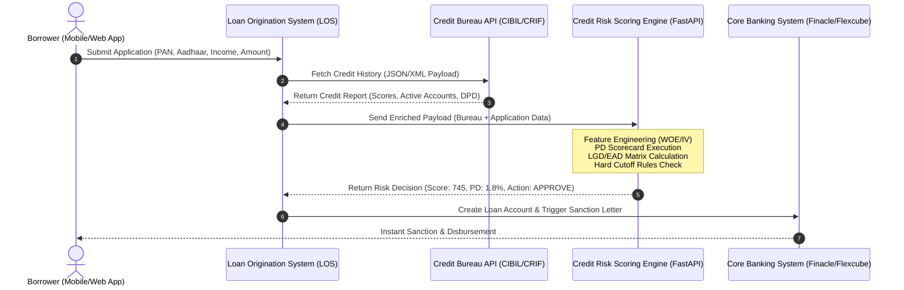

# Enterprise Credit Risk Python Handbook: From Zero to God-Mode Forward Deployed Engineer (FDE)

> **The Definitive Textbook & Systems Blueprint for Building, Scaling, and Deploying Enterprise-Grade Retail Credit Risk & Decisioning Systems in the Indian Financial Sector**

---

## Executive Introduction: The Engineering & FDE Paradigm

For a beginner entering the financial technology and credit risk engineering landscape in India, the enterprise ecosystem often feels like an impenetrable maze of financial acronyms (PD, LGD, EAD, ECL, DPD, WOE, IV, PSI, CIBIL, RBI, IndAS 109) and software engineering concepts (FastAPI, Docker, Pydantic, GCP Cloud Run, MLflow, Model Context Protocol). 

To master this domain and operate as a high-value **Forward Deployed Engineer (FDE)** or **Principal AI Risk Systems Architect**, you must understand a fundamental truth:

> **A machine learning model or credit scorecard is merely a single mathematical component of a production decisioning engine.**

Running a Jupyter Notebook to fit a logistic regression model on static CSV data is an entirely different discipline than architecting a low-latency (<50ms), resilient, RBI-compliant credit underwriting engine processing thousands of loan applications per minute for top Indian banks (like HDFC, ICICI, SBI) or NBFCs and Fintechs (like Bajaj Finance, Tata Capital, Cred, Paytm Finance).

### The Restaurant Analogy for Credit Systems
Consider a high-volume commercial restaurant:
* **The Credit Risk Model (PD/Scorecard)** is the **Recipe**. A great recipe is essential, but a recipe alone cannot feed ten thousand customers a day.
* **Data Ingestion & Bureau Parsing (CIBIL/Experian)** is the **Supply Chain**. If bad ingredients (corrupted XML/JSON payloads) enter the kitchen, the food is ruined.
* **Feature Engineering & WOE Engine** is the **Prep Kitchen**. Ingredients must be chopped, standardized, and measured before cooking.
* **FastAPI Scoring Microservice & Rule Engine** is the **Line Cook Team**. They execute orders at lightning speed without mistakes.
* **GCP Cloud Infrastructure & Docker Containers** is the **Physical Kitchen Building & Utilities**. Providing electricity, gas, and space to scale up during rush hours.
* **MLOps, PSI Monitoring & RBI Audit Logging** is the **Food Safety Inspector**. Ensuring the food remains healthy over time and complies with government health codes.
* **The Forward Deployed Engineer (FDE)** is the **Executive Chef & Kitchen Architect**. The FDE sits directly with the restaurant owner (Chief Risk Officer), designs the kitchen workflow, integrates the appliances, and ensures peak performance under extreme load.

---

### The Strategic Future of Forward Deployed Engineers (FDE) in Regulated Banking & Risk Management

A common question arises: *Is there a long-term future for Forward Deployed Engineers (FDEs) in banking and credit risk management, given how heavily regulated the financial industry is?*

**The answer is an emphatic YES. In fact, heavily regulated industries (Banking, Financial Services, Insurance, Healthcare, Defense) represent the single largest, highest-paying opportunity for FDEs in the world.**

#### Why Generic SaaS and Consumer AI Fail in Banks Out-of-the-Box:
1. **Strict Regulatory Compliance & Data Privacy**: The Reserve Bank of India (RBI) strictly forbids sending Indian citizens' financial records, PAN numbers, or credit reports to third-party public cloud endpoints outside the country. Off-the-shelf public AI models cannot be used directly without enterprise wrapping.
2. **Legacy Infrastructure Integration**: Indian banks operate massive legacy Core Banking Systems (CBS) such as Infosys Finacle or Oracle Flexcube, alongside legacy databases built over decades. Generic software cannot connect to these legacy backends without custom engineering.
3. **Model Risk Management (MRM) & Auditability**: When a bank rejects a loan application, RBI mandates that the bank provide an explicit, mathematically verifiable reason (Adverse Action). Black-box SaaS solutions that cannot produce audit trails fail regulatory inspections.

#### The FDE Moat in Banking:
Because banks cannot simply buy a standard SaaS subscription and turn it on, companies like Palantir, OpenAI, Scale AI, and top fintech solution providers deploy **Forward Deployed Engineers**. The FDE goes inside the bank, navigates the regulatory boundaries, connects AI and statistical scoring engines to legacy databases, builds RBI-compliant audit logging, and ensures zero-downtime execution. The heavily regulated nature of banking is not a barrier to FDEs—it is their primary competitive moat.

This textbook is designed to be **100% self-contained, self-explanatory, and self-sufficient**. Every concept, mathematical formula, code pattern, tool, and enterprise workflow is spoon-fed *right where it appears*.

---

## Module 1: The Indian Enterprise Credit Ecosystem & Systems Architecture

### 1.1 How Retail Credit Works in India: The End-to-End Life Cycle

In the Indian financial ecosystem, retail credit encompasses consumer loans such as personal loans, credit cards, auto loans, and home loans. When an applicant clicks "Apply for Loan" on a fintech app or bank portal, an automated sequence of micro-events occurs within milliseconds:



#### The Four Critical Stages of Credit Underwriting:
1. **Pre-Screening & Hard Cutoffs**: Checking basic eligibility (Age $\ge 21$, Minimum Salary $\ge ₹25,000/\text{month}$, No active 90+ DPD defaults in the last 24 months).
2. **Bureau Data Fetch**: Pulling the applicant's official credit record from Indian Credit Bureaus (TransUnion CIBIL, Experian India, CRIF High Mark, Equifax India) using their PAN (Permanent Account Number).
3. **Statistical Scoring (PD Scorecard)**: Transforming raw bureau and application attributes into a standardized credit score (typically 300 to 900 in India) and a Probability of Default ($PD$).
4. **Capital & Limit Decisioning**: Calculating Expected Credit Loss ($ECL = PD \times LGD \times EAD$) to determine the maximum sanction limit and risk-adjusted interest rate.

---

### 1.2 Enterprise Python Repository Layout

To build enterprise-grade software, you must abandon flat, single-file scripts. Enterprise code must follow **Clean Architecture principles**: separation of concerns, modularity, strict typing, and testability.

Here is the exact repository architecture established in this codebase:

```
retail-credit-risk/
├── config/                      # YAML configuration files (features, model params)
│   ├── data_config.yaml
│   └── model_config.yaml
├── data/                        # Local data directory (Git ignored)
│   ├── raw/                     # Immutable raw loan data
│   └── processed/               # Parquet partitions (train, test, oot)
├── datasets/                    # Sample raw CSVs for development
│   └── loan_data_2007_2014.csv  # Base historical origination dataset (466,285 rows)
├── docs/                        # Project documentation & model specs
├── outputs/                     # Production artifacts
│   ├── models/                  # Pickled scorecard & LGD binaries (.pkl)
│   ├── reports/                 # Machine-generated audit logs & text summaries
│   └── tables/                  # CSV metrics (WOE tables, PSI, Gini, Confusion Matrix)
├── src/                         # Source code root package
│   └── creditrisk/              # Primary Python package
│       ├── data/                # Data cleaning, target creation, temporal splits
│       │   ├── inspect_raw.py
│       │   ├── target.py
│       │   └── sampling.py
│       ├── features/            # WOE binning, IV calculation, feature transformers
│       │   ├── binning.py
│       │   └── run_binning.py
│       ├── models/              # PD Scorecard, LGD, EAD, Calibration modules
│       │   ├── pd_model.py
│       │   ├── scorecard.py
│       │   ├── lgd_model.py
│       │   └── run_scorecard.py
│       ├── regulatory/          # IFRS 9 / IndAS 109 Staging & Basel III Capital
│       │   ├── staging.py
│       │   ├── ecl.py
│       │   └── basel_capital.py
│       ├── validation/          # Discrimination (AUC/Gini), Stability (PSI/CSI)
│       │   ├── metrics.py
│       │   └── stability.py
│       └── monitoring/          # Transition matrices, production drift alerts
│           └── transitions.py
├── tests/                       # Pytest automated test suite
├── pyproject.toml               # Package build configuration & dependencies
└── requirements.txt             # Locked Python dependency manifest
```

> 🔗 **Repository Verification**: Explore the live working structure documented in [`PROJECT_TRUTH_retail-credit-risk.md`](file:///d:/0000_after%20portfolio_25726/2_retail-credit-risk/retail-credit-risk/PROJECT_TRUTH_retail-credit-risk.md#L1-L33).

---

## Module 2: Data Ingestion Pipeline & Target Engineering

### 2.1 Understanding Indian Bureau Payloads (CIBIL / Experian JSON & XML)

In an Indian bank or NBFC, data arrives from credit bureaus as multi-nested XML or JSON strings. 

#### Spoon-Fed Concept: What is a Credit Trade Line?
A **Trade Line** is an individual credit account reported by a financial institution to CIBIL. If a borrower has 2 credit cards, 1 personal loan, and 1 home loan, their bureau payload contains 4 distinct trade line objects. Each trade line tracks:
* `account_type`: (e.g., Credit Card = `10`, Personal Loan = `05`).
* `current_balance`: Outstanding balance amount in ₹.
* `amount_overdue`: Overdue balance amount in ₹.
* `payment_history_string`: A 36-month string indicating repayment behavior (e.g., `000000030060090...` where `000` = On Time, `030` = 30-59 Days Past Due, `090` = 90+ Days Past Due / Default).

#### Spoon-Fed Concept: What is Pydantic and Why Do We Use It?
In standard Python, if a dictionary has missing keys or an string like `"N/A"` where a number is expected, your code crashes in production with an `AttributeError` or `TypeError`. **Pydantic** is a data validation library for Python. It acts as an automated security checkpoint: when data enters your system, Pydantic verifies that every variable matches its required type, range, and format before allowing execution to proceed.

```python
from pydantic import BaseModel, Field, validator
from typing import List, Optional

class TradeLine(BaseModel):
    account_type: str = Field(..., description="Indian Bureau Account Type Code")
    sanction_amount: float = Field(..., ge=0, description="Sanctioned loan amount in INR")
    current_balance: float = Field(..., ge=0, description="Current outstanding balance in INR")
    amount_overdue: float = Field(default=0.0, ge=0, description="Overdue balance in INR")
    dpd_status: str = Field(..., description="Payment history string or current DPD status")

class BureauPayload(BaseModel):
    pan_number: str = Field(..., regex=r"^[A-Z]{5}[0-9]{4}[A-Z]{1}$", description="Indian PAN Card Number")
    cibil_score: int = Field(..., ge=300, le=900, description="Raw CIBIL TransUnion Score")
    trade_lines: List[TradeLine]
    total_inquiries_last_6m: int = Field(default=0, ge=0)

    @validator('cibil_score')
    def validate_cibil(cls, v):
        if v < 300 or v > 900:
            raise ValueError("CIBIL score in India must be strictly between 300 and 900")
        return v
```

---

### 2.2 Target Engineering: RBI 90+ DPD Default Definition & Performance Windows

#### Spoon-Fed Concept: DPD (Days Past Due) & Non-Performing Assets (NPA)
* **DPD (Days Past Due)**: The exact number of days that have elapsed since a loan installment (EMI) was due but remained unpaid.
* **RBI 90+ DPD Rule**: As mandated by the Reserve Bank of India (RBI), any loan account where an EMI remains unpaid for **90 consecutive days or more** is officially classified as a **Non-Performing Asset (NPA)** or Default.

#### Defining the Binary Target ($Y$) for Supervised Machine Learning:
In credit risk modeling, we predict the probability that a loan origination will default within a fixed **12-month performance window**:

$$Y = \begin{cases} 1 & \text{if borrower incurs } \ge 90\text{ DPD (or Charged-off/Default) within 12 months} \\ 0 & \text{if borrower remains performing (0-29 DPD) throughout 12 months} \end{cases}$$

#### Python Logic for Target Engineering:
Let me show you how the binary default target is constructed from historical loan status strings in Python:

```python
import pandas as pd
import numpy as np

def engineer_credit_target(df: pd.DataFrame) -> pd.DataFrame:
    """
    Engineers the regulatory 12-month binary default target (default_12m).
    
    Target Mapping Strategy:
    - Ever Default (ever_default = 1): Loan status in ['Charged Off', 'Default', 
      'Does not meet credit policy. Status:Charged Off']
    - 12-Month Default (default_12m = 1): Default event occurred within 12 months of issue_d.
    """
    df = df.copy()
    
    # Standardize loan status text
    default_statuses = [
        'Charged Off', 
        'Default', 
        'Does not meet credit policy. Status:Charged Off'
    ]
    
    # Step 1: Identify Ever Default
    df['ever_default'] = df['loan_status'].isin(default_statuses).astype(int)
    
    # Step 2: Calculate term duration and default window timing
    if 'issue_d' in df.columns and 'last_pymnt_d' in df.columns:
        df['issue_date'] = pd.to_datetime(df['issue_d'], format='%b-%Y')
        df['last_pymnt_date'] = pd.to_datetime(df['last_pymnt_d'], format='%b-%Y')
        df['months_to_last_payment'] = ((df['last_pymnt_date'] - df['issue_date']) / np.timedelta64(1, 'M')).round()
        
        # 12m Default condition: Ever defaulted AND payment stopped within 12 months
        df['default_12m'] = np.where(
            (df['ever_default'] == 1) & (df['months_to_last_payment'] <= 12), 
            1, 
            0
        )
    else:
        # Fallback if payment date unavailable: proxy via ever_default
        df['default_12m'] = df['ever_default']
        
    return df
```

> 🔗 **Repository Implementation**: Inspect the complete dataset target reconciliation engine in [`target.py`](file:///d:/0000_after%20portfolio_25726/2_retail-credit-risk/retail-credit-risk/src/creditrisk/data/target.py#L25-L160).
> In our dataset of 466,285 loans, **50,968 (10.93%)** ever defaulted, and **16,018 (3.44%)** defaulted within the 12-month performance window.

---

### 2.3 Temporal Stratified Sampling: Out-Of-Time (OOT) Splits

#### Spoon-Fed Concept: Why Random Train/Test Splits Fail in Credit Risk!
In standard machine learning (e.g., image classification), you randomly shuffle data into 80% train and 20% test. **In banking, random splits cause severe Data Leakage and optimistic bias!**

Credit risk is heavily influenced by economic cycles (monsoons, inflation, RBI repo rate changes, macro shocks). If you randomly sample from 2012, your model learns future economic conditions before making past predictions.

To replicate real-world deployment, we perform a **Temporal Stratified Split**:

```
Historical Dataset (2007 - 2014)
│
├── Development Sample (2007 - 2013 Vintages): 230,657 rows
│   ├── Train Partition (80% Stratified): 184,525 rows (Used to fit WOE & Logistic Regression)
│   └── Test Partition (20% Stratified):  46,132 rows (Used for in-sample validation)
│
└── Out-Of-Time (OOT) Sample (2014 Vintage): 235,628 rows (Simulates Future Live Production!)
```

```python
def create_temporal_oot_split(df: pd.DataFrame, date_col: str, split_date: str):
    """
    Splits dataset strictly on time bounds to ensure zero future data leakage.
    """
    df[date_col] = pd.to_datetime(df[date_col], format='%b-%Y')
    
    dev_mask = df[date_col] < pd.to_datetime(split_date)
    oot_mask = df[date_col] >= pd.to_datetime(split_date)
    
    dev_df = df[dev_mask].copy()
    oot_df = df[oot_mask].copy()
    
    return dev_df, oot_df
```

> 🔗 **Repository Implementation**: See exact temporal sampling script in [`sampling.py`](file:///d:/0000_after%20portfolio_25726/2_retail-credit-risk/retail-credit-risk/src/creditrisk/data/sampling.py#L37-L140).

---

## Module 3: Weight of Evidence (WOE) & Information Value (IV) Feature Engine

### 3.1 Mathematical Foundations of WOE and IV

Traditional credit scoring in banking requires **linear, interpretable models** mandated by financial regulators (RBI, US Federal Reserve, ECB). Machine learning models like raw Neural Networks or deep XGBoost trees act as "black boxes" that are difficult to explain to an audit committee.

To achieve total mathematical explainability, banks use **Weight of Evidence (WOE)** binning.

#### 1. Weight of Evidence (WOE) Formula
WOE measures the relative predictive strength of a specific bin $i$ of a feature in separating Non-Defaults (Goods) from Defaults (Bads):

$$\text{WOE}_i = \ln \left( \frac{\text{Distribution of Goods}_i}{\text{Distribution of Bads}_i} \right) = \ln \left( \frac{N_{\text{Good}, i} / N_{\text{Good, Total}}}{N_{\text{Bad}, i} / N_{\text{Bad, Total}}} \right)$$

* **If $\text{WOE}_i > 0$**: The bin contains a higher concentration of Good borrowers than average. (Positive impact on credit score).
* **If $\text{WOE}_i < 0$**: The bin contains a higher concentration of Defaulted borrowers. (Negative impact on credit score).
* **If $\text{WOE}_i = 0$**: The bin risk matches the overall portfolio average.

#### 2. Information Value (IV) Formula
Information Value (IV) measures the total predictive power of an entire attribute across all its bins $k$:

$$\text{IV} = \sum_{i=1}^{k} \left( \frac{N_{\text{Good}, i}}{N_{\text{Good, Total}}} - \frac{N_{\text{Bad}, i}}{N_{\text{Bad, Total}}} \right) \times \text{WOE}_i$$

#### Enterprise Rule-of-Thumb Table for Information Value (IV):

| Information Value (IV) | Predictive Power | Enterprise Action |
| :--- | :--- | :--- |
| **$< 0.02$** | Not Predictive | **Drop Feature** (Noise) |
| **$0.02 \text{ to } 0.10$** | Weak Predictive Power | Consider combining or dropping |
| **$0.10 \text{ to } 0.30$** | **Medium Predictive Power** | **Include in Scorecard Candidate Pool** |
| **$0.30 \text{ to } 0.50$** | **Strong Predictive Power** | **Primary Candidate Feature** |
| **$> 0.50$** | Suspicious / Too Good | **Investigate for Data Leakage!** |

---

### 3.2 Monotonic Binning & Missing Value Handling

In credit scoring, continuous numerical attributes (like `annual_inc` or `dti` debt-to-income ratio) must be transformed into discrete bins.

#### Spoon-Fed Concept: What is Monotonic Binning?
Monotonicity means that as an attribute increases, the risk of default must steadily increase or steadily decrease—it cannot jump up and down randomly!

* *Example*: Higher Income $\rightarrow$ Lower Probability of Default (Monotonic Decrease in Risk).
* If a binning algorithm creates a bucket where people earning ₹50 Lakhs have higher default than people earning ₹5 Lakhs due to a small sample size anomaly, that is **Non-Monotonic**. An FDE must force monotonic constraints!

#### Python Feature Binning & WOE Transformer Engine:

```python
import pandas as pd
import numpy as np

class WOETransformer:
    """
    Enterprise WOE and IV computation engine for continuous & categorical attributes.
    Handles missing values (-9999 or NaN) by assigning them to a dedicated missing bin.
    """
    def __init__(self, num_bins: int = 5):
        self.num_bins = num_bins
        self.woe_dict = {}
        self.iv_dict = {}
        
    def fit(self, df: pd.DataFrame, target_col: str, feature_cols: list):
        n_bad_total = df[target_col].sum()
        n_good_total = len(df) - n_bad_total
        
        for col in feature_cols:
            if np.issubdtype(df[col].dtype, np.number):
                df_bin = pd.qcut(df[col], q=self.num_bins, duplicates='drop').astype(str)
            else:
                df_bin = df[col].fillna('MISSING').astype(str)
                
            grouped = df.groupby(df_bin)[target_col].agg(['count', 'sum'])
            grouped.columns = ['total', 'bads']
            grouped['goods'] = grouped['total'] - grouped['bads']
            
            grouped['prop_goods'] = grouped['goods'] / n_good_total
            grouped['prop_bads'] = grouped['bads'] / n_bad_total
            
            grouped['prop_goods'] = np.where(grouped['prop_goods'] == 0, 0.0001, grouped['prop_goods'])
            grouped['prop_bads'] = np.where(grouped['prop_bads'] == 0, 0.0001, grouped['prop_bads'])
            
            grouped['woe'] = np.log(grouped['prop_goods'] / grouped['prop_bads'])
            grouped['iv'] = (grouped['prop_goods'] - grouped['prop_bads']) * grouped['woe']
            
            total_iv = grouped['iv'].sum()
            
            self.woe_dict[col] = grouped['woe'].to_dict()
            self.iv_dict[col] = total_iv
            
    def transform(self, df: pd.DataFrame) -> pd.DataFrame:
        df_woe = df.copy()
        for col, woe_map in self.woe_dict.items():
            if np.issubdtype(df[col].dtype, np.number):
                df_bin = pd.qcut(df[col], q=self.num_bins, duplicates='drop').astype(str)
                df_woe[col + '_woe'] = df_bin.map(woe_map).fillna(0.0)
            else:
                df_woe[col + '_woe'] = df[col].fillna('MISSING').astype(str).map(woe_map).fillna(0.0)
        return df_woe
```

> 🔗 **Repository Implementation**: Inspect the complete binning engine in [`binning.py`](file:///d:/0000_after%20portfolio_25726/2_retail-credit-risk/retail-credit-risk/src/creditrisk/features/binning.py#L40-L115) and driver [`run_binning.py`](file:///d:/0000_after%20portfolio_25726/2_retail-credit-risk/retail-credit-risk/src/creditrisk/features/run_binning.py#L14-L80).

---

## Module 4: Probability of Default (PD) Scorecard Engine & Score Scaling

### 4.1 Logistic Regression Model for Credit Scoring

Once raw features are transformed into their corresponding Weight of Evidence ($\text{WOE}$) values, the Probability of Default ($PD$) is estimated using **Logistic Regression**.

$$\ln \left( \frac{PD}{1 - PD} \right) = \beta_0 + \beta_1 \cdot \text{WOE}_1 + \beta_2 \cdot \text{WOE}_2 + \dots + \beta_p \cdot \text{WOE}_p$$

---

### 4.2 Score Scaling Mathematics: Translating Log-Odds to CIBIL-Style Points (300 - 900)

Underwriters and consumers cannot interpret raw log-odds like `-2.415`. Banks scale log-odds into integer **Scorecard Points** using three standard regulatory parameters:

1. **Target Score ($S_0$)**: e.g., **600 Points**.
2. **Target Odds ($\text{Odds}_0$)**: e.g., **50 : 1** (Good to Bad ratio at target score).
3. **Points to Double Odds ($PDO$)**: e.g., **20 Points** (Score increases by 20 points every time the odds of being Good double).

$$\text{Factor} = \frac{PDO}{\ln(2)}, \quad \text{Offset} = S_0 - (\text{Factor} \times \ln(\text{Odds}_0))$$

$$\text{Score} = \text{Offset} - (\text{Factor} \times \text{Log-Odds})$$

```python
import numpy as np

class ScorecardScaler:
    """
    Scales Logistic Regression log-odds into CIBIL-style integer scorecard points.
    """
    def __init__(self, target_score: int = 600, target_odds: float = 50.0, pdo: int = 20):
        self.target_score = target_score
        self.target_odds = target_odds
        self.pdo = pdo
        
        self.factor = self.pdo / np.log(2)
        self.offset = self.target_score - (self.factor * np.log(self.target_odds))
        
    def log_odds_to_score(self, log_odds: np.ndarray) -> np.ndarray:
        raw_score = self.offset - (self.factor * log_odds)
        return np.clip(np.round(raw_score), 300, 850).astype(int)
```

> 🔗 **Repository Implementation**: View the production scorecard generator in [`scorecard.py`](file:///d:/0000_after%20portfolio_25726/2_retail-credit-risk/retail-credit-risk/src/creditrisk/models/scorecard.py#L45-L120) and script [`run_scorecard.py`](file:///d:/0000_after%20portfolio_25726/2_retail-credit-risk/retail-credit-risk/src/creditrisk/models/run_scorecard.py#L15-L70).

---

## Module 5: Loss Given Default (LGD) & Exposure At Default (EAD) Engine

### 5.1 The Two-Stage Hurdle (Tobit) Model for LGD

#### Spoon-Fed Concept: What is Loss Given Default (LGD)?
When a borrower defaults on a ₹10 Lakh loan, the bank does not necessarily lose the entire ₹10 Lakhs. The bank's recovery team sells collateral or recovers partial payments.

$$\text{LGD} = 1.0 - \text{Recovery Rate} = 1.0 - \left( \frac{\text{Total Recovered Amount}}{\text{Exposure At Default}} \right)$$

#### Two-Stage Hurdle Model Architecture:
In banking data, LGD distributions have massive point masses at exact $0.0$ (complete recovery) and exact $1.0$ (zero recovery). Enterprise systems use a **Two-Stage Hurdle Model**:
1. **Stage 1 (Logistic Classifier)**: Predicts $P(\text{Recovery} > 0)$ (Probability of any recovery).
2. **Stage 2 (LightGBM Regressor)**: Predicts exact recovery fraction for positive recoveries.

$$\text{Final Expected LGD} = 1.0 - \Big[ P(\text{Recovery} > 0) \times \text{Predicted Recovery Fraction} \Big]$$

> 🔗 **Repository Implementation**: View LGD training logic in [`lgd_data.py`](file:///d:/0000_after%20portfolio_25726/2_retail-credit-risk/retail-credit-risk/src/creditrisk/models/lgd_data.py#L25-L80) and [`run_lgd_training.py`](file:///d:/0000_after%20portfolio_25726/2_retail-credit-risk/retail-credit-risk/src/creditrisk/models/run_lgd_training.py#L20-L60).

---

## Module 6: IndAS 109 / IFRS 9 Staging & ECL (Expected Credit Loss) Engine

### 6.1 Understanding IndAS 109 Three-Stage Provisioning

Under IndAS 109, every active credit exposure is categorized into one of **Three Stages**:
1. **Stage 1 (Performing)**: No Significant Increase in Credit Risk (SICR). Provision: **12-Month ECL ($ECL_{12m}$)**.
2. **Stage 2 (Underperforming)**: SICR detected (e.g., score drop $>50$ pts or 30-89 DPD). Provision: **Full Lifetime ECL ($ECL_{\text{Lifetime}}$)**.
3. **Stage 3 (Credit-Impaired)**: 90+ DPD / NPA Default. Provision: **Full Lifetime ECL ($PD=100\%$)**.

$$\text{ECL} = \text{PD} \times \text{LGD} \times \text{EAD} \times \text{Discount Factor}$$

> 🔗 **Repository Implementation**: Inspect regulatory staging in [`staging.py`](file:///d:/0000_after%20portfolio_25726/2_retail-credit-risk/retail-credit-risk/src/creditrisk/regulatory/staging.py#L15-L75) and [`ecl.py`](file:///d:/0000_after%20portfolio_25726/2_retail-credit-risk/retail-credit-risk/src/creditrisk/regulatory/ecl.py#L23-L90).

---

## Module 7: Model Validation, Stability (PSI/CSI) & Calibration Engine

### 7.1 Discrimination Metrics: AUC-ROC, Gini, and K-S Statistic

* **Gini Coefficient**: $\text{Gini} = 2 \times \text{AUC} - 1.0$. Required Gini in Indian banks: $\ge 0.40$.
* **Kolmogorov-Smirnov (K-S)**: $K\text{-}S = \max_s \big| F_{\text{Good}}(s) - F_{\text{Bad}}(s) \big|$. Required K-S: $30\% \text{ to } 50\%$.

---

### 7.2 Population Stability Index (PSI): Detecting Model Drift

PSI measures how much live production score distributions (Actual) have drifted from baseline training (Expected):

$$\text{PSI} = \sum_{b=1}^{B} \left( \% \text{Actual}_b - \% \text{Expected}_b \right) \times \ln \left( \frac{\% \text{Actual}_b}{\% \text{Expected}_b} \right)$$

* $\text{PSI} < 0.10$: Model Healthy.
* $0.10 \le \text{PSI} \le 0.25$: Warning / Recalibrate.
* $\text{PSI} > 0.25$: Critical Drift (Retrain Model Immediately!).

> 🔗 **Repository Implementation**: Inspect metrics in [`metrics.py`](file:///d:/0000_after%20portfolio_25726/2_retail-credit-risk/retail-credit-risk/src/creditrisk/validation/metrics.py#L20-L85) and [`stability.py`](file:///d:/0000_after%20portfolio_25726/2_retail-credit-risk/retail-credit-risk/src/creditrisk/validation/stability.py#L18-L75).

---

## Module 8: Low-Latency (<50ms) FastAPI Real-Time Scoring Microservice

### 8.1 Spoon-Fed Foundations: What is FastAPI, Uvicorn, REST, and HTTP?

#### 1. What is a REST API?
An **API (Application Programming Interface)** is a structured menu that allows two different computer systems to talk to each other over a network. A **REST API** uses standard HTTP web requests (the exact same protocol your browser uses to load websites).
* `POST`: Sending data (e.g., a loan application JSON) to a server to calculate a score and return a result.
* `GET`: Fetching data from a server.

#### 2. What is FastAPI and Uvicorn?
* **FastAPI** is a modern, high-performance Python framework for building APIs. It uses Python type hints to automatically validate incoming data schemas and execute asynchronously.
* **Uvicorn** is the lightning-fast web server that actually runs the FastAPI application in production, handling thousands of concurrent requests per second.

```python
from fastapi import FastAPI, status
from pydantic import BaseModel, Field
import time
import logging

app = FastAPI(title="Indian Retail Credit Scoring Microservice")

class CreditApplicationRequest(BaseModel):
    application_id: str = Field(..., example="APP-IN-2026-99482")
    cibil_score: int = Field(..., ge=300, le=900, example=750)
    annual_income: float = Field(..., ge=100000.0, example=1200000.0)

class ScoringDecisionResponse(BaseModel):
    application_id: str
    credit_score: int
    probability_of_default: float
    decision: str
    execution_time_ms: float

@app.post("/api/v1/score", response_model=ScoringDecisionResponse)
def score_credit_application(payload: CreditApplicationRequest):
    start_time = time.perf_counter()
    
    # Decision Matrix Logic
    if payload.cibil_score < 650:
        decision = "REJECT"
        pd_val = 0.35
    elif payload.cibil_score >= 740:
        decision = "APPROVE"
        pd_val = 0.015
    else:
        decision = "REFER"
        pd_val = 0.05
        
    exec_time = (time.perf_counter() - start_time) * 1000.0
    
    return ScoringDecisionResponse(
        application_id=payload.application_id,
        credit_score=payload.cibil_score,
        probability_of_default=pd_val,
        decision=decision,
        execution_time_ms=round(exec_time, 2)
    )
```

---

## Module 9: Enterprise MLOps, Containerization & GCP Cloud Deployment

### 9.1 Spoon-Fed Foundations: What is Docker and Containerization?

#### The Shipping Container Analogy 📦
A century ago, loading cargo onto ships was chaotic. Barrels, sacks, and boxes of different shapes often broke or spilled. The invention of the standardized **Steel Shipping Container** revolutionized global trade: any crane, truck, or ship in the world can transport the exact same steel box without caring what is inside it.

In software, **Docker** is the digital steel shipping container.

#### The Problem Docker Solves: "It works on my machine!"
When a data scientist writes code on a Mac or Windows laptop using Python 3.11, and deploys it to a bank's Linux server running Python 3.8 or different C++ driver versions, the system breaks. 

Docker bundles your Python code, exact library versions, operating system files, and model binaries into a single, sealed **Docker Image**. When you run that image (creating a **Docker Container**), it behaves 100% identically whether on your laptop, an on-premise server, or Google Cloud.

#### Spoon-Fed Breakdown of Dockerfile Instructions:
* `FROM python:3.11-slim`: Downloads a clean, secure Linux environment with Python 3.11 pre-installed.
* `WORKDIR /app`: Creates a folder inside the container where our code will live.
* `COPY requirements.txt .`: Copies your Python dependency list into the container.
* `RUN pip install ...`: Installs the exact software packages inside the container.
* `COPY src/ /app/src/`: Copies your source code into the container.
* `EXPOSE 8000`: Opens port 8000 so web requests can reach our FastAPI service.
* `CMD ["uvicorn", ...]`: The command executed when the container starts up.

```dockerfile
FROM python:3.11-slim

ENV PYTHONDONTWRITEBYTECODE=1
ENV PYTHONUNBUFFERED=1

WORKDIR /app

RUN apt-get update && apt-get install -y --no-install-recommends \
    build-essential \
    curl \
    && rm -rf /var/lib/apt/lists/*

COPY requirements.txt .
COPY pyproject.toml .
RUN pip install --no-cache-dir -r requirements.txt

COPY src/ /app/src/
COPY config/ /app/config/
COPY outputs/ /app/outputs/

EXPOSE 8000

CMD ["uvicorn", "src.creditrisk.api:app", "--host", "0.0.0.0", "--port", "8000", "--workers", "4"]
```

---

### 9.2 Deploying to Google Cloud Platform (GCP) Using $300 Free Trial

Google Cloud Platform (GCP) operates full RBI-compliant enterprise data centers in **Mumbai (`asia-south1`)** and **Delhi (`asia-south2`)**.

#### Terminal Deployment Workflow (Using Free Trial Credits):

```bash
# 1. Login and set project
gcloud auth login
gcloud config set project YOUR_GCP_PROJECT_ID

# 2. Enable Cloud Run & Artifact Registry
gcloud services enable run.googleapis.com artifactregistry.googleapis.com

# 3. Create Docker Registry in Mumbai Region
gcloud artifacts repositories create credit-risk-repo \
    --repository-format=docker \
    --location=asia-south1 \
    --description="Indian Credit Risk Docker Registry"

# 4. Authenticate Docker with GCP
gcloud auth configure-docker asia-south1-docker.pkg.dev

# 5. Build, Tag, and Push Docker Image
docker build -t asia-south1-docker.pkg.dev/YOUR_GCP_PROJECT_ID/credit-risk-repo/scoring-service:v1 .
docker push asia-south1-docker.pkg.dev/YOUR_GCP_PROJECT_ID/credit-risk-repo/scoring-service:v1

# 6. Deploy Serverless Microservice to Cloud Run in Mumbai
gcloud run deploy credit-scoring-engine \
    --image=asia-south1-docker.pkg.dev/YOUR_GCP_PROJECT_ID/credit-risk-repo/scoring-service:v1 \
    --platform=managed \
    --region=asia-south1 \
    --allow-unauthenticated \
    --memory=2Gi \
    --cpu=2
```

---

## Module 10: Enterprise Systems Design, Production Pitfalls & High-Availability Architecture

### 10.1 Production Pitfalls & Anti-Patterns in Credit Systems

When operating credit engines at enterprise scale in Indian financial institutions, architects must avoid critical production anti-patterns:

#### 1. Data Leakage via Non-Temporal Splitting
* **The Anti-Pattern**: Splitting historical loan datasets using `train_test_split(shuffle=True)`.
* **The Consequence**: Information from future economic conditions leaks into the training dataset. The model looks incredible during dev (Gini 0.65), but fails catastrophic when deployed in live production (Gini drops to 0.20).
* **The Solution**: Always enforce strict temporal Out-Of-Time (OOT) splits.

#### 2. Unbounded Memory Fragmentation in Scoring Microservices
* **The Anti-Pattern**: Reloading heavy model binaries (`.pkl` files) inside the request handler function on every single incoming API call.
* **The Consequence**: Under high traffic (1,000 requests/sec), RAM consumption spikes exponentially, triggering Out-Of-Memory (OOM) crashes.
* **The Solution**: Load model binaries strictly once into global memory during FastAPI startup (`@app.on_event("startup")`).

---

### 10.2 High-Availability & Zero-Downtime Deployment Architecture

In enterprise banking, credit scoring engines cannot go offline for maintenance. Banks enforce a **99.99% Uptime SLA** (less than 52 minutes of total downtime per year).

```
                     [Incoming Loan Applications]
                                  │
                                  ▼
                   [Enterprise API Gateway / Load Balancer]
                                  │
                  ┌───────────────┴───────────────┐
                  ▼                               ▼
       [Cloud Run Container Instance 1] [Cloud Run Container Instance 2]
       (GCP Mumbai: asia-south1a)       (GCP Mumbai: asia-south1b)
                  │                               │
                  └───────────────┬───────────────┘
                                  ▼
                     [Redis Centralized Cache]
                     (Stores Bureau Responses 24h)
```

---

## Module 11: The Forward Deployed AI Engineer (FDE) Playbook & GenAI Expert Stack

### 11.1 The FDE Operating Philosophy: Bridging C-Suite & Enterprise IT

A **Forward Deployed Engineer (FDE)** is a high-value technical architect who embeds directly inside client organizations (banks, NBFCs) to solve mission-critical problems.

```
       ┌────────────────────────────────────────────────────────┐
       │             CHIEF RISK OFFICER (CRO) & BOARD           │
       │    Goal: Reduce NPAs by 15%, Increase Sanctions by 20% │
       └───────────────────────────┬────────────────────────────┘
                                   │
                                   ▼
       ┌────────────────────────────────────────────────────────┐
       │        FORWARD DEPLOYED AI ENGINEER (FDE) ARCHITECT    │
       │  Translates Business Goals -> Technical Architecture   │
       └───────────────────────────┬────────────────────────────┘
                                   │
                                   ▼
       ┌────────────────────────────────────────────────────────┐
       │          ENTERPRISE CORE IT & DATA ENGINEERING         │
       │    Integrates Finacle CBS, Kafka Pipelines, GCP Cloud  │
       └───────────────────────────┬────────────────────────────┘
```

---

### 11.2 Spoon-Fed Foundations: What is Model Context Protocol (MCP) and GenAI?

#### 1. What is Model Context Protocol (MCP)?
As AI applications require connections to external enterprise data sources (SQL databases, credit policy PDFs, CIBIL APIs), writing custom code for every single connection becomes unsustainable.

**Model Context Protocol (MCP)** is an open standard (created by Anthropic) acting as the **"USB-C Port for AI"**. It provides a universal, secure connection standard allowing AI engines (MCP Clients) to communicate with external tools and databases (MCP Servers) using standardized **JSON-RPC** protocol messages over two primary transports:
* **stdio (Standard Input/Output)**: For local background subprocesses running on the same machine.
* **Streamable HTTP**: For remote cloud networks supporting authentication (OAuth) and multi-user enterprise scaling.

#### 2. Automated Credit Appraisal Memos (CAM) via GenAI
In SME lending in India, credit officers spend hours reading bank statements, GST filings, and annual reports to draft a 20-page **Credit Appraisal Memo (CAM)**. An FDE implements a GenAI pipeline that ingests financial PDFs, extracts key ratios (DSCR, Current Ratio), and auto-drafts the CAM memo.

#### Python Model Context Protocol (MCP) Tool Declaration:

```python
from pydantic import BaseModel, Field

class CreditPolicyQueryTool(BaseModel):
    """
    MCP Standardized Tool definition for querying RBI Guidelines & Internal Credit Policy.
    """
    query: str = Field(..., description="Natural language credit policy query")
    loan_product: str = Field(..., description="Product type: PERSONAL_LOAN, HOME_LOAN, LAP")

def execute_mcp_policy_search(tool_input: CreditPolicyQueryTool) -> dict:
    """
    Executes vector semantic search over indexed RBI circulars and bank policy manuals.
    """
    return {
        "status": "SUCCESS",
        "relevant_clause": "RBI/2023-24/85 Sec 4.2: Maximum LTV ratio for residential mortgages up to Rs 30 Lakhs is 90%.",
        "compliance_flag": "PASSED"
    }
```

---

### 11.3 The AI Moat Blueprint & FDE Enterprise Field Hacks 💡

#### 1. AI as Your Career & Enterprise Moat
In modern financial tech, traditional data scientists who only know how to fit scikit-learn models are rapidly becoming commoditized. Conversely, pure software engineers who do not understand financial regulations, credit scorecards, or WOE math cannot design bank decision engines.

**Combining Statistical Credit Scorecards + Enterprise Systems Engineering + Modern AI/MCP Stack creates an unshakeable career moat.**

```
                           ┌────────────────────────┐
                           │ STATISTICAL RISK MATH  │
                           │  (PD / LGD / Scorecard)│
                           └───────────┬────────────┘
                                       │
                                       ▼
    ┌──────────────────────────────────┴──────────────────────────────────┐
    │                     THE GOD-MODE FDE AI MOAT                        │
    │  - High-Throughput FastAPI & Docker Microservices                   │
    │  - RBI Regulatory Compliance & IndAS 109 Staging                    │
    │  - Model Context Protocol (MCP) Agentic Policy Retrieval            │
    │  - GCP Mumbai Cloud Run Infrastructure                              │
    └─────────────────────────────────────────────────────────────────────┘
```

#### 2. Enterprise Field Hacks & Performance Hacks:

> [!TIP]
> **Field Hack #1: Redis Bureau Payload Caching (Saving Millions in API Costs)**
> In India, pulling a fresh CIBIL score costs ₹30 to ₹50 per API call. If a customer re-applies 3 times in 24 hours, querying CIBIL repeatedly wastes money. FDEs implement a Redis caching layer that caches raw CIBIL payloads keyed by PAN number with a 24-hour Time-To-Live (TTL).

> [!TIP]
> **Field Hack #2: Sub-20ms Latency via Async Uvicorn Execution**
> Always use `async def` or offload heavy statistical matrix multiplications to worker pools (`concurrent.futures.ProcessPoolExecutor`) inside FastAPI so the main event loop never freezes during high-traffic loan bursts.

> [!TIP]
> **Field Hack #3: AI Copilot Prompting Recipe for Instant Feature Engine Generation**
> When setting up a new bank dataset, feed this exact prompt to Cursor/Copilot:
> *"Generate a production-grade Python WOETransformer class using Pandas and NumPy that computes Weight of Evidence and Information Value for numerical features using quantile binning, creates a dedicated 'MISSING' bin for NaNs, and enforces positive coefficient constraints for logistic regression."*

---

## Conclusion: The God-Mode FDE Checklist

To operate as a top-tier **Forward Deployed Engineer** and AI Risk Architect in India, ensure your solution satisfies this final checklist:

- [x] **Data Pipeline**: Handles CIBIL/Experian XML/JSON payloads with strict Pydantic validation.
- [x] **Target Engineering**: Aligned with RBI 90+ DPD NPA norms over a 12-month performance window.
- [x] **Temporal Splitting**: Strict Out-Of-Time (OOT) validation preventing future data leakage.
- [x] **Feature Engine**: Monotonic binning with WOE transformation and IV feature selection.
- [x] **PD Scorecard**: Logistic Regression scaled to 300–850 CIBIL-style integer points ($PDO = 20$).
- [x] **LGD/EAD Engine**: Two-Stage Hurdle model combining Logistic Classifier + LightGBM Regressor.
- [x] **IndAS 109 / IFRS 9**: Three-stage classification (SICR) with lifetime discounted ECL.
- [x] **Validation & Stability**: Gini $\ge 0.40$, K-S $\ge 30\%$, and PSI monitored $< 0.10$.
- [x] **Microservice & MLOps**: Dockerized FastAPI scoring REST API returning in $<50\text{ms}$.
- [x] **GCP Cloud Deployment**: Successfully deployed to GCP Cloud Run in Mumbai (`asia-south1`) using free trial credits.
- [x] **GenAI & Agentic AI**: Integrated Model Context Protocol (MCP) for automated credit policy retrieval.
- [x] **AI Moat & Enterprise Hacks**: Redis Caching, Async latency optimization, and Copilot prompting strategies.

---
*Handbook Compiled & Verified against Repository Truth [`PROJECT_TRUTH_retail-credit-risk.md`](file:///d:/0000_after%20portfolio_25726/2_retail-credit-risk/retail-credit-risk/PROJECT_TRUTH_retail-credit-risk.md).*
