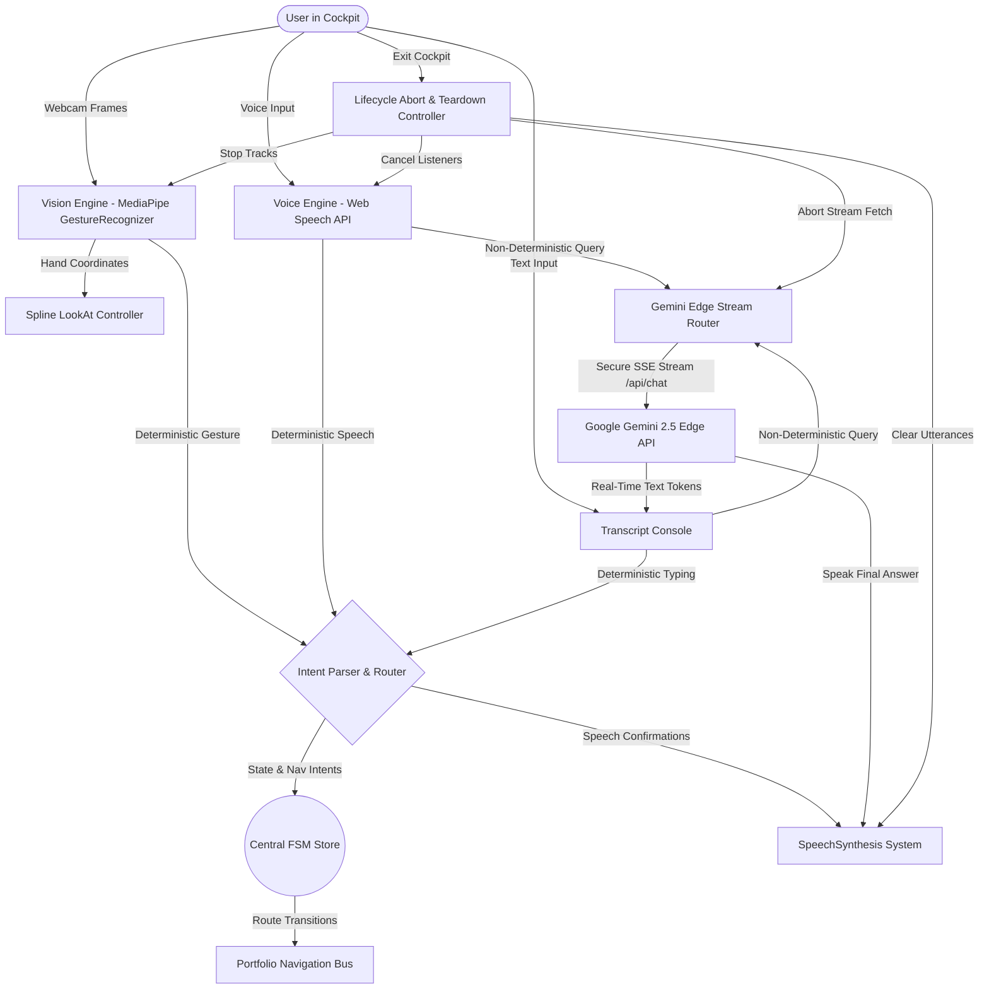

# JARVIZ Live — Technical Architecture Summary

This document describes the multi-modal interaction layer, state machine, and edge routing layers built for JARVIZ Live.

---

## 🏗️ Architectural Overview Diagram

---

## 🧩 Architectural Modules

### 1. Central FSM Store (`lib/jarviz/useJarvizStore.ts`)
*   Manages the state transitions of the entire workspace.
*   **States**: `IDLE` | `VISION_ONLINE` | `HAND_DETECTED` | `GESTURE_CANDIDATE` | `COMMAND_CONFIRMED` | `LISTENING` | `ROBOT_RESPONDING`.
*   Includes throttle protections on coordinate and status changes to prevent reactive loops.

### 2. Vision Pipeline (`components/jarviz/VisionEngine.tsx`)
*   Dynamically imports and initializes `@mediapipe/tasks-vision` inside the client context on webcam activation.
*   Intercepts and silences TensorFlow delegate warnings using console logs filters to maintain a clean developer environment.
*   Extracts normalized hand coordinates and gesture classifications to drive LookAt and navigations.

### 3. Spline LookAt Bridge (`components/jarviz/SplineController.ts`)
*   Translates normalized 3D hand coordinates ($x, y$) directly into screen-space pointer events.
*   Dispatches synthetic `pointermove` and `mousemove` events targetting the Spline Canvas, which triggers the robot head's native 3D tracking vectors smoothly.

### 4. Voice Engine (`components/jarviz/VoiceEngine.tsx`)
*   Leverages the browser's native Web Speech `SpeechRecognition` API.
*   Uses local keyword regex to match commands (e.g. `show work`, `go home`) with immediate zero-latency execution.
*   Defers complex, non-deterministic inputs to the server-side streaming endpoint.

### 5. Gemini SSE Bridge (`app/api/chat/route.ts` & `TranscriptPanel.tsx`)
*   Uses a secure Next.js App Router API edge route running on the Edge Runtime to proxy queries.
*   Connects using Server-Sent Events (SSE), delivering partial text tokens immediately as they are generated by Gemini.
*   Utilizes a standard `AbortController` bound to cockpit close hooks and stop buttons to cancel active connections instantly.

### 6. SpeechSynthesis Engine (`lib/jarviz/speech.ts`)
*   Wraps the native `window.speechSynthesis` queue with async safeguards.
*   Configured with optimal audio rates (`1.05`) and pitch parameters, prioritizing high-fidelity English text-to-speech engines.

### 7. Lifecycle Teardown Pipeline (`components/jarviz/JarvizCockpit.tsx`)
*   Triggered when closing the cockpit overlay or pressing the Escape key.
*   Sequentially halts MediaPipe detection loops, turns off webcam LED indicator elements by closing video tracks, cancels SpeechRecognition instances, flushes SpeechSynthesis utterance buffers, and calls the active `AbortController.abort()` to terminate API queries.
