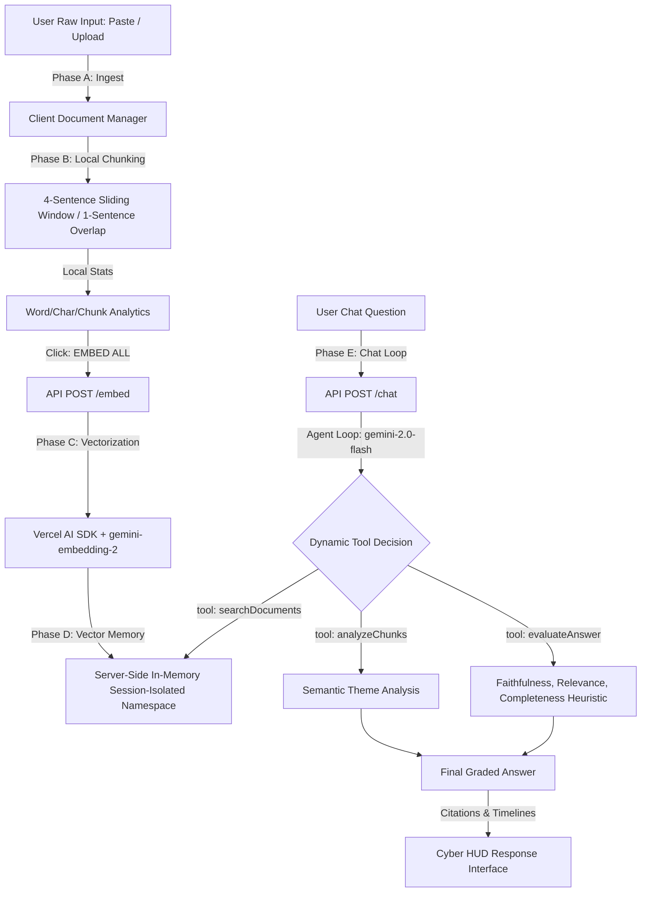

# Ponder — Agentic RAG Showcase

> [!NOTE]
> **One-Line Pitch:** An AI research console that searches uploaded documents, reasons over retrieved evidence, evaluates its own answer, and shows the full operational trace in real-time.

---

## 🚀 What it Demonstrates

Ponder is designed not as a generic wrapper, but as a flagship showcase for **transparent, observable AI systems engineering**. It demonstrates the following production concepts in a lightweight, session-isolated environment:

1.  **Grounded Retrieval-Augmented Generation (RAG):** Answers user questions strictly using the contexts and documents ingested dynamically at runtime.
2.  **High-Observability Systems Design:** Exposes every layer of the cognitive loop in a premium cyber-cyan HUD console—from raw input text, to overlapping chunks, token counts, matching similarity scores, and multi-step tool logs.
3.  **In-Memory Server-Side Vector Store:** Generates state-of-the-art 3,072-dimensional vector representations in parallel using Google Gemini embeddings (`gemini-embedding-2`), storing and querying them inside a session-isolated in-memory vector namespace.
4.  **Multi-Step Agent Tool Loop:** Uses a tool-based loop powered by `gemini-2.0-flash`. The agent dynamically decides when to query the vectors (`searchDocuments`), analyze facts (`analyzeChunks`), and check its own draft response (`evaluateAnswer`).
5.  **Self-Evaluation Grading:** Evaluates draft answers on *Faithfulness*, *Relevance*, and *Completeness* (graded 0 to 100), providing model-generated self-evaluation scores as a useful grounding signal. Faithfulness/relevance/completeness metrics are heuristics that help flag uncertainty, but should not be treated as formal verification.
6.  **Interactive Citation Drawers:** Renders direct, click-to-expand citation badges (`[1]`, `[2]`) mapping inline claims back to the exact chunk of source text retrieved.
7.  **Dynamic Delete Sync:** Automatically purges server-side vectors and metadata chunks when a document is deleted in the UI.

---

## 🛠️ System Architecture

---

## 🛡️ Important Demo Limitations (Honest & Transparent)

Ponder is a **functional systems prototype** built to show core engineering competency rather than a production-scale enterprise RAG database. Please note:
*   **Session-Scoped Demo Memory:** All vectors and text chunks are stored in active server memory isolated by your client-generated `sessionId` for demo isolation. Active delete actions purge vectors for the current session. Refreshing the browser resets the client session state; old vectors are temporary and naturally reset on server cold starts or redeploys.
*   **No Database Persistence:** There is no persistent database instance (such as Supabase pgvector or Pinecone) behind the active demo. This is session-scoped demo memory and is not a substitute for authentication or production tenancy.
*   **Free-Tier API Quota Limits:** As a free-tier showcase, the console is subject to Gemini API rate limits (input token and request rate blocks). If hit, the UI degrades gracefully with a red HUD notification detailing remaining cooldown.
*   **Plain Text/Markdown Only:** File uploads support `.txt` and `.md` formats (up to 5 documents, 50,000 characters per document limit) rather than binary `.pdf` or doc formats.

---

## 🔮 What is Next for a Production Release

In an enterprise-grade SaaS environment, this architecture would scale with:
1.  **Persistent Vector Storage:** Transition the in-memory backend database to a robust PostgreSQL engine utilizing `pgvector` or Supabase for permanent document storage.
2.  **User Authentication:** Wire up Supabase Auth or NextAuth to secure individual user profiles and persistent document libraries.
3.  **Advanced Ingestion Engines:** Integrate OCR-backed multi-format parsing (PDF, DOCX, XLSX, images) using tools like LlamaIndex or LangChain.
4.  **Production Observability:** Push trace telemetries into dedicated developer tracking consoles (such as LangSmith, Phoenix, or LangFuse).
5.  **Multi-Model Router Orchestration:** Implement token-aware dynamic fallback routing between Gemini Pro, Claude 3.5 Sonnet, and GPT-4o depending on computational complexity.
