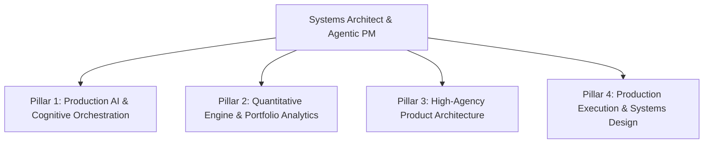

# Master Source of Truth — Tharun Gajula (V6)

**Last updated:** May 25, 2026

**Positioning:** Agentic AI Product Manager & Systems Architect

**Ethos:** Dilip Kumar (High-agency, zero-fluff, shipping profitable products, absolute execution)

**Stack:** Zach Wilson Stack (Production AI, FastAPI, MCP, Vector DBs, Agentic Workflows, Distributed Systems)

  

---

  

# 1) MASTER PROFESSIONAL SUMMARY

  

I am an Agentic AI Product Manager and Systems Architect. I operate at the intersection of deep AI orchestration, complex domain workflows, and high-performance product interfaces. I design and build software that automates dense, high-friction processes, solves concrete commercial problems, and generates net profits. I avoid marketing hype, superficial UI modifications, and PR loops. My primary metric is execution.

  

My background spans credit risk modeling, B2B lending integrations, corporate portfolio analytics, and production AI engineering. I specialize in designing and coordinating advanced cognitive architectures, implementing Model Context Protocol (MCP) servers, integrating secure vector databases, and constructing high-throughput backends using FastAPI and Next.js. I do not build simple API wrapper apps. Instead, I architect secure, distributed AI systems that ingest unstructured, high-dimensional data (clinical profiles, medical telemetry, tabular credit histories) and output highly predictable, structurally sound actions.

  

I learn new domains by constructing functional, production-ready prototypes. I am built for high-growth, early-stage environments that require absolute ownership, technical autonomy, and skin in the game.

  

---

  

# 2) TARGET ROLES

  

## What I am looking for

Agentic AI Product Manager, Systems Architect, or Founder's Office role at an early-stage startup (pre-Series A to Series C) in Bengaluru. I operate on-site or hybrid, working directly beside founders who prioritize technical rigor, operational efficiency, and rapid execution over bureaucratic structures.

  

## Sectors of interest

AI infrastructure, enterprise software, B2B SaaS, healthcare/healthtech, fintech, and database/workflow orchestration. I seek dense, high-barrier-to-entry domains where unstructured data and complex business logic can be systematized via secure, multi-agent pipelines.

  

## What I bring to a Founder's Office / AI Product Team specifically

- **Systems Engineering Rigor**: I design entire system architectures. I map API contracts, build schema migrations, write clean backend endpoints in FastAPI, index Vector DBs, and engineer highly responsive, pixel-perfect frontend layouts.

- **High-Agency Execution (Dilip Kumar Ethos)**: Zero fluff. I take poorly scoped, ambiguous business constraints and convert them into working software single-handedly. I do not wait for external resources; I construct the required components.

- **Advanced AI Orchestration (Zach Wilson Stack)**: I orchestrate advanced cognitive workflows, implement custom Model Context Protocol (MCP) servers, design stateful multi-agent pipelines, configure custom RAG vectors, and build secure distributed service layers.

- **Quantitative & Financial Judgment**: I understand balance sheets, operational waterfalls, credit metrics, and P&L constraints. I build tools that optimize cash flow and team productivity, not just aesthetic interaction metrics.

- **Extreme Domain Adaptability**: I absorb complex fields (geriatric longevity medicine, behavioral clinical psychology, quantitative equity portfolios) within days by building actual, working systems that test the boundary constraints of the domain.

- **Operations & Documentation Discipline**: I write technical PRDs, map end-to-end multi-party system integrations, construct strict API verification schemas, and manage engineering sprint cycles.

  

## What I do NOT want

- Purely cosmetic product management roles focused on superficial design revisions or vanity metric tracking.

- Large, bureaucratic corporate environments where progress is slow.

- Projects built around simple API wrappers or hype-driven AI applications lacking business utility.

- Roles where tasks are highly micro-managed, leaving zero room for technical execution or systems architecture decisions.

  

---

  

# 3) THE CAREER ARC (how it all connects)

  

My professional path is a logical sequence of mastering structured analytical reasoning, B2B workflow design, institutional risk analytics, and production-grade AI systems engineering.

  

**2017-2019: Analytical & Systems Foundation**

B.Tech in Mechanical Engineering from GRIET Hyderabad (85.62%), followed by a pivot to PGDM in Banking and Finance at NIBM Pune (an RBI-governed institution). Engineering trained me in mathematical rigor, structural analysis, and first-principles modeling, while NIBM established a strong foundation in institutional finance, risk management, and quantitative metrics.

  

**2021: Institutional Workflows & Portfolio Analytics**

Two consecutive enterprise roles. At Lentra AI (Pune), I sat as a Business Analyst between engineering and B2B clients, mapping end-to-end B2B loan origination system workflows, drafting functional documentation, and coordinating complex API integrations for retail banks. At Jana Small Finance Bank (Bengaluru), I served as Manager — Loan Product & Portfolio Analytics, where I designed and deployed internal loan products and portfolio workflows, modeled credit risk scorecards, and engineered automated database pipelines in SQL and KNIME that cut data turnaround times by 30%.

  

**2022-2025: Autonomy, Deep Learning, and Systems Engineering**

Four years of independent consulting and rigorous self-directed development. I transitioned from workflows to production-grade systems engineering. I developed automated data pipelines in Python, constructed multi-factor quantitative equity strategy frameworks, and engineered automated analytics dashboards for clients. Simultaneously, I built a technical foundation: completed the IISc Bangalore Deep Learning Programme (graduating with a 92% score) and Google Advanced Data Analytics certification, implemented 8 end-to-end machine learning and reinforcement learning pipelines, and mastered Next.js, FastAPI, vector search, and full-stack software architecture. This period was an intensive systems engineering sprint.

  

**2026-Present: Production AI & Agentic Architectures**

I took this consolidated skill set and designed six highly sophisticated Functional AI Concept Prototypes in 90 days. Each is a self-aware, fully operational concept product constructed to test LLM orchestration, structured output parsing, custom matching algorithms, vector database integrations, and complex domain state machines. Currently, I am exploring production-grade agentic workflows, custom Model Context Protocol (MCP) implementations, FastAPI service layers, and secure multi-agent cognitive architectures.

  

---

  

# 4) EXPERIENCE (detailed)

  

## 4A. Independent Consultant

**Remote, India | April 2022 - December 2025**

  

Consulted on quantitative analytics, operations, and custom software automation while systematically building a deep technical foundation in machine learning and full-stack web applications.

  

**What I did:**

- Developed automated ETL pipelines and data transformation scripts in Python, replacing manual recurring spreadsheets and reports for growth and analytics clients.

- Constructed a multi-factor quantitative equity strategy framework covering mathematical factor ranking, portfolio construction, liquidity analysis, robustness testing, and turnover optimization.

- Engineered responsive client dashboards and content portals, managing full-stack hosting, domain routing, and security protocols.

- Completed the intensive IISc Deep Learning programme (92%) and Google Advanced Data Analytics certification during this period to master deep architectures and statistical modeling.

  

**Systems Learned & Lessons Applied:**

- Learned to work under highly ambiguous project parameters, transforming raw business requests into clean technical specifications.

- Learned how to manage end-to-end delivery pipelines, from conceptual architecture to production deployment and client handoff.

- Developed an adaptable learning framework, acquiring new technical capabilities (FastAPI, Next.js, Vector Search) directly through implementation.

  

## 4B. Jana Small Finance Bank

**Manager — Loan Product & Portfolio Analytics | Bengaluru, India | November 2021 - March 2022**

  

Served in a core analytical capacity monitoring credit risk parameters and loan portfolio behaviors across Retail and SME segments.

  

**What I did:**

- Engineered SQL and KNIME database automation scripts, building robust pipelines for internal loan products and portfolio workflows that reduced operational turnaround times by 30%.

- Monitored credit risk indicators, retail/SME loan portfolio health metrics, and institutional data lineage structures to support underwriting strategies.

- Developed concept-stage predictive risk scorecards (logistic regression, XGBoost, Weight of Evidence) and performed statistical model validation (KS, AUC, PSI).

  

**Systems Learned & Lessons Applied:**

- Acquired experience in managing institutional data schemas and building scoring models on large, noisy human databases where misclassification has severe commercial consequences.

- Demonstrated that analytical pipelines should be designed as robust, reproducible software products to eliminate manual operations and reduce system turnaround latency.

  

## 4C. Lentra AI

**Business Analyst (Product Management) | Pune, India | April 2021 - October 2021**

  

Sat between B2B banking clients and internal engineering teams to deliver a cloud-based B2B loan origination system.

  

**What I did:**

- Translated dense bank lending criteria, compliance frameworks, and underwriting rulesets into clean business requirement documents (BRDs) and functional specifications.

- Mapped end-to-end product workflows, API routing logic, and screen states, ensuring alignment between engineering schedules and client business needs.

- Executed User Acceptance Testing (UAT) pipelines, including test-data preparation, financial interest calculation verification, and REST API testing via Postman.

  

**Systems Learned & Lessons Applied:**

- Developed a deep understanding of B2B fintech workflows, neobank lending integrations, and the operational friction between institutional banking legacy codebases and modern SaaS systems.

- Mastered the ability to translate complex business rules into logical engineering documentation.

  

## 4D. Yadnya Academy Pvt Ltd

**Research Analyst Intern | Remote, Pune | August 2020 - October 2020**

  

- Conducted fundamental analysis, sector mapping, and financial modeling across Indian public equities.

- Delivered quantitative research insights and report structures to support investment understanding.

  

---

  

# 5) PRODUCT AND SYSTEMS PROTOTYPING (detailed)

  

## Overview

Over the past few months, I executed an intensive prototyping sprint, building six highly sophisticated **Functional AI Concept Prototypes**. These systems are designed to test the limits of LLM orchestration, structured output parsing, spatial database mapping, and high-performance user interfaces.

  

---

  

## 5A. Therapy Matching OS

- **Status:** Functional AI Concept Prototype

- **Domain:** Healthcare / Mental Health

- **Technical Stack:** React / Next.js, Framer Motion, Tailwind CSS, Local Storage, LLM JSON Structured Output Parsing

- **URL:** (Deploying)

  

**What it is:** A highly sophisticated clinical matching engine designed for the urban professional market (ages 25-40). The prototype addresses the treatment gap in clinical psychology by mapping dense patient preferences and clinical profiles rather than displaying static therapist directories.

  

**Technical Architecture & System Design:**

- **58-Point Clinical Matching Matrix**:

  - *Layer 1 (Hard Filters)*: Structural constraints including clinical licensing, language fluency, session fee thresholds, scheduling availability, crisis intervention capability, diagnostic specializations, and identity-affirmative gates.

  - *Layer 2 (Weighted Compatibility Scoring)*: Computes a multi-dimensional score (out of 100) based on clinical severity matching, therapeutic modality alignment (e.g., CBT, ACT, Psychodynamic), communication preference scaling (measured via the Cooper-Norcross C-NIP framework), religious/cultural/caste sensitivity, and historic therapeutic alliance metrics.

  - *Layer 3 (Feedback Orchestration)*: Integrates post-session outcome loops. Measures tracking parameters via the Outcome Rating Scale (ORS) and Session Rating Scale (SRS) to continuously adjust therapist scores based on real clinical alliance performance.

- **Intelligent Onboarding Pipeline**:

  - A structured 22-question, 5-chapter diagnostic onboarding wizard that takes approximately 3.5 minutes. It uses progressive disclosure to capture complex qualitative concerns without inducing user intake fatigue.

  - Integrates PHQ-2 and GAD-2 screening indices with passive crisis-detection layers (flags indicators of suicidal ideation or severe distress and dynamically routes users to national crisis hotlines like iCall, Vandrevala, and Tele-MANAS).

- **Explainable Matching Logic**:

  - Generates custom, plain-language matching rationales ("Why we matched you") translating complex scoring matrices into human-readable text by matching therapist modalities with the user's specific self-reported challenges.

- **Aesthetic System Design**:

  - Styled with a custom non-clinical, calming interface using HSL tailored colors: sage green (#7A9E7E), muted lavender (#C9B8E0), warm ochre (#D4A574), and soft cream (#F7F3ED), eliminating the friction commonly associated with sterile healthcare dashboards.

  

**Research Foundation:**

Built upon established clinical literature including Bordin's 1979 Working Alliance Theory, Horvath and Symonds' 1991 Meta-Analysis of Alliance, Flückiger et al. 2018 (alliance correlation r ~ 0.275 across 30,000+ patients), Swift et al. 2018 (demonstrating preference matching reduces treatment dropout by ~50%), and Prochaska's Transtheoretical Model of Change.

  

---

  

## 5B. Relational Matching OS (Mila)

- **Status:** Complete concept prototype (15+ functional routes)

- **Domain:** Social Technology / Behavioral Dynamics

- **Technical Stack:** React / Next.js, Framer Motion, Tailwind CSS, Local Storage, JSON State Engines

- **URL:** meetmila.vercel.app

  

**What it is:** A psychology-backed connection prototype designed to replace addictive, low-efficiency infinite swiping with three highly curated weekly introductions.

  

**Technical Architecture & System Design:**

- **3-Layer Algorithmic Curation**:

  - *Layer 1 (Gates)*: Strict validation of user intent, geographical boundaries, mutual dealbreakers, and profile data completeness.

  - *Layer 2 (Weighted Scoring Matrix)*: Evaluates core compatibility vectors: value alignment (35%), attachment compatibility (15%), communication dynamics (15%), date style preferences (10%), intent horizon (10%), interest overlap (10%), and platform activity indices (5%).

  - *Layer 3 (Feedback Reinforcement Loop)*: Computes Pearson-style correlations on post-date ratings, dynamically adjusting profile compatibility weights based on actual interaction outcomes.

- **80-Profile MECE Psychological Matrix**:

  - Designed a highly structured, Mutually Exclusive and Collectively Exhaustive (MECE) behavioral matrix crossing attachment styles (Secure, Anxious, Avoidant, Fearful), life goals, and primary communication types.

- **Explainable Match Generation**:

  - Translates quantitative compatibility vectors into custom-generated, human-readable explainers outlining the shared principles, attachment balance, and conversational alignment of the match.

- **Commercial Curation Model**:

  - Restricts access to three introductions weekly. Monetizes high-touch human curation and verified physical events rather than gamified engagement, boosts, or search visibility algorithms, ensuring high-fidelity incentives.

  

---

  

## 5C. Parents Health OS

- **Status:** Live concept prototype

- **Domain:** Geriatric Care / Longevity Systems

- **Technical Stack:** React / Next.js, Tailwind CSS, Local Storage, Gemini API Multi-modal Structured Parsing

- **URL:** yukti-os.vercel.app

  

**What it is:** A geriatric care longevity companion designed to synthesize longitudinal health trends, clinical documentation, and high-frequency health metrics into a secure, unified dashboard for families and clinical supervisors.

  

**Technical Architecture & System Design:**

- **15-Question Clinical Protocol Matrix**:

  - Implements a structured protocol evaluating 10 key geriatric dimensions (metabolic health, cardiovascular reserve, cognitive function, frailty indexes, mobility, medication risk).

  - Computes a comprehensive 175-point risk profile with targeted medical triage alerts.

- **Longitudinal Data Correlation Engine**:

  - Dynamically aligns high-frequency daily telemetry (vitals, sleep quality, medication adherence logs) with low-frequency, deep clinical data (blood panels, diagnostic lab reports).

- **AI Document Synthesis Layer**:

  - Integrates the Gemini API to parse multi-page medical PDF uploads, extracting raw test measurements, lab reference ranges, and diagnostic text summaries into clean JSON schemas stored client-side.

- **Local-First Privacy Architecture**:

  - Resolves privacy concerns in medical data by running entirely on browser-based localStorage. Zero server-side persistence ensures patient data ownership.

  - Uses an interface designed specifically for elderly navigation, including large tap-targets, optimized text contrast, and clear guidance menus.

  

---

  

## 5D. Curiosity OS

- **Status:** Locked V2.0

- **Domain:** Education / Pedagogical Engineering

- **Technical Stack:** React / Next.js, Tailwind CSS, Framer Motion, State-Machine Routers

- **URL:** curiosity-os.vercel.app

  

**What it is:** A pedagogical workspace and learning-facilitation dashboard that maps dense cognitive theory and lesson plans into dynamic classroom tools.

  

**Technical Architecture & System Design:**

- **147-Node Atomic Knowledge Graph**:

  - Maps educational concepts and teaching sequences using a custom directed graph featuring 381 semantic connections (e.g., `builds_on`, `contrasts_with`, `reinforces`).

- **4-Wing Pedagogical Framework**:

  - Segregates operations into distinct functional quadrants: *Decode* (intake/analysis), *Cognition* (processing), *Relate* (contextual integration), and *Sandbox* (experiential testing).

- **6-Stage Active Operating Loop**:

  - Guides lesson design and active classroom delivery through six iterative phases: *Browse* (discover concepts), *Plan* (structure flow), *Run* (deliver lesson), *Notice* (observe students), *Reflect* (evaluate effectiveness), and *Adapt* (modify logic).

- **Tactical Facilitation HUD**:

  - Implements live state execution with countdown timers, task progression trackers, and visual pacing alerts to assist teachers in orchestrating high-density classroom activities in real time.

  

---

  

## 5E. Quant OS

- **Status:** Production ready concept

- **Domain:** Quantitative Research / Spatial Information Design

- **Technical Stack:** React / Next.js, Tailwind CSS, react-force-graph-2d, Remark/Rehype KaTeX, Gemini API RAG

- **URL:** quant-os.vercel.app

  

**What it is:** A high-performance spatial learning environment and interactive portfolio graph that visualizes quantitative finance models and data science projects as an active physics-based neural map.

  

**Technical Architecture & System Design:**

- **Spatial Force-Directed Network Engine**:

  - Integrates a 2D canvas physics simulation using `react-force-graph-2d` to map 14 distinct quantitative pillars, research papers, and technical projects as an active node network.

  - Employs particle streams to represent mathematical connections and dependency flows across node boundaries.

- **Mathematical Rendering Pipeline**:

  - Compiles dense mathematical documentation, financial formulas (e.g., Expected Loss equations, Weight of Evidence, Sharpe Ratios), and tabular validation structures natively using Remark, Rehype, and KaTeX.

- **Embedded AI RAG Terminal**:

  - Leverages the Gemini API with structured system prompts (driven by a unified AI context file) to serve as an intelligent, context-aware RAG copilot capable of answering deep architectural questions about the quantitative projects in real time.

  

---

  

## 5F. FMCG Whitespace OS (Pause)

- **Status:** Complete

- **Domain:** Growth Analytics / FMCG Analytics

- **Technical Stack:** React / Next.js, Tailwind CSS, GSAP (GreenSock Animation Platform)

- **URL:** fmcg-whitespace-os.vercel.app

  

**What it is:** A D2C and FMCG growth analytics framework and whitespace identification dashboard that translates dense financial modeling, market surveys, and product benchmarking into a narrative, visual scroll interface.

  

**Technical Architecture & System Design:**

- **Dynamic Margin Waterfall Modeler**:

  - Computes end-to-end unit economics from Gross Margins (44% to 62%) down to Contribution Margin 3 (CM3) net contributions, modeling the business impact of logistics, payment gateways, marketing CAC, and platform fees.

- **Biochemical & Nutritional Indexing**:

  - Integrates nutritional databases to compute DIAAS (Digestible Indispensable Amino Acid Score) and MPS (Muscle Protein Synthesis) thresholds, comparing product offerings against industry standards.

- **Targeted Market Segment Positioning**:

  - Maps market whitespace and product-market positioning targeting the South Indian lactose-intolerant and functional indulgence consumer segments.

- **High-Performance Scroll Storytelling**:

  - Employs GSAP animations and timeline controllers to synchronize mathematical charts, waterfall diagrams, and product benchmarks with the user's scroll depth for high-impact analytical presentation.

  

---

  

# 6) ANALYTICS AND ML TRACK (detailed)

  

I have built eight end-to-end quantitative systems to develop and demonstrate rigorous statistical reasoning, data preprocessing capabilities, and mathematical validation standards.

  

Full portfolio: github.com/tharungajula2/Portfolio

  

---

  

### 6A. Lending Club Credit Risk Architecture (Flagship)

- **Concept:** Institutional retail credit risk estimation.

- **Architecture:** Constructs a rigorous credit risk scoring pipeline on messy tabular historical lending data.

- **Mathematical Depth:**

  - Implements **Weight of Evidence (WoE)** and **Information Value (IV)** feature selection algorithms to bin high-dimensional tabular data and maintain linear risk representations.

  - Builds interpretable Logistic Regression credit risk scorecards.

  - Establishes explicit **Expected Loss (EL)** calculations using the core risk identity:

    $$\text{Expected Loss (EL)} = \text{Probability of Default (PD)} \times \text{Loss Given Default (LGD)} \times \text{Exposure at Default (EAD)}$$

  - Integrates Forward-Looking Current Expected Credit Losses (CECL) stress-testing parameters.

  - Validates scorecard stability via Kolmogorov-Smirnov (KS) statistics, Area Under the ROC Curve (AUC), and Population Stability Index (PSI).

  

### 6B. Bank Churn Neural Networks

- **Concept:** Customer attrition modeling via neural architectures.

- **Architecture:** Custom feed-forward neural networks constructed to capture multi-layered non-linear retention dynamics.

- **Mathematical Depth:**

  - Addresses heavy class imbalances using synthetic oversampling (SMOTE) and specialized loss weighting.

  - Benchmarks SGD, RMSprop, and Adam optimizers.

  - Optimizes the model threshold to prioritize **Recall** over raw accuracy, identifying high-risk attrition candidates without triggering false-positive intervention costs.

  

### 6C. Employee Retention Risk Classifier

- **Concept:** Human capital attrition modeling.

- **Architecture:** Builds a comparative ensemble framework (Logistic Regression, Decision Trees, Random Forests) to forecast organizational exit risk.

- **Mathematical Depth:**

  - Isolates predictive features via rigorous target encoding and collinearity checks (Variance Inflation Factor).

  - Validates predictive parameters to ensure model stability across distinct business segments and tenures.

  

### 6D. Socio-Economic Household Classification

- **Concept:** Tabular processing under high noise conditions.

- **Architecture:** An ensemble classification framework (XGBoost, Random Forests) designed to process noisy public census datasets.

- **Mathematical Depth:**

  - Executes comprehensive preprocessing including median-imputation loops, Robust Scaling for outliers, and Principal Component Analysis (PCA) for feature dimensionality reduction.

  - Balances class-imbalanced targets to ensure stable classification scoring.

  

### 6E. Twitter Sentiment NLP Pipeline

- **Concept:** Natural Language Processing text classifier.

- **Architecture:** An end-to-end NLP workflow to classify textual sentiment from streaming social media logs.

- **Mathematical Depth:**

  - Implements textual preprocessing (lemmatization, tokenization, stop-word filtering) and vectorization pipelines using TF-IDF matrices and CountVectorizer.

  - Conducts class-wise confusion matrix analysis to verify classification accuracy across minority sentiments.

  

### 6F. CartPole Reinforcement Learning Comparison

- **Concept:** Benchmarking discrete policy optimization.

- **Architecture:** Compares reinforcement learning agents operating within the Gymnasium CartPole environment.

- **Mathematical Depth:**

  - Implements **REINFORCE** (Policy Gradient) with baseline subtraction to reduce gradient variance.

  - Evaluates Deep Q-Networks (DQN), Proximal Policy Optimization (PPO), Actor-Critic models, and Soft Actor-Critic (SAC) configurations.

  

### 6G. Antidiabetic Demand Forecast

- **Concept:** Time-series medical demand forecasting.

- **Architecture:** Deploys statistical forecasting models to predict medicine pipeline requirements.

- **Mathematical Depth:**

  - Deconstructs seasonal trends via STL (Seasonal and Trend decomposition using Loess).

  - Verifies stationarity using the Augmented Dickey-Fuller (ADF) test.

  - Deploys and benchmarks **SARIMA** (Seasonal Autoregressive Integrated Moving Average) models against naive baselines using rolling window out-of-sample validation.

  

### 6H. NIFTY 100 Portfolio Optimizer

- **Concept:** Modern Portfolio Theory allocation.

- **Architecture:** Builds an asset allocation model using historical Indian equity datasets.

- **Mathematical Depth:**

  - Computes historical log-return variance-covariance matrices.

  - Executes Monte Carlo simulations mapping thousands of asset weight combinations.

  - Maps the **Efficient Frontier**, isolating optimal allocations by maximizing the Sharpe Ratio:

    $$\text{Sharpe Ratio} = \frac{R_p - R_f}{\sigma_p}$$

  

---

  

# 7) THE 4 PROFILE PILLARS (for quick reference)

  

These four pillars form my professional core. They define how I analyze, design, and execute.

  

  

### Pillar 1: Production AI & Cognitive Orchestration

I orchestrate advanced multi-agent workflows, implement custom Model Context Protocol (MCP) servers, configure stateful database storage, and design secure, fast backends in FastAPI. I focus on predictability, structured output validation, and cost-containment.

*   *Proof:* FastAPI microservices, MCP integrations, vector indexing (PGVector), and the IISc Deep Learning background.

  

### Pillar 2: Quantitative Engine & Portfolio Analytics

I build advanced predictive and forecasting models on complex financial, medical, and operational data. I validate models rigorously (KS, AUC, PSI, out-of-time splits) and understand how to translate mathematical models into actual business decisions.

*   *Proof:* Manager — Loan Product & Portfolio Analytics at Jana SFB, Lending Club expected loss architecture, SARIMA forecasting, and NIFTY portfolio optimizer.

  

### Pillar 3: High-Agency Product Architecture

I sit between complex database constraints and business metrics, mapping end-to-end B2B and consumer workflows. I write clear functional specifications, align cross-functional engineering teams, and ship functional products designed with extreme attention to structural completeness.

*   *Proof:* Lentra AI B2B systems analysis, Jana Bank credit workflow design, and the execution of 6 Functional AI Concept Prototypes in a 90-day lab sprint.

  

### Pillar 4: Production Execution & Systems Design

I operate as a zero-fluff builder who creates highly logical, aesthetic, and functional user interfaces. I eliminate operational overhead by building the necessary systems, dashboards, visual explainers, and database connections myself.

*   *Proof:* Full-stack Next.js and portfolio architecture, react-force-graph spatial integrations, custom data visualizations, and rapid deployment pipelines.

  

---

  

# 8) TECHNICAL SKILLS

  

- **Product & Systems Management:**

  Systems Analysis, Requirements Architecture, Technical PRDs, API Mapping, Workflow Design, SDLC Coordination, User Acceptance Testing (UAT), Database Schema Design, Agile Sprint Orchestration.

- **AI & Systems Orchestration:**

  FastAPI, Model Context Protocol (MCP), Vector Databases (PGVector, Pinecone), Agentic Workflows, Stateful Task Loops, Structured JSON Output Parsing, LLM Orchestration, Custom RAG Architectures, Distributed Systems, Python, SQL, KNIME, Git.

- **Statistical Modeling & ML:**

  Deep Learning, Reinforcement Learning, Natural Language Processing (NLP), Time-Series Forecasting, Logistic Regression, XGBoost, Weight of Evidence (WoE), Model Validation (KS, AUC, PSI), Expected Loss Estimation.

- **Frontend & Visualization:**

  Next.js, React, Tailwind CSS, Framer Motion, GSAP, react-force-graph-2d, Remark/Rehype, KaTeX, Figma, Vercel.

- **Domain Areas:**

  Credit Risk Modeling (PD/LGD/EAD), B2B Loan Origination Systems (LOS), Portfolio Risk Analytics, Geriatric Care Protocols, Therapeutic Alliance Dynamics, Pedagogical Graph Systems.

  

---

  

# 9) EDUCATION

  

**Indian Institute of Science (IISc), Bengaluru**

*Post Graduate Level Programme in Deep Learning | 2023 - 2025 | Grade: 92%*

- Focus: Neural Architectures, Reinforcement Learning, Optimization Algorithms, Computer Vision.

  

**National Institute of Bank Management (NIBM), Pune**

*PGDM in Banking and Finance | 2019 - 2021 | Grade: 74.13%*

- Focus: Credit Risk Management, Asset Liability Management (ALM), Quantitative Finance, Portfolio Optimization. RBI-governed institutional framework.

  

**GRIET (JNTUH), Hyderabad**

*Bachelor of Technology in Mechanical Engineering | 2013 - 2017 | Grade: 85.62%*

- Focus: Advanced Calculus, Computational Systems, Project Documentation, Vendor Coordination. Led the structural design and logistics for a custom all-terrain vehicle (ATV) fabrication.

  

---

  

# 10) CERTIFICATIONS

  

- **Google Advanced Data Analytics** | Professional Certificate | June 2023

- **Foundations of Agile Development and Scrum** | IBM | June 2024

- **Unilever Digital Marketing Analyst** | Professional Certificate | May 2024

  

---

  

# 11) OPERATIONAL ETHOS (in my own words)

  

- **Absolute Agency (Dilip Kumar Ethos)**: I do not ask for direction or wait for perfect circumstances. I take messy, half-formed business objectives, define the constraints, map the architecture, build the code, and ship the product. I focus on execution and profitability.

- **Production AI over Wrapper Hype (Zach Wilson Stack)**: I do not build superficial API wrappers. I orchestrate complex multi-agent cognitive loops, develop custom Model Context Protocol (MCP) servers to bridge filesystems and database schemas, and optimize vector databases for secure local-first execution.

- **Total Systems Writing**: I write logical, highly structured technical documents. My PRDs, database schemas, and code comments are treated with the same precision as raw calculations, ensuring clear cross-functional alignment.

- **First-Principles Domain Ingestion**: I do not fear unfamiliar industries. When entering a new sector, I systematically read the primary literature, analyze the baseline parameters, and build a functional system in it. That is how I mapped geriatric health protocols, clinical therapy matrices, and pedagogy node networks.

- **Extreme Efficiency**: I eliminate manual steps. My work at Jana SFB was not about working longer hours; it was about designing SQL and KNIME pipeline tools that automated repetitive operational steps to cut process turnaround by 30%.

  

---

  

# 12) THE SPRINT & CONSULTING FRAMING (for interviews)

  

Interviewer questions often focus on my four-year independent consulting and deep learning sprint. I address this directly and logically:

  

**The Facts:**

I chose to transition away from standard corporate structures in 2022 to independently build a technical foundation in deep learning, full-stack web applications, and production AI orchestration. During this time, I consulted on quantitative analytics and custom automation workflows for clients, completed the IISc Deep Learning Programme with a 92% grade, and built eight quantitative projects alongside six advanced AI concept prototypes.

  

**The Narrative Framing:**

"I left traditional corporate roles to deliberately construct the advanced technical foundation I wanted. My consulting work gave me commercial breadth across diverse business contexts, while my self-directed deep learning and software engineering gave me systems-level depth. Rather than executing minor updates in a corporate silo, I spent this time learning how to architect and ship complete systems from scratch."

  

---

  

# 13) ACTIVE APPLICATIONS AND OUTREACH LOG

  

## Elfina Health | Founder's Office (Mental Health)

- **Founder:** Tanvi Agrawal

- **Status:** Resume submitted to Aradhay Gupta (Founding PM) on May 4, 2026. Custom Loom video and Founder's Office thesis note queued for delivery to hiring@elfinahealth.com.

- **Contact:** Aradhay (LinkedIn), hiring@elfinahealth.com

- **Role Parameters:** On-site HSR Layout Bengaluru. Core focus: Execution, Systems Coordination, AI Integration.

- **My Strategy:** Leverage **Therapy Matching OS** as direct proof of domain capability. Connect institutional credit scoring concepts with clinical matching dynamics. Highlight first-principles learning speed.

- **Proof of Work:** Therapy Matching OS (Clinical matching engine mapping 58 analytical metrics client-side).

- **Key Intel:** Tanvi values high agency, clean structural writing, concrete unit economics, and AI applied as practical business leverage. She avoids superficial AI posturing.

  

---

  

# 14) PORTFOLIO LINKS

  

- **Systems Architecture Portfolio:** tharungajula.vercel.app

- **GitHub Analytics Repository:** github.com/tharungajula2/Portfolio

- **LinkedIn Profile:** linkedin.com/in/tharungajula

- **Email:** tharun.gajula.2@gmail.com

- **Contact Number:** +91-9110572145

  

**Active Concept Prototypes:**

- **Therapy Matching OS:** (Deploying client-side)

- **Relational Matching OS (Mila):** meetmila.vercel.app

- **Parents Health OS:** yukti-os.vercel.app

- **Quant OS:** quant-os.vercel.app

- **Curiosity OS:** curiosity-os.vercel.app

- **FMCG Whitespace OS (Pause):** fmcg-whitespace-os.vercel.app

  

---

  

# 15) SYSTEMS TO-DO & IMPROVEMENTS

  

- Finalize the local-first production deployment configuration for **Therapy Matching OS**.

- Update the active application status records for Elfina Health.

- Restructure the GitHub repository README to reflect the updated Agentic PM and Systems Architect branding.

- Inject the systems architecture context file directly into the local conversational AI interface configurations.
